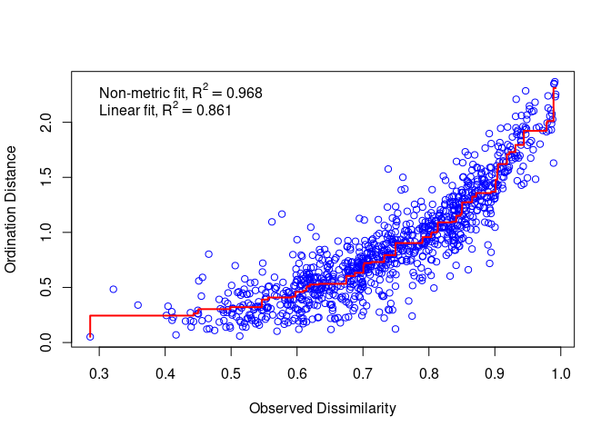
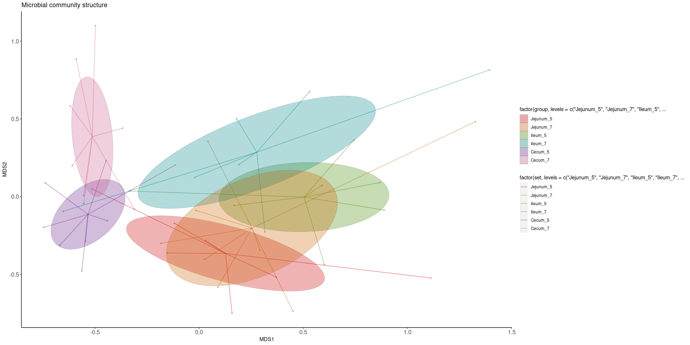
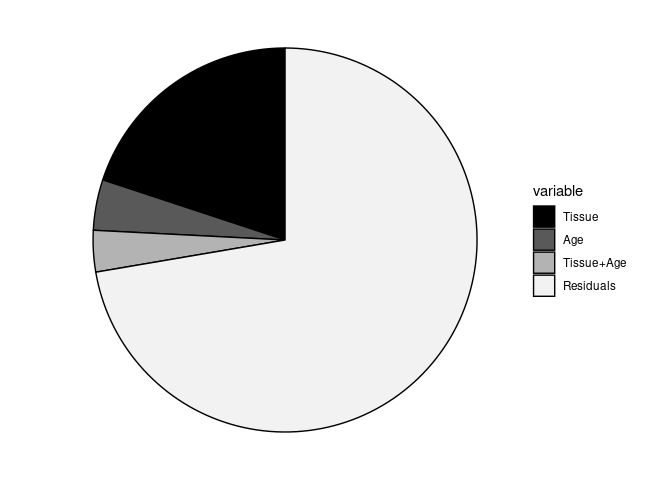
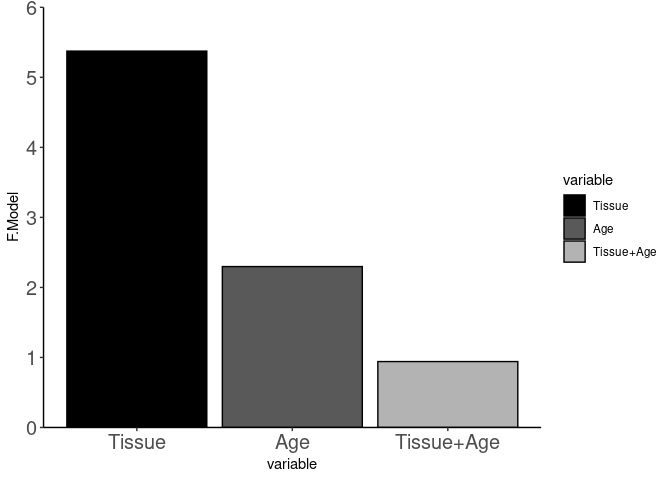

NMDS Visualization & PERMANOVA Statistics
================
Jayne Wiarda
2022May12

# Overview

Mucosal swabs were collected from jejunum, ileum, and cecum of eight
pigs 2 and 4 weeks post-weaning. Pigs were weaned at \~3 weeks of age,
so timepoints are equivalent to \~5 or \~7 weeks of age as well.
Microbial DNA was collected for 16S rRNA sequencing. Sequences were
classified as amplicon sequence variants (ASVs) to assess microbial
diversity across samples.

Importantly, ASVs are MUTUALLY EXCLUSIVE/DISCRETE, meaning every
recovered sequence was assigned to only one ASV.

The objective of the below analyses is to summarize the microbial
community structures amongst samples/treatments based on comparing the
ASV frequencies across samples.

## Load required packages

See session information at bottom for further information.

``` r
library(readxl)
library(vegan)
library(funfuns)
library(tidyverse)
library(dplyr)
library(ggplot2)
```

## Organize the data

Set a seed for reproducibility:

``` r
set.seed(123)
```

Read in the counts data for the 32 subsets & organize further:

``` r
data <- read_excel('/home/Jayne.Wiarda/NG10/Dissertation/Micro_16S/NG10_TotalASVCountsBySample.xlsx')
head(data)
```

    ## # A tibble: 6 × 2,438
    ##   MicroID ASV_1 ASV_2 ASV_3 ASV_4 ASV_5 ASV_6 ASV_7 ASV_8 ASV_9 ASV_10 ASV_11
    ##   <chr>   <dbl> <dbl> <dbl> <dbl> <dbl> <dbl> <dbl> <dbl> <dbl>  <dbl>  <dbl>
    ## 1 S4       1015  4445  1962  1924  5084   136  4336     4  2489   1038    324
    ## 2 S2        427  1857 19782   767   226 15250   177   963   179    179   6392
    ## 3 S3        421   893  5848   518   250   256   163    70   469     83  16978
    ## 4 S12      6845  2726  8854   147  1813    24  2077    13  3317    167    142
    ## 5 S10      5658   397 26157    20    35   518   161   103   254   1498    162
    ## 6 S20       401  2270    10   175   199     2    78    15   202   2459      4
    ## # … with 2,426 more variables: ASV_12 <dbl>, ASV_13 <dbl>, ASV_14 <dbl>,
    ## #   ASV_15 <dbl>, ASV_16 <dbl>, ASV_17 <dbl>, ASV_18 <dbl>, ASV_19 <dbl>,
    ## #   ASV_20 <dbl>, ASV_21 <dbl>, ASV_22 <dbl>, ASV_23 <dbl>, ASV_24 <dbl>,
    ## #   ASV_25 <dbl>, ASV_27 <dbl>, ASV_28 <dbl>, ASV_29 <dbl>, ASV_30 <dbl>,
    ## #   ASV_33 <dbl>, ASV_34 <dbl>, ASV_35 <dbl>, ASV_36 <dbl>, ASV_37 <dbl>,
    ## #   ASV_38 <dbl>, ASV_39 <dbl>, ASV_40 <dbl>, ASV_42 <dbl>, ASV_43 <dbl>,
    ## #   ASV_44 <dbl>, ASV_45 <dbl>, ASV_46 <dbl>, ASV_47 <dbl>, ASV_48 <dbl>, …

``` r
names <- data$MicroID
data <- subset(data, select=-c(MicroID))
rownames(data) <- names
data <- as.data.frame(data) # convert to data frame instead of tibble
```

Read in meta data & organize further:

``` r
meta <- read_excel("/home/Jayne.Wiarda/NG10/Dissertation/Micro_16S/NG10_MetaData_16S.xlsx") # read in meta data
head(meta) # look at meta data... if you don't want to include all metadata columns, subset before next step
```

    ## # A tibble: 6 × 4
    ##   AnimalID WeeksOfAge Tissue  MicroID
    ##      <dbl>      <dbl> <chr>   <chr>  
    ## 1        1          5 Cecum   S4     
    ## 2        1          5 Ileum   S2     
    ## 3        1          5 Jejunum S3     
    ## 4        5          5 Cecum   S12    
    ## 5        5          5 Ileum   S10    
    ## 6        9          5 Cecum   S20

``` r
meta$WeeksOfAge <- as.character(meta$WeeksOfAge) # convert from numeric to character
meta$ID <- paste0(meta$AnimalID, meta$Tissue)
meta$set <- paste(meta$Tissue, meta$WeeksOfAge, sep = '_')
meta$SampleID <- paste(meta$ID, meta$WeeksOfAge, sep = '_')
meta <- meta[match(names, meta$MicroID),]
rownames(meta) <- meta$MicroID  # sets rownames
meta <- as.data.frame(meta) # convert to data frame instead of tibble
head(meta)
```

    ##     AnimalID WeeksOfAge  Tissue MicroID       ID       set   SampleID
    ## S4         1          5   Cecum      S4   1Cecum   Cecum_5   1Cecum_5
    ## S2         1          5   Ileum      S2   1Ileum   Ileum_5   1Ileum_5
    ## S3         1          5 Jejunum      S3 1Jejunum Jejunum_5 1Jejunum_5
    ## S12        5          5   Cecum     S12   5Cecum   Cecum_5   5Cecum_5
    ## S10        5          5   Ileum     S10   5Ileum   Ileum_5   5Ileum_5
    ## S20        9          5   Cecum     S20   9Cecum   Cecum_5   9Cecum_5

Convert counts data to percentages of total ASVs:

``` r
rowSums(data) 
```

    ##     S4     S2     S3    S12    S10    S20    S18    S19    S28    S26    S27 
    ##  65515 118327 118449  68748  65162  18116  17960  62244  19789  63235  88023 
    ##    S36    S34    S35    S44    S42    S43    S52    S51    S60    S58    S59 
    ##  54374  71798  77582  36966  63753  33538  34852  34692  20197  20088 147769 
    ##    S68    S66    S67    S76    S74    S75    S84    S82    S83    S92    S90 
    ##  42648  62643  72725  68600  83142  12607  34794   8866  72401  24509  32291 
    ##    S91   S100    S98    S99   S108   S107   S116   S114   S115   S124   S122 
    ##  82894  43331  66715  23123  59534  99284 107972  41003 109074  85225  79704 
    ##   S123 
    ##  99167

``` r
data <- (data / rowSums(data)) * 100
rowSums(data) # should all be equal to 100
```

    ##   S4   S2   S3  S12  S10  S20  S18  S19  S28  S26  S27  S36  S34  S35  S44  S42 
    ##  100  100  100  100  100  100  100  100  100  100  100  100  100  100  100  100 
    ##  S43  S52  S51  S60  S58  S59  S68  S66  S67  S76  S74  S75  S84  S82  S83  S92 
    ##  100  100  100  100  100  100  100  100  100  100  100  100  100  100  100  100 
    ##  S90  S91 S100  S98  S99 S108 S107 S116 S114 S115 S124 S122 S123 
    ##  100  100  100  100  100  100  100  100  100  100  100  100  100

## Create NMDS plots for visualization

Now that we have converted our counts data to percentages that account
for all of our ASVs, we can use this information to plot the
relationships between treatment groups. We will do so by creating NMDS
plots.

#### Create NMDS plot:

``` r
NMDS <- NMDS_ellipse(metadata = meta, 
                     OTU_table = data, 
                     grouping_set = 'set')
```

    ## Run 0 stress 0.1787049 
    ## Run 1 stress 0.1787049 
    ## ... Procrustes: rmse 4.676044e-06  max resid 1.349173e-05 
    ## ... Similar to previous best
    ## Run 2 stress 0.1865515 
    ## Run 3 stress 0.1787049 
    ## ... Procrustes: rmse 1.073277e-05  max resid 4.153008e-05 
    ## ... Similar to previous best
    ## Run 4 stress 0.1790651 
    ## ... Procrustes: rmse 0.008783241  max resid 0.0300077 
    ## Run 5 stress 0.1787516 
    ## ... Procrustes: rmse 0.006927421  max resid 0.03074146 
    ## Run 6 stress 0.1787049 
    ## ... Procrustes: rmse 2.333877e-05  max resid 0.0001006608 
    ## ... Similar to previous best
    ## Run 7 stress 0.1900885 
    ## Run 8 stress 0.1790653 
    ## ... Procrustes: rmse 0.00880196  max resid 0.03005917 
    ## Run 9 stress 0.187511 
    ## Run 10 stress 0.1790094 
    ## ... Procrustes: rmse 0.005649302  max resid 0.02864247 
    ## Run 11 stress 0.1790095 
    ## ... Procrustes: rmse 0.005650654  max resid 0.02875836 
    ## Run 12 stress 0.1787516 
    ## ... Procrustes: rmse 0.006926211  max resid 0.0307164 
    ## Run 13 stress 0.1859029 
    ## Run 14 stress 0.1787098 
    ## ... Procrustes: rmse 0.004199514  max resid 0.02478227 
    ## Run 15 stress 0.1787098 
    ## ... Procrustes: rmse 0.004198711  max resid 0.02478038 
    ## Run 16 stress 0.1787049 
    ## ... Procrustes: rmse 1.403338e-05  max resid 4.382784e-05 
    ## ... Similar to previous best
    ## Run 17 stress 0.1787049 
    ## ... Procrustes: rmse 1.856164e-05  max resid 5.460917e-05 
    ## ... Similar to previous best
    ## Run 18 stress 0.1867933 
    ## Run 19 stress 0.1787517 
    ## ... Procrustes: rmse 0.006904139  max resid 0.03062295 
    ## Run 20 stress 0.1923107 
    ## *** Solution reached
    ## [1] "Ordination stress: 0.178704942752762"

Check the stress of the NMDS plot to see how well the 2-D ordination
distances can truly represent underlying multidimensional distances.
Stress &lt; 0.1 indicates good 2-D representation, while stress &gt; 0.2
is concerning.

``` r
stressplot(NMDS[[3]])
```

<!-- -->

``` r
NMDS[[3]]$stress
```

    ## [1] 0.1787049

Now finally, make the NMDS plot:

``` r
ggplot(data = NMDS[[1]],aes(x=MDS1, y=MDS2)) +
  geom_point(size=1, alpha = 0.4, fill = 'grey50', , col = 'grey50', shape = 19) +
  geom_segment(aes(xend=centroidX, yend=centroidY, col = factor(set, levels = c('Jejunum_5', 'Jejunum_7',
                                                                     'Ileum_5', 'Ileum_7',
                                                                     'Cecum_5', 'Cecum_7'))),
               linejoin = 'round', size=0.5, alpha = 0.5) + 
  scale_colour_manual(values = c('red3', 'darkorange3', 'chartreuse4', 'turquoise4', 'darkorchid4', 'hotpink3')) +
  geom_polygon(data = NMDS[[2]], aes(x=NMDS1, y=NMDS2, group=group, 
                                     fill = factor(group, levels = c('Jejunum_5', 'Jejunum_7',
                                                                     'Ileum_5', 'Ileum_7',
                                                                     'Cecum_5', 'Cecum_7'))), 
               inherit.aes = FALSE, alpha=0.3, color = 'grey40', lwd = 0.1) +
  scale_fill_manual(values = c('red3', 'darkorange3', 'chartreuse4', 'turquoise4', 'darkorchid4', 'hotpink3')) +
    theme(panel.grid.major = element_blank(), panel.grid.minor = element_blank(),
        panel.background = element_blank(), axis.line = element_line(colour = "black"),
        axis.text.x=element_text(size=12), axis.text.y=element_text(size=12)) +
  labs(title = "Microbial community structure")
```

<!-- -->

## Perform PERMANOVA analysis

The above NMDS plots can be really handy for getting a first impression
of the data, but now we need numbers to quantify the relationships
between groups! We can start by performing PERMANOVA analysis to
determine if any of our treatment variables have significant singular or
combinatorial effects on the data.

#### Perform PERMANOVA analysis

Perform overall analysis of data:

``` r
adon <- adonis(formula = data ~ (Tissue * WeeksOfAge), data = meta)
adon
```

    ## 
    ## Call:
    ## adonis(formula = data ~ (Tissue * WeeksOfAge), data = meta) 
    ## 
    ## Permutation: free
    ## Number of permutations: 999
    ## 
    ## Terms added sequentially (first to last)
    ## 
    ##                   Df SumsOfSqs MeanSqs F.Model      R2 Pr(>F)    
    ## Tissue             2    2.4579 1.22896  5.3741 0.19931  0.001 ***
    ## WeeksOfAge         1    0.5254 0.52538  2.2974 0.04260  0.009 ** 
    ## Tissue:WeeksOfAge  2    0.4305 0.21523  0.9412 0.03491  0.541    
    ## Residuals         39    8.9186 0.22868         0.72319           
    ## Total             44   12.3324                 1.00000           
    ## ---
    ## Signif. codes:  0 '***' 0.001 '**' 0.01 '*' 0.05 '.' 0.1 ' ' 1

Plot R2 statistics:

``` r
df <- as.data.frame(adon$aov.tab[1:4,])
df$variable <- c('Tissue', 'Age', 'Tissue+Age', 'Residuals')
df$variable <- factor(df$variable, levels = c('Tissue', 'Age', 'Tissue+Age', 'Residuals'))
ggplot(df, aes(x = '', y = R2, fill = variable)) +
  geom_bar(stat = 'identity', width = 1, col = 'black') +
  coord_polar("y", start=0) +
  theme_void() +
  scale_fill_manual(values = c('black', 'grey35', 'grey70', 'grey95'))
```

<!-- -->

Plot F statistics:

``` r
df <- df[1:3,] # remove last row with residuals info since not part of F-statistic
ggplot(df, aes(x = variable, y = F.Model, fill = variable)) +
  geom_bar(stat = 'identity', col = 'black') +
  theme_classic() +
  scale_fill_manual(values = c('black', 'grey35', 'grey70')) +
  scale_y_continuous(expand = c(0, 0), lim = c(0, 6)) +
  theme(axis.text.x=element_text(size=15), axis.text.y=element_text(size=15)) 
```

<!-- -->

Perform pairwise comparison of data:

``` r
pwadon <- pairwise.adonis(data, meta$set, p.adjust.m = 'none')
pwadon
```

    ##                     pairs  F.Model         R2 p.value p.adjusted
    ## 1      Cecum_5 vs Ileum_5 4.909456 0.27412649   0.002      0.002
    ## 2    Cecum_5 vs Jejunum_5 2.599253 0.16662676   0.004      0.004
    ## 3      Cecum_5 vs Cecum_7 1.621104 0.10377653   0.052      0.052
    ## 4      Cecum_5 vs Ileum_7 3.108426 0.19296897   0.001      0.001
    ## 5    Cecum_5 vs Jejunum_7 4.118003 0.22728789   0.001      0.001
    ## 6    Ileum_5 vs Jejunum_5 2.647046 0.18072217   0.007      0.007
    ## 7      Ileum_5 vs Cecum_7 5.440163 0.29501709   0.001      0.001
    ## 8      Ileum_5 vs Ileum_7 1.382090 0.10327908   0.154      0.154
    ## 9    Ileum_5 vs Jejunum_7 3.114743 0.19328530   0.002      0.002
    ## 10   Jejunum_5 vs Cecum_7 3.753072 0.22402290   0.001      0.001
    ## 11   Jejunum_5 vs Ileum_7 2.254493 0.15816015   0.010      0.010
    ## 12 Jejunum_5 vs Jejunum_7 1.177106 0.08302866   0.223      0.223
    ## 13     Cecum_7 vs Ileum_7 2.647321 0.16918686   0.008      0.008
    ## 14   Cecum_7 vs Jejunum_7 4.260378 0.23331268   0.001      0.001
    ## 15   Ileum_7 vs Jejunum_7 2.110797 0.13968798   0.024      0.024

Extract only pairwise comparisons of interest (between tissues within a
single treatment/timepoint; between timepoints within a single
tissue/treatment; between treatments within a single tissue/timepoint) &
recalculate the adjusted p-values:

``` r
pwadonsub <- pwadon %>% slice(1:3,6, 8, 12:15)
pwadonsub$p.adjusted <- p.adjust(pwadonsub$p.value, method = 'fdr') 
pwadonsub
```

    ##                    pairs  F.Model         R2 p.value p.adjusted
    ## 1     Cecum_5 vs Ileum_5 4.909456 0.27412649   0.002 0.00900000
    ## 2   Cecum_5 vs Jejunum_5 2.599253 0.16662676   0.004 0.01200000
    ## 3     Cecum_5 vs Cecum_7 1.621104 0.10377653   0.052 0.06685714
    ## 4   Ileum_5 vs Jejunum_5 2.647046 0.18072217   0.007 0.01440000
    ## 5     Ileum_5 vs Ileum_7 1.382090 0.10327908   0.154 0.17325000
    ## 6 Jejunum_5 vs Jejunum_7 1.177106 0.08302866   0.223 0.22300000
    ## 7     Cecum_7 vs Ileum_7 2.647321 0.16918686   0.008 0.01440000
    ## 8   Cecum_7 vs Jejunum_7 4.260378 0.23331268   0.001 0.00900000
    ## 9   Ileum_7 vs Jejunum_7 2.110797 0.13968798   0.024 0.03600000

Save the data:

``` r
setwd('/home/Jayne.Wiarda/NG10/Dissertation/Micro_16S/')
dir.create('NMDS_PERMANOVA')
setwd('NMDS_PERMANOVA')
write.csv(adon$aov.tab, '/home/Jayne.Wiarda/NG10/Dissertation/Micro_16S/NMDS_PERMANOVA/PERMANOVA.csv')
write.csv(pwadonsub, '/home/Jayne.Wiarda/NG10/Dissertation/Micro_16S/NMDS_PERMANOVA/StatsPairwise.csv')
```

### View session information

``` r
sessionInfo()
```

    ## R version 4.1.3 (2022-03-10)
    ## Platform: x86_64-pc-linux-gnu (64-bit)
    ## Running under: Ubuntu 20.04.4 LTS
    ## 
    ## Matrix products: default
    ## BLAS:   /usr/lib/x86_64-linux-gnu/openblas-pthread/libblas.so.3
    ## LAPACK: /usr/lib/x86_64-linux-gnu/openblas-pthread/liblapack.so.3
    ## 
    ## locale:
    ##  [1] LC_CTYPE=en_US.UTF-8       LC_NUMERIC=C              
    ##  [3] LC_TIME=en_US.UTF-8        LC_COLLATE=en_US.UTF-8    
    ##  [5] LC_MONETARY=en_US.UTF-8    LC_MESSAGES=en_US.UTF-8   
    ##  [7] LC_PAPER=en_US.UTF-8       LC_NAME=C                 
    ##  [9] LC_ADDRESS=C               LC_TELEPHONE=C            
    ## [11] LC_MEASUREMENT=en_US.UTF-8 LC_IDENTIFICATION=C       
    ## 
    ## attached base packages:
    ## [1] stats     graphics  grDevices utils     datasets  methods   base     
    ## 
    ## other attached packages:
    ##  [1] forcats_0.5.1   stringr_1.4.0   dplyr_1.0.7     purrr_0.3.4    
    ##  [5] readr_2.0.1     tidyr_1.1.3     tibble_3.1.4    ggplot2_3.3.5  
    ##  [9] tidyverse_1.3.1 funfuns_0.1.2   vegan_2.5-7     lattice_0.20-45
    ## [13] permute_0.9-5   readxl_1.3.1   
    ## 
    ## loaded via a namespace (and not attached):
    ##  [1] Rcpp_1.0.7       lubridate_1.7.10 assertthat_0.2.1 digest_0.6.27   
    ##  [5] utf8_1.2.2       R6_2.5.1         cellranger_1.1.0 backports_1.2.1 
    ##  [9] reprex_2.0.1     evaluate_0.14    highr_0.9        httr_1.4.2      
    ## [13] pillar_1.6.2     rlang_0.4.11     rstudioapi_0.13  Matrix_1.4-1    
    ## [17] rmarkdown_2.11   labeling_0.4.2   splines_4.1.3    munsell_0.5.0   
    ## [21] broom_0.7.9      compiler_4.1.3   modelr_0.1.8     xfun_0.26       
    ## [25] pkgconfig_2.0.3  mgcv_1.8-40      htmltools_0.5.2  tidyselect_1.1.1
    ## [29] fansi_0.5.0      crayon_1.4.1     tzdb_0.1.2       dbplyr_2.1.1    
    ## [33] withr_2.4.2      MASS_7.3-57      grid_4.1.3       nlme_3.1-157    
    ## [37] jsonlite_1.7.2   gtable_0.3.0     lifecycle_1.0.0  DBI_1.1.1       
    ## [41] magrittr_2.0.1   scales_1.1.1     cli_3.0.1        stringi_1.7.4   
    ## [45] farver_2.1.0     fs_1.5.0         xml2_1.3.2       ellipsis_0.3.2  
    ## [49] generics_0.1.0   vctrs_0.3.8      tools_4.1.3      glue_1.4.2      
    ## [53] hms_1.1.0        parallel_4.1.3   fastmap_1.1.0    yaml_2.2.1      
    ## [57] colorspace_2.0-2 cluster_2.1.3    rvest_1.0.1      knitr_1.34      
    ## [61] haven_2.4.3
