Cell Clustering and Filtering
================
Jayne Wiarda
2022April28

# Overview

Epithelial cell fractions were collected from jejunum, ileum, and cecum
of eight pigs 2 and 4 weeks post-weaning. Pigs were weaned at \~3 weeks
of age, so timepoints are equivalent to \~5 or \~7 weeks of age as well.
Epithelial cell fractions were stained via flow cytometry to detect
intraepithelial T cells (CD3e+ lymphocytes) and associated phenotype
markers (CD4, CD8a, CD8b, gdTCR, CD2, CD16, CD27). Samples were
collected and stained across multiple batches.

We have already gated live CD3e+ lymphocytes from flow cytometry samples
imported into FlowJo (FlowJo, LLC). We exported channel values in .csv
format for all CD3e+ cells of each flow sample. What we want to do now
is merge together all the .csv files with channel values from our
different samples while also incorporating pertinent meta data from our
experiment.

We next integrated data to lessen batch effects. While visualizing
integrated data, we noted some CD4 T cells and what appears to be some
cellular debri that we would like to exclude from further analyses. In
this step, we will next cluster our data in order to isolate CD4 T cells
and debri for exclusion.

## Load required packages

See session information at bottom for further information.

``` r
library(Spectre)
library(data.table)
library(Rtsne)
library(scales)
library(colorRamps)
library(ggthemes)
library(RColorBrewer)
library(ggpointdensity)
library(flowCore)
library(FlowSOM)
```

    ## Loading required package: igraph

    ## 
    ## Attaching package: 'igraph'

    ## The following object is masked from 'package:flowCore':
    ## 
    ##     normalize

    ## The following objects are masked from 'package:stats':
    ## 
    ##     decompose, spectrum

    ## The following object is masked from 'package:base':
    ## 
    ##     union

    ## Thanks for using FlowSOM. From version 2.1.4 on, the scale 
    ## parameter in the FlowSOM function defaults to FALSE

``` r
library(pheatmap)
library(ggplot2)
```

## Set directory:

``` r
setwd('/home/Jayne.Wiarda/NG10/Dissertation/TIEL_FC/') # set working directory
dir.create('CellClusteringFiltering')
setwd('CellClusteringFiltering')
```

## Import integrated data:

``` r
cell.dat <- fread("/home/Jayne.Wiarda/NG10/Dissertation/TIEL_FC/BatchIntegration/AllCellsMerged_SubsetCells_HarmonyIntegratedData.csv")
cell.dat
```

    ##         FSC_A FSC_H FSC_W SSC_A SSC_H SSC_W CD8A_APC Viability_eFluor480
    ##      1:   341   323   592   493   351     1      896                 525
    ##      2:   236   219   556   413   323     1      805                 453
    ##      3:   227   218   555   507   349     1      733                 458
    ##      4:   137   134   499   521   361     0      537                 382
    ##      5:   232   210   553   449   324     1      745                 397
    ##     ---                                                                 
    ## 214604:   365   337   604   516   354     1      817                 493
    ## 214605:   188   166   541   476   341     0      856                 538
    ## 214606:   248   230   567   450   328     1      142                 520
    ## 214607:   344   320   592   456   331     2      815                 501
    ## 214608:   263   249   565   504   360     2      780                 490
    ##         CD27_FITC CD4_PerCPCy5.5 CD16_BUV496 CD2_BV650 CD8B_PE gdTCR_iFluor594
    ##      1:       130            109          91       818     723             322
    ##      2:       222            303          98       799     586             333
    ##      3:       136              0         513       764     505             345
    ##      4:       263            437         129       341     213             596
    ##      5:       253            341         226       713     566             345
    ##     ---                                                                       
    ## 214604:       530            148         147       748     683             321
    ## 214605:       622            359         146       861     685             316
    ## 214606:       168            134         132       756     220             528
    ## 214607:       462            309         151       830     698             321
    ## 214608:       387            132         129       820     647             342
    ##         CD3E_PECy7                                                 FileName
    ##      1:        293 13ce_E9_E09_009_CD3e+_CD3EposOnly_ChannelValues_20220209
    ##      2:        256 13ce_E9_E09_009_CD3e+_CD3EposOnly_ChannelValues_20220209
    ##      3:        433 13ce_E9_E09_009_CD3e+_CD3EposOnly_ChannelValues_20220209
    ##      4:        516 13ce_E9_E09_009_CD3e+_CD3EposOnly_ChannelValues_20220209
    ##      5:        490 13ce_E9_E09_009_CD3e+_CD3EposOnly_ChannelValues_20220209
    ##     ---                                                                    
    ## 214604:        337 9jej_E1_E01_001_CD3e+_CD3EposOnly_ChannelValues_20220209
    ## 214605:        517 9jej_E1_E01_001_CD3e+_CD3EposOnly_ChannelValues_20220209
    ## 214606:        640 9jej_E1_E01_001_CD3e+_CD3EposOnly_ChannelValues_20220209
    ## 214607:        407 9jej_E1_E01_001_CD3e+_CD3EposOnly_ChannelValues_20220209
    ## 214608:        355 9jej_E1_E01_001_CD3e+_CD3EposOnly_ChannelValues_20220209
    ##         FileNo Batch WeeksOfAge  Tissue AnimalID SampleID CD8A_APC_aligned
    ##      1:      1     B          5   cecum       13  13cecum         919.9380
    ##      2:      1     B          5   cecum       13  13cecum         828.9640
    ##      3:      1     B          5   cecum       13  13cecum         756.9582
    ##      4:      1     B          5   cecum       13  13cecum         561.1305
    ##      5:      1     B          5   cecum       13  13cecum         768.9766
    ##     ---                                                                   
    ## 214604:     48     B          5 jejunum        9 9jejunum         840.9482
    ## 214605:     48     B          5 jejunum        9 9jejunum         879.9691
    ## 214606:     48     B          5 jejunum        9 9jejunum         166.4043
    ## 214607:     48     B          5 jejunum        9 9jejunum         838.9640
    ## 214608:     48     B          5 jejunum        9 9jejunum         803.9533
    ##         CD27_FITC_aligned CD4_PerCPCy5.5_aligned CD16_BUV496_aligned
    ##      1:          135.4776             106.538140            83.19258
    ##      2:          227.5140             300.511654            90.21933
    ##      3:          141.5050              -2.481775           505.21256
    ##      4:          268.7636             434.328427           121.40696
    ##      5:          258.5318             338.498635           218.23251
    ##     ---                                                             
    ## 214604:          535.4913             145.528202           139.20253
    ## 214605:          627.5210             356.506521           138.22450
    ## 214606:          174.2206             130.989250           124.76055
    ## 214607:          467.5139             306.511673           143.21930
    ## 214608:          392.4986             129.522848           121.20797
    ##         CD2_BV650_aligned CD8B_PE_aligned gdTCR_iFluor594_aligned
    ##      1:          805.0520        747.8631                322.4818
    ##      2:          786.0243        610.8431                333.4859
    ##      3:          751.0315        529.8488                345.4847
    ##      4:          327.8265        237.6904                596.5174
    ##      5:          700.0107        590.8331                345.4879
    ##     ---                                                          
    ## 214604:          735.0418        707.8561                321.4832
    ## 214605:          848.0190        709.8393                316.4866
    ## 214606:          742.4436        244.3721                528.5850
    ## 214607:          817.0244        722.8432                321.4858
    ## 214608:          807.0362        671.8519                342.4841

## Cluster data:

Use FlowSOM clustering since it’s quick.

``` r
#xdim * ydim determines the number of grids used to create Self-Organizing Map (SOM) for clustering. Can test different xdim & ydim values to adjust for over/underclustering. More complex datasets require larger values to fully describe heterogeneity. 

#FlowSOM cluster number is equal to xdim*ydim. You can create a specified number of FlowSOM metaclusters by merging FlowSOM clusters or have this autogenerated. Regardless, we will use cluster rather than metacluster designations here.

colnames(cell.dat)
```

    ##  [1] "FSC_A"                   "FSC_H"                  
    ##  [3] "FSC_W"                   "SSC_A"                  
    ##  [5] "SSC_H"                   "SSC_W"                  
    ##  [7] "CD8A_APC"                "Viability_eFluor480"    
    ##  [9] "CD27_FITC"               "CD4_PerCPCy5.5"         
    ## [11] "CD16_BUV496"             "CD2_BV650"              
    ## [13] "CD8B_PE"                 "gdTCR_iFluor594"        
    ## [15] "CD3E_PECy7"              "FileName"               
    ## [17] "FileNo"                  "Batch"                  
    ## [19] "WeeksOfAge"              "Tissue"                 
    ## [21] "AnimalID"                "SampleID"               
    ## [23] "CD8A_APC_aligned"        "CD27_FITC_aligned"      
    ## [25] "CD4_PerCPCy5.5_aligned"  "CD16_BUV496_aligned"    
    ## [27] "CD2_BV650_aligned"       "CD8B_PE_aligned"        
    ## [29] "gdTCR_iFluor594_aligned"

``` r
cell.dat <- run.flowsom(cell.dat, 
                    use.cols = colnames(cell.dat[,c(23:29)]), # use aligned data values for clustering
                    xdim = 6, # can increase x and y dimensions for more complex datasets; x*y = number of FlowSOM clusters formed (same as number of pieces in the SOM grid)
                    ydim = 6, 
                    clust.seed = 123,
                    meta.seed = 123) 
```

    ## Loading required package: Biobase

    ## Loading required package: BiocGenerics

    ## Loading required package: parallel

    ## 
    ## Attaching package: 'BiocGenerics'

    ## The following objects are masked from 'package:parallel':
    ## 
    ##     clusterApply, clusterApplyLB, clusterCall, clusterEvalQ,
    ##     clusterExport, clusterMap, parApply, parCapply, parLapply,
    ##     parLapplyLB, parRapply, parSapply, parSapplyLB

    ## The following objects are masked from 'package:igraph':
    ## 
    ##     normalize, path, union

    ## The following object is masked from 'package:flowCore':
    ## 
    ##     normalize

    ## The following objects are masked from 'package:stats':
    ## 
    ##     IQR, mad, sd, var, xtabs

    ## The following objects are masked from 'package:base':
    ## 
    ##     anyDuplicated, append, as.data.frame, basename, cbind, colnames,
    ##     dirname, do.call, duplicated, eval, evalq, Filter, Find, get, grep,
    ##     grepl, intersect, is.unsorted, lapply, Map, mapply, match, mget,
    ##     order, paste, pmax, pmax.int, pmin, pmin.int, Position, rank,
    ##     rbind, Reduce, rownames, sapply, setdiff, sort, table, tapply,
    ##     union, unique, unsplit, which.max, which.min

    ## Welcome to Bioconductor
    ## 
    ##     Vignettes contain introductory material; view with
    ##     'browseVignettes()'. To cite Bioconductor, see
    ##     'citation("Biobase")', and for packages 'citation("pkgname")'.

    ## Preparing data

    ## Starting FlowSOM

    ## Building SOM

    ## Mapping data to SOM

    ## Building MST

    ## Binding metacluster labels to starting dataset

    ## Binding cluster labels to starting dataset

``` r
colnames(cell.dat) # note new FlowSOM_cluster and FlowSOM_metacluster columns
```

    ##  [1] "FSC_A"                   "FSC_H"                  
    ##  [3] "FSC_W"                   "SSC_A"                  
    ##  [5] "SSC_H"                   "SSC_W"                  
    ##  [7] "CD8A_APC"                "Viability_eFluor480"    
    ##  [9] "CD27_FITC"               "CD4_PerCPCy5.5"         
    ## [11] "CD16_BUV496"             "CD2_BV650"              
    ## [13] "CD8B_PE"                 "gdTCR_iFluor594"        
    ## [15] "CD3E_PECy7"              "FileName"               
    ## [17] "FileNo"                  "Batch"                  
    ## [19] "WeeksOfAge"              "Tissue"                 
    ## [21] "AnimalID"                "SampleID"               
    ## [23] "CD8A_APC_aligned"        "CD27_FITC_aligned"      
    ## [25] "CD4_PerCPCy5.5_aligned"  "CD16_BUV496_aligned"    
    ## [27] "CD2_BV650_aligned"       "CD8B_PE_aligned"        
    ## [29] "gdTCR_iFluor594_aligned" "FlowSOM_cluster"        
    ## [31] "FlowSOM_metacluster"

## Visualize clusters in t-SNE plot

First subset data again to make the process faster:

``` r
sub.all <- do.subsample(cell.dat, 
                        targets = rep(500, length(unique(cell.dat$SampleID))), 
                        divide.by = 'SampleID') # subset 500 random cells from each sample
sub.all$FlowSOM_cluster <- as.character(sub.all$FlowSOM_cluster)
```

Generate t-SNE coordinates for data:

``` r
colnames(sub.all)
```

    ##  [1] "FSC_A"                   "FSC_H"                  
    ##  [3] "FSC_W"                   "SSC_A"                  
    ##  [5] "SSC_H"                   "SSC_W"                  
    ##  [7] "CD8A_APC"                "Viability_eFluor480"    
    ##  [9] "CD27_FITC"               "CD4_PerCPCy5.5"         
    ## [11] "CD16_BUV496"             "CD2_BV650"              
    ## [13] "CD8B_PE"                 "gdTCR_iFluor594"        
    ## [15] "CD3E_PECy7"              "FileName"               
    ## [17] "FileNo"                  "Batch"                  
    ## [19] "WeeksOfAge"              "Tissue"                 
    ## [21] "AnimalID"                "SampleID"               
    ## [23] "CD8A_APC_aligned"        "CD27_FITC_aligned"      
    ## [25] "CD4_PerCPCy5.5_aligned"  "CD16_BUV496_aligned"    
    ## [27] "CD2_BV650_aligned"       "CD8B_PE_aligned"        
    ## [29] "gdTCR_iFluor594_aligned" "FlowSOM_cluster"        
    ## [31] "FlowSOM_metacluster"

``` r
set.seed(123)
tsne.out <- Rtsne(sub.all[,c(23:29)], # use only these columns to generate t-SNE coordinates
                  perplexity = 15) 
sub.all$tsne1 <- tsne.out$Y[,1]
sub.all$tsne2 <- tsne.out$Y[,2]
rm(tsne.out) # free up space
```

Plot cell markers:

``` r
make.multi.plot(sub.all, 
                'tsne1', 
                'tsne2', 
                colnames(sub.all[,c(1:6, 8, 15, 23:29)]), # note: some of these parameters were not used to perform t-SNE dimensionality reduction, but we can still see where they show up in the plot. Some parameters also don't have aligned values, but we can still view the unaligned data for them.
                colours = 'inferno',
                figure.title = 'AllCellMarkers_500downsample',
                path = '/home/Jayne.Wiarda/NG10/Dissertation/TIEL_FC/CellClusteringFiltering')
```

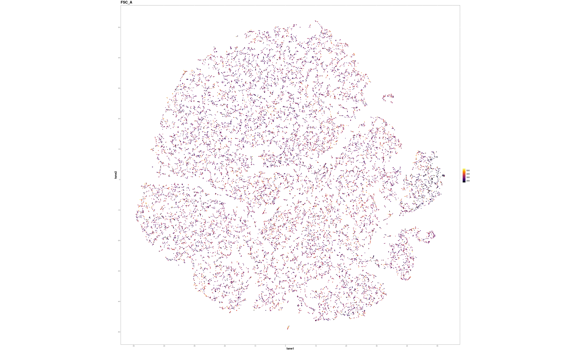<!-- -->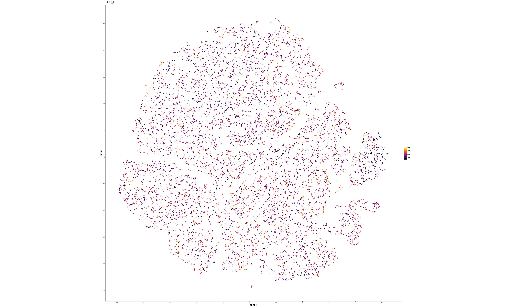<!-- -->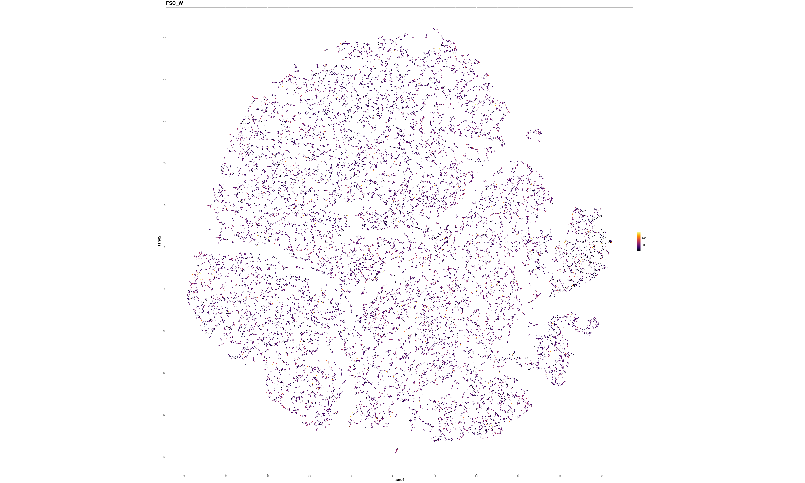<!-- -->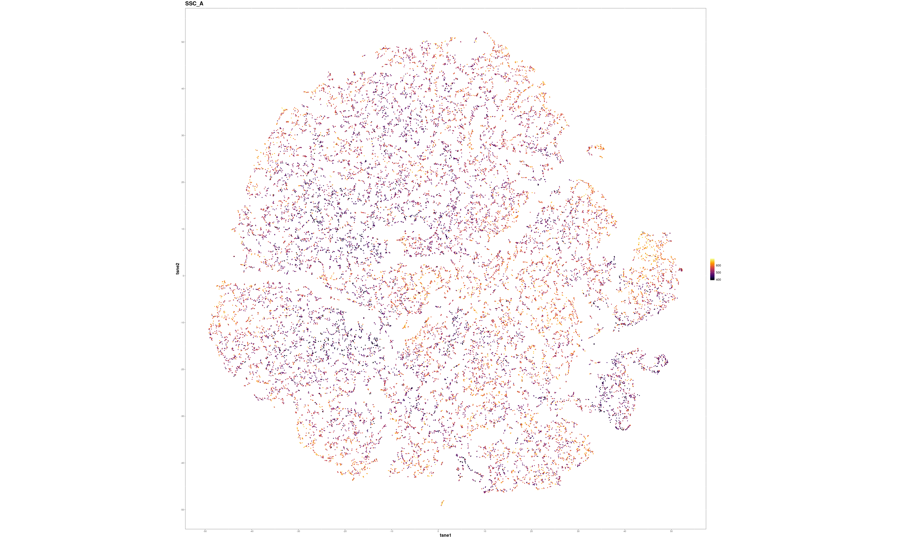<!-- -->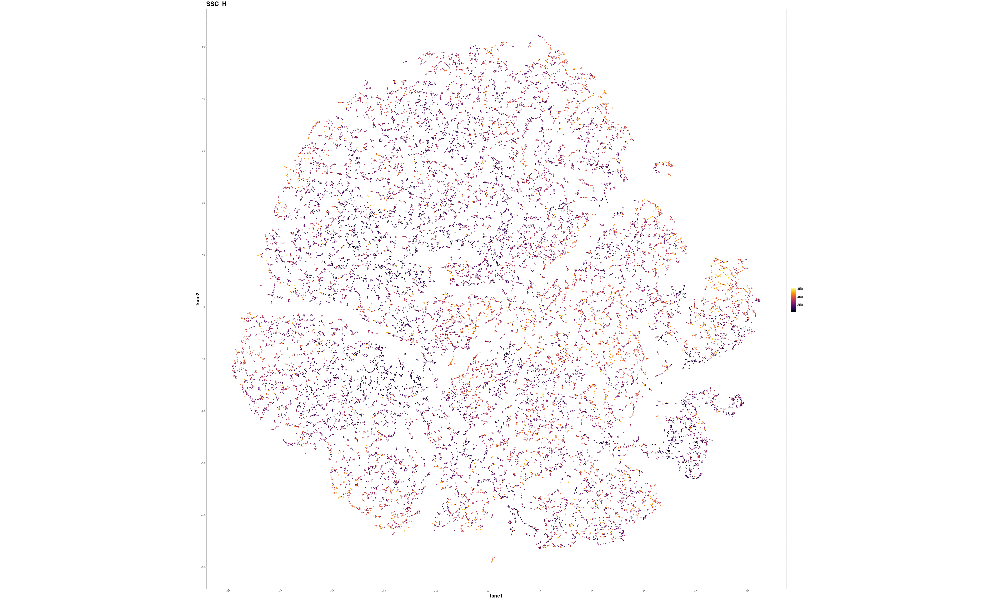<!-- -->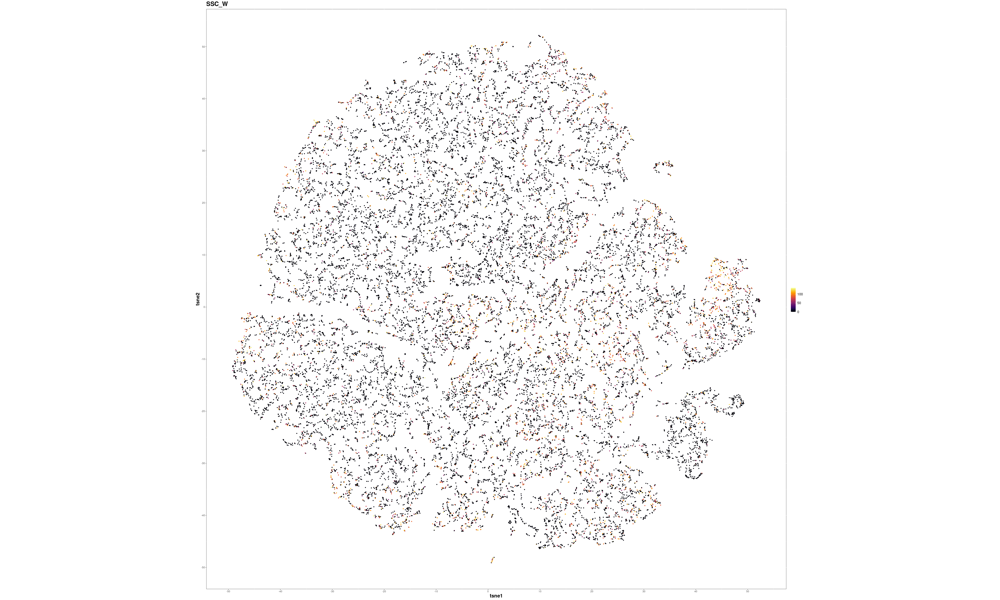<!-- -->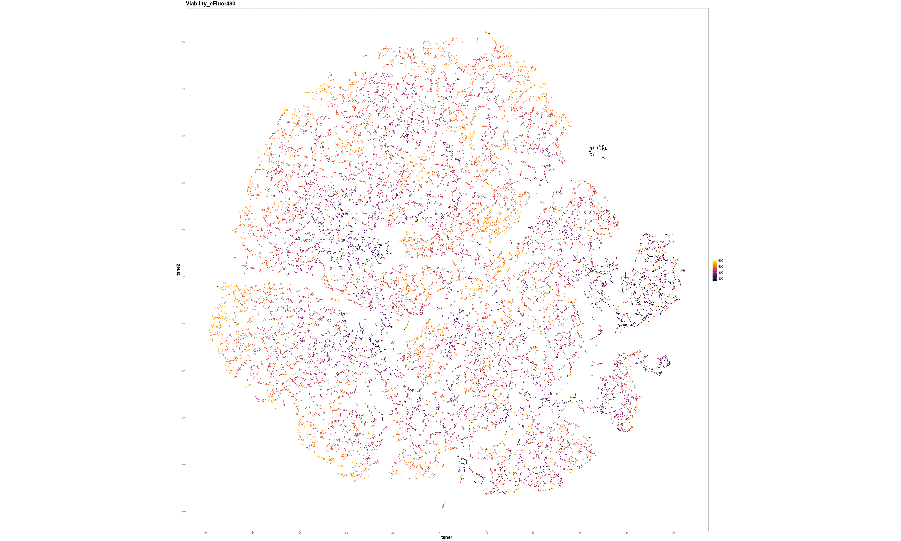<!-- -->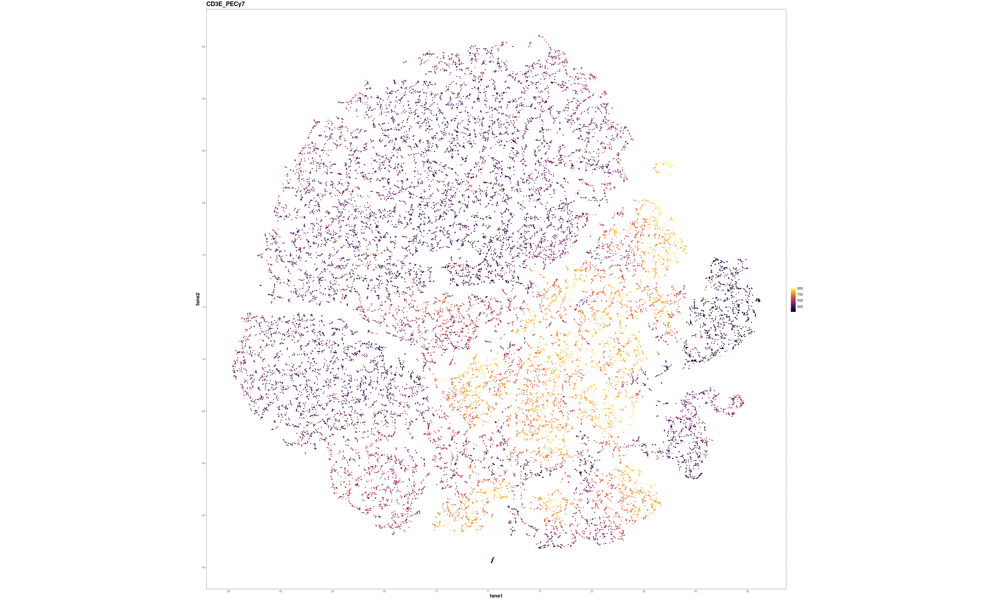<!-- -->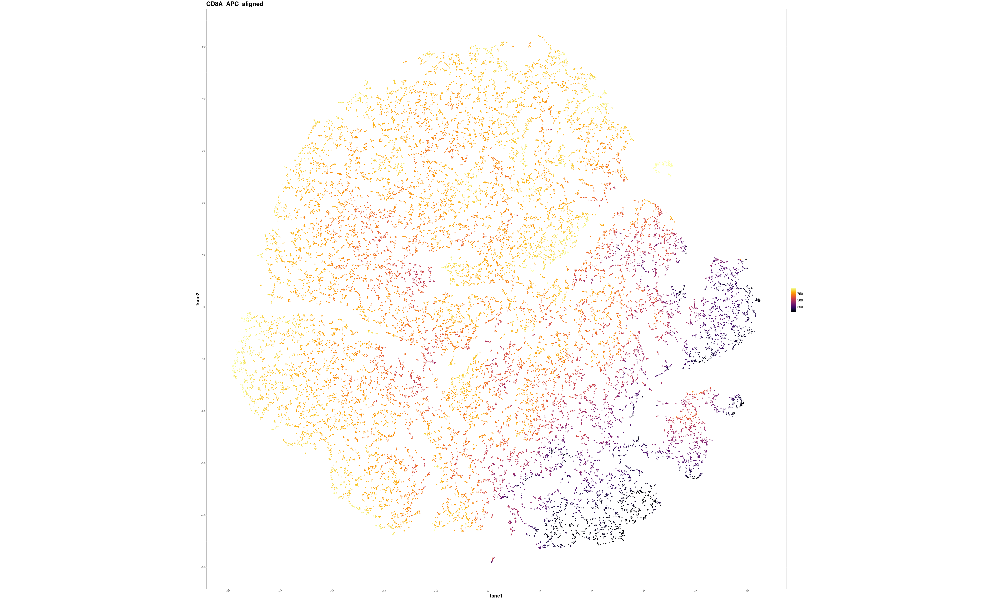<!-- --><!-- -->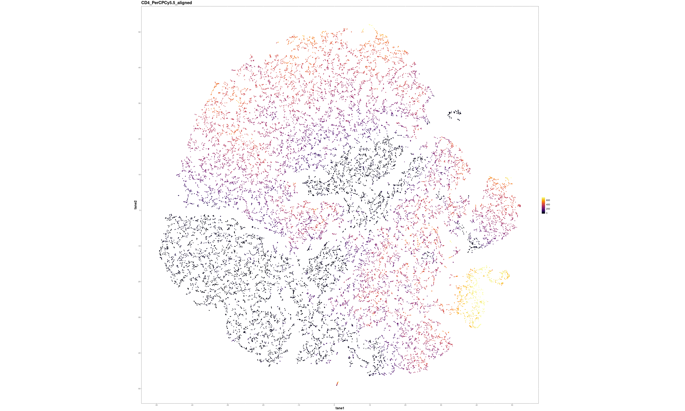<!-- -->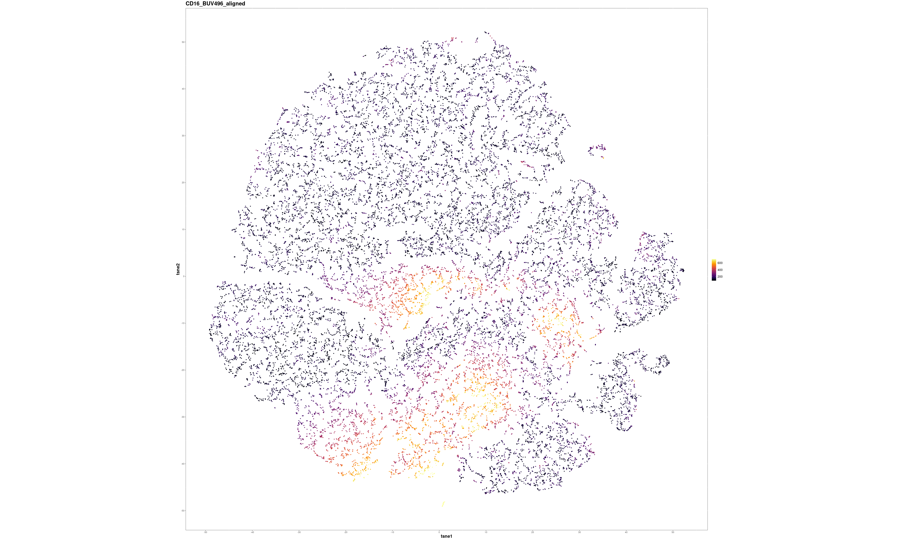<!-- -->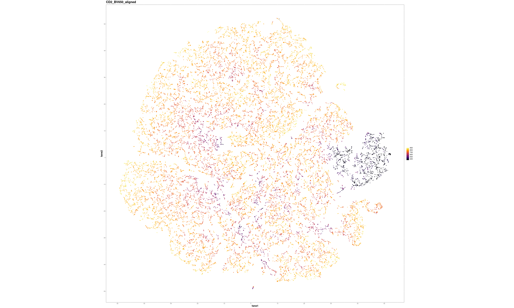<!-- -->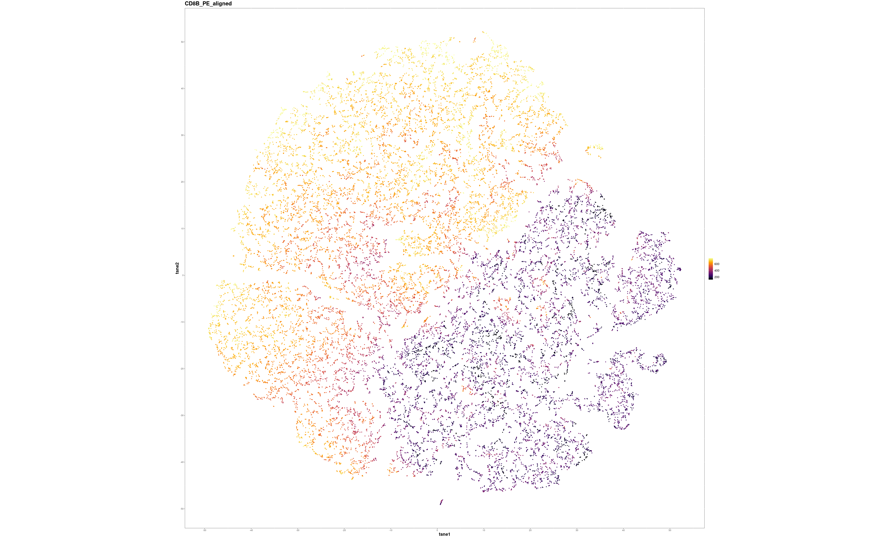<!-- -->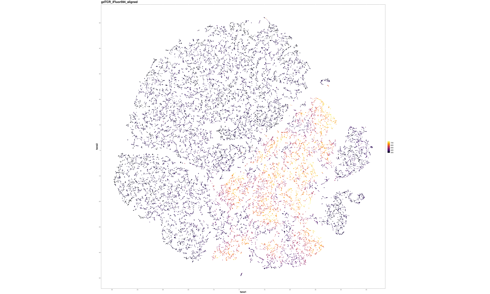<!-- -->

    ## Check your working directory for a new .png called 'AllCellMarkers_500downsample.png'

<!-- -->

Plot cell clusters:

``` r
make.colour.plot(sub.all, 
                 'tsne1', 
                 'tsne2', 
                 'FlowSOM_cluster',
                 col.type = 'factor',
                 filename = 'CellClusters_FlowSOM_6x6_500downsample.png',
                 colours = 'inferno',
                 add.label = TRUE,
                path = '/home/Jayne.Wiarda/NG10/Dissertation/TIEL_FC/CellClusteringFiltering')
```

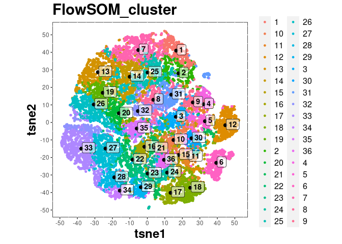<!-- -->

``` r
rm(sub.all)
```

We see that clusters 12 and 6 appear to be the debri cluster and CD4 T
cell clusters, respectively, that we want to exclude from further
analyses.

## Visualize clusters in heatmap

Visualize relative marker intensities on heatmap:

``` r
exp <- do.aggregate(dat = cell.dat, 
                    use.cols =  colnames(cell.dat[,c(23:29)]), 
                    by = 'FlowSOM_cluster')
make.pheatmap(dat = exp, 
                   sample.col = 'FlowSOM_cluster', 
                   plot.cols = colnames(cell.dat[,c(23:29)]), 
                   standard.colours = 'inferno',
                   path = '/home/Jayne.Wiarda/NG10/Dissertation/TIEL_FC/CellClusteringFiltering')
```

    ## A pheatmap has been saved to your working directory

``` r
rm(exp) # free up space
```

Cluster 12 has low relative fluorescence values for all markers,
indicating debri that ‘snuck into’ the CD3e+ parent gate. Cluster 6 has
high relative CD4 and no/little gdTCR and CD8b fluorescence, indicating
CD4 T cells, which we know are contaminating cells from sub-epithelium.

## Make stacked barplot of sample type distribution for cells in each cluster:

``` r
cell.dat$combo <- paste(cell.dat$Tissue, cell.dat$WeeksOfAge, sep = '_')
dat <- table(cell.dat$combo, cell.dat$FlowSOM_cluster)
dat <- dat[c('jejunum_5', 'jejunum_7', 'ileum_5', 'ileum_7',
             'cecum_5', 'cecum_7'),]
dat <- dat[,c('31', '32', '8', '2', '1', '14', '25', '7', '35', '34', '28', 
              '33', '27', '20', '13', '26', '19', '5', '12', '22', '21',
              '15', '6', '17', '18', '29', '36', '23', '24', '11', '10',
              '16', '30', '4', '3', '9')]
cols <- c('red3', 'darkorange3', 'chartreuse4', 'turquoise4',
          'darkorchid4', 'hotpink3')
barplot(dat,
        col = cols,
        xlab = "Cluster #", 
        ylab = "Number of cells", 
        ylim = c(0, 14000),
        las = 2,
        #legend = rownames(dat),
        border = NA,
        space = 0.05)
legend("topright",
       legend = rownames(dat),
       pch = 15,
       col = cols)
```

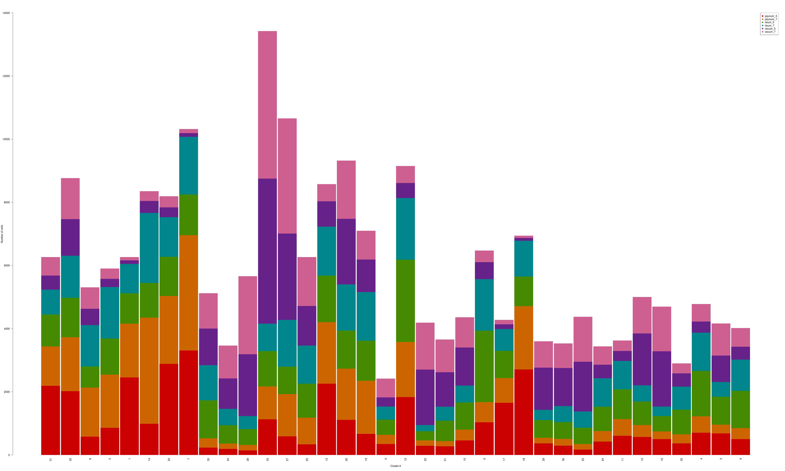<!-- -->

## Cell filtering

Filter out debri (cluster 12) and CD4 T cells (cluster 6):

``` r
cell.dat <- subset(cell.dat, !(FlowSOM_cluster %in% c('6', '12')))
```

Subset data so every sample again has the same number of cells present:

``` r
nrow(cell.dat) # how many total cells do we have?
```

    ## [1] 198982

``` r
min(table(cell.dat$SampleID)) # how many cells were in our smallest sample?
```

    ## [1] 3451

``` r
cell.dat <- do.subsample(cell.dat, 
                         targets = rep(min(table(cell.dat$SampleID)), length(unique(cell.dat$SampleID))), 
                         divide.by = 'SampleID') # subset so that every sample has the same number of cells as was present in our smallest sample
nrow(cell.dat) # how many total cells now?
```

    ## [1] 165648

## Save data

``` r
fwrite(cell.dat, "/home/Jayne.Wiarda/NG10/Dissertation/TIEL_FC/CellClusteringFiltering/AllCellsMerged_SubsetCells_HarmonyIntegratedData_FilteredData.csv") 
```

## Session information

``` r
sessionInfo()
```

    ## R version 4.1.3 (2022-03-10)
    ## Platform: x86_64-pc-linux-gnu (64-bit)
    ## Running under: Ubuntu 20.04.4 LTS
    ## 
    ## Matrix products: default
    ## BLAS:   /usr/lib/x86_64-linux-gnu/openblas-pthread/libblas.so.3
    ## LAPACK: /usr/lib/x86_64-linux-gnu/openblas-pthread/liblapack.so.3
    ## 
    ## locale:
    ##  [1] LC_CTYPE=en_US.UTF-8       LC_NUMERIC=C              
    ##  [3] LC_TIME=en_US.UTF-8        LC_COLLATE=en_US.UTF-8    
    ##  [5] LC_MONETARY=en_US.UTF-8    LC_MESSAGES=en_US.UTF-8   
    ##  [7] LC_PAPER=en_US.UTF-8       LC_NAME=C                 
    ##  [9] LC_ADDRESS=C               LC_TELEPHONE=C            
    ## [11] LC_MEASUREMENT=en_US.UTF-8 LC_IDENTIFICATION=C       
    ## 
    ## attached base packages:
    ## [1] parallel  stats     graphics  grDevices utils     datasets  methods  
    ## [8] base     
    ## 
    ## other attached packages:
    ##  [1] Biobase_2.52.0       BiocGenerics_0.38.0  ggplot2_3.3.5       
    ##  [4] pheatmap_1.0.12      FlowSOM_2.0.0        igraph_1.2.6        
    ##  [7] flowCore_2.4.0       ggpointdensity_0.1.0 RColorBrewer_1.1-2  
    ## [10] ggthemes_4.2.4       colorRamps_2.3       scales_1.1.1        
    ## [13] Rtsne_0.15           data.table_1.14.0    Spectre_0.4.1       
    ## 
    ## loaded via a namespace (and not attached):
    ##   [1] ggnewscale_0.4.5            colorspace_2.0-2           
    ##   [3] ggsignif_0.6.3              ellipsis_0.3.2             
    ##   [5] rio_0.5.27                  cytolib_2.4.0              
    ##   [7] base64enc_0.1-3             ggpubr_0.4.0               
    ##   [9] farver_2.1.0                hexbin_1.28.2              
    ##  [11] CytoML_2.4.0                ggrepel_0.9.1              
    ##  [13] fansi_0.5.0                 xml2_1.3.2                 
    ##  [15] knitr_1.34                  polyclip_1.10-0            
    ##  [17] jsonlite_1.7.2              broom_0.7.9                
    ##  [19] cluster_2.1.3               png_0.1-7                  
    ##  [21] graph_1.70.0                ggforce_0.3.3              
    ##  [23] compiler_4.1.3              httr_1.4.2                 
    ##  [25] backports_1.2.1             assertthat_0.2.1           
    ##  [27] fastmap_1.1.0               tweenr_1.0.2               
    ##  [29] htmltools_0.5.2             tools_4.1.3                
    ##  [31] ncdfFlow_2.38.0             gtable_0.3.0               
    ##  [33] glue_1.4.2                  flowWorkspace_4.4.0        
    ##  [35] dplyr_1.0.7                 ggcyto_1.20.0              
    ##  [37] Rcpp_1.0.7                  scattermore_0.7            
    ##  [39] carData_3.0-4               cellranger_1.1.0           
    ##  [41] vctrs_0.3.8                 xfun_0.26                  
    ##  [43] stringr_1.4.0               openxlsx_4.2.4             
    ##  [45] lifecycle_1.0.0             rstatix_0.7.0              
    ##  [47] XML_3.99-0.7                zlibbioc_1.38.0            
    ##  [49] MASS_7.3-56                 RProtoBufLib_2.4.0         
    ##  [51] ragg_1.2.0                  hms_1.1.0                  
    ##  [53] RBGL_1.68.0                 yaml_2.2.1                 
    ##  [55] curl_4.3.2                  aws.signature_0.6.0        
    ##  [57] gridExtra_2.3               latticeExtra_0.6-29        
    ##  [59] stringi_1.7.4               highr_0.9                  
    ##  [61] S4Vectors_0.30.2            zip_2.2.0                  
    ##  [63] rlang_0.4.11                pkgconfig_2.0.3            
    ##  [65] systemfonts_1.0.3           matrixStats_0.60.1         
    ##  [67] evaluate_0.14               lattice_0.20-45            
    ##  [69] purrr_0.3.4                 labeling_0.4.2             
    ##  [71] tidyselect_1.1.1            plyr_1.8.6                 
    ##  [73] magrittr_2.0.1              R6_2.5.1                   
    ##  [75] generics_0.1.0              DBI_1.1.1                  
    ##  [77] pillar_1.6.2                haven_2.4.3                
    ##  [79] foreign_0.8-82              withr_2.4.2                
    ##  [81] abind_1.4-5                 tibble_3.1.4               
    ##  [83] crayon_1.4.1                car_3.0-11                 
    ##  [85] utf8_1.2.2                  rmarkdown_2.11             
    ##  [87] aws.s3_0.3.21               jpeg_0.1-9                 
    ##  [89] grid_4.1.3                  readxl_1.3.1               
    ##  [91] Rgraphviz_2.36.0            ConsensusClusterPlus_1.56.0
    ##  [93] forcats_0.5.1               digest_0.6.27              
    ##  [95] tidyr_1.1.3                 textshaping_0.3.6          
    ##  [97] RcppParallel_5.1.4          stats4_4.1.3               
    ##  [99] munsell_0.5.0               viridisLite_0.4.0
