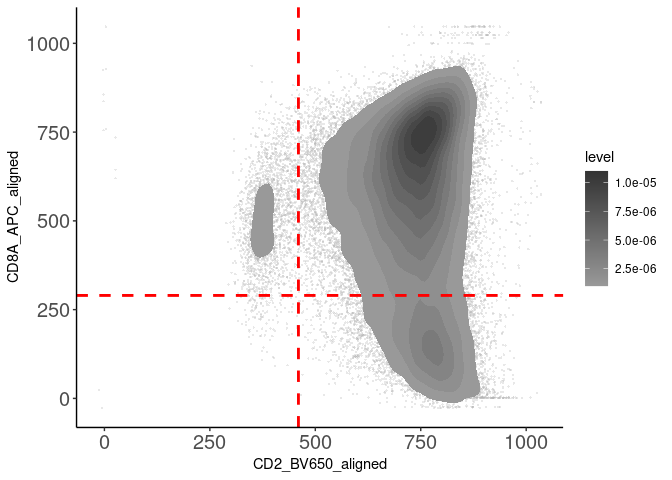
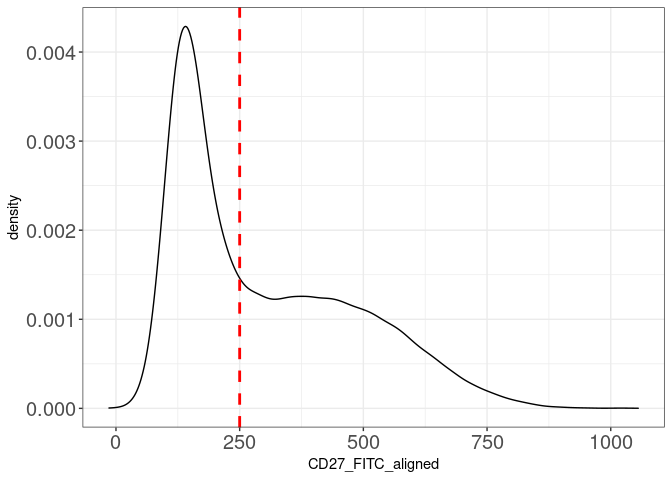

Cell Gating and Annotation
================
Jayne Wiarda
2022April28

# Overview

Epithelial cell fractions were collected from jejunum, ileum, and cecum
of eight pigs 2 and 4 weeks post-weaning. Pigs were weaned at \~3 weeks
of age, so timepoints are equivalent to \~5 or \~7 weeks of age as well.
Epithelial cell fractions were stained via flow cytometry to detect
intraepithelial T cells (CD3e+ lymphocytes) and associated phenotype
markers (CD4, CD8a, CD8b, gdTCR, CD2, CD16, CD27). Samples were
collected and stained across multiple batches.

We have already gated live CD3e+ lymphocytes from flow cytometry samples
imported into FlowJo (FlowJo, LLC). We exported channel values in .csv
format for all CD3e+ cells of each flow sample. What we want to do now
is merge together all the .csv files with channel values from our
different samples while also incorporating pertinent meta data from our
experiment.

We next integrated data to lessen batch effects. While visualizing
integrated data, we noted some CD4 T cells and what appears to be some
cellular debri that we would elected to filter out. We are now left with
an equal number of integrated, filtered cells from each sample that
represent intraepithelial T cell populations. At this point, we elected
to use manual gating to define biologically relevant T cell populations
for further analysis.

## Load required packages

See session information at bottom for further information.

``` r
library(data.table)
library(ggplot2)
library(Spectre)
library(Rtsne)
library(scales)
library(colorRamps)
library(ggthemes)
library(RColorBrewer)
library(ggpointdensity)
library(pheatmap)
library(tidyr)
library(writexl)
library(viridis)
```

    ## Loading required package: viridisLite

    ## 
    ## Attaching package: 'viridis'

    ## The following object is masked from 'package:scales':
    ## 
    ##     viridis_pal

## Set directory:

``` r
setwd('/home/Jayne.Wiarda/NG10/Dissertation/TIEL_FC/') # set working directory
dir.create('CellGatingAnnotation')
setwd('CellGatingAnnotation')
```

## Import integrated & filtered data:

``` r
cell.dat <- fread("/home/Jayne.Wiarda/NG10/Dissertation/TIEL_FC/CellClusteringFiltering/AllCellsMerged_SubsetCells_HarmonyIntegratedData_FilteredData.csv")
cell.dat
```

    ##         FSC_A FSC_H FSC_W SSC_A SSC_H SSC_W CD8A_APC Viability_eFluor480
    ##      1:   234   200   578   454   328     1      781                 452
    ##      2:   322   302   568   533   381     2      756                 468
    ##      3:   403   382   597   543   376     3      864                 523
    ##      4:   172   161   526   428   331     1      768                 394
    ##      5:   268   259   561   432   323     0      749                 398
    ##     ---                                                                 
    ## 165644:   247   212   569   546   360     1      667                 439
    ## 165645:   257   234   565   520   362     3      807                 529
    ## 165646:   371   341   605   635   420    97      461                 542
    ## 165647:   246   234   554   484   355     1      777                 452
    ## 165648:   270   251   556   637   425    98        0                 492
    ##         CD27_FITC CD4_PerCPCy5.5 CD16_BUV496 CD2_BV650 CD8B_PE gdTCR_iFluor594
    ##      1:       128              0          96       733     501             344
    ##      2:       111              0         268       722     455             327
    ##      3:       700            336         108       835     649             345
    ##      4:       373            231          92       634     483             342
    ##      5:       634            141         111       735     650             343
    ##     ---                                                                       
    ## 165644:       250             81         159       795     646             330
    ## 165645:       437              0         138       810     575             342
    ## 165646:       758            461         346       861     304             748
    ## 165647:       331            449         124       795     739             325
    ## 165648:       175            365         143       909     184             606
    ##         CD3E_PECy7                                                 FileName
    ##      1:        100 13ce_E9_E09_009_CD3e+_CD3EposOnly_ChannelValues_20220209
    ##      2:        489 13ce_E9_E09_009_CD3e+_CD3EposOnly_ChannelValues_20220209
    ##      3:        437 13ce_E9_E09_009_CD3e+_CD3EposOnly_ChannelValues_20220209
    ##      4:        203 13ce_E9_E09_009_CD3e+_CD3EposOnly_ChannelValues_20220209
    ##      5:        314 13ce_E9_E09_009_CD3e+_CD3EposOnly_ChannelValues_20220209
    ##     ---                                                                    
    ## 165644:        250 9jej_E1_E01_001_CD3e+_CD3EposOnly_ChannelValues_20220209
    ## 165645:        348 9jej_E1_E01_001_CD3e+_CD3EposOnly_ChannelValues_20220209
    ## 165646:        892 9jej_E1_E01_001_CD3e+_CD3EposOnly_ChannelValues_20220209
    ## 165647:        553 9jej_E1_E01_001_CD3e+_CD3EposOnly_ChannelValues_20220209
    ## 165648:        714 9jej_E1_E01_001_CD3e+_CD3EposOnly_ChannelValues_20220209
    ##         FileNo Batch WeeksOfAge  Tissue AnimalID SampleID CD8A_APC_aligned
    ##      1:      1     B          5   cecum       13  13cecum        804.94032
    ##      2:      1     B          5   cecum       13  13cecum        779.94585
    ##      3:      1     B          5   cecum       13  13cecum        887.96912
    ##      4:      1     B          5   cecum       13  13cecum        791.95760
    ##      5:      1     B          5   cecum       13  13cecum        772.95576
    ##     ---                                                                   
    ## 165644:     48     B          5 jejunum        9 9jejunum        690.95516
    ## 165645:     48     B          5 jejunum        9 9jejunum        830.94480
    ## 165646:     48     B          5 jejunum        9 9jejunum        485.29194
    ## 165647:     48     B          5 jejunum        9 9jejunum        800.97649
    ## 165648:     48     B          5 jejunum        9 9jejunum         25.04248
    ##         CD27_FITC_aligned CD4_PerCPCy5.5_aligned CD16_BUV496_aligned
    ##      1:          133.4806              -2.463991            88.19468
    ##      2:          116.4879              -2.469313           260.20000
    ##      3:          705.5210             333.506564           100.22444
    ##      4:          378.5043             228.518784            84.21201
    ##      5:          639.5019             138.520473           103.21034
    ##     ---                                                             
    ## 165644:          255.5015              78.520727           151.21015
    ## 165645:          442.4866              -2.468335           130.19903
    ## 165646:          764.0244             458.135516           338.60706
    ## 165647:          336.5324             446.498162           116.23310
    ## 165648:          182.3411             361.153712           136.63788
    ##         CD2_BV650_aligned CD8B_PE_aligned gdTCR_iFluor594_aligned
    ##      1:          720.0499        525.8618                344.4821
    ##      2:          709.0445        479.8581                327.4828
    ##      3:          822.0191        673.8394                345.4866
    ##      4:          621.0321        507.8491                342.4846
    ##      5:          722.0338        674.8502                343.4844
    ##     ---                                                          
    ## 165644:          782.0338        670.8500                330.4845
    ## 165645:          797.0455        599.8587                342.4827
    ## 165646:          847.6114        328.5152                748.5543
    ## 165647:          782.0099        763.8321                325.4881
    ## 165648:          894.4834        207.5513                606.7612
    ##         FlowSOM_cluster FlowSOM_metacluster     combo
    ##      1:              27                   1   cecum_5
    ##      2:              28                   1   cecum_5
    ##      3:               1                   1   cecum_5
    ##      4:              14                   1   cecum_5
    ##      5:               2                   1   cecum_5
    ##     ---                                              
    ## 165644:              32                   1 jejunum_5
    ## 165645:              32                   1 jejunum_5
    ## 165646:               4                   2 jejunum_5
    ## 165647:               7                   1 jejunum_5
    ## 165648:              18                   3 jejunum_5

## Perform gating

Gate gamma delta versus alpha beta T cells:

``` r
#colnames(cell.dat)
ggplot() + # make a t-SNE plot
  geom_point(data=cell.dat, aes(x = gdTCR_iFluor594_aligned, y = SSC_A), alpha = 0.3, size = 0.5, pch = 16, fill = 'grey70', col = 'grey70') + # fully aware SSC_A parameter is not batch-corrected here
  stat_density_2d(data=cell.dat, aes(x = gdTCR_iFluor594_aligned, y = SSC_A, fill = ..level..), geom = "polygon") + 
  scale_fill_gradientn(colours = rev(c('grey20', 'grey40', 'grey60'))) +
  theme_classic() +
  geom_vline(aes(xintercept = 395), color = 'red', lwd = 1, linetype = 'dashed') + # define gate for positive vs negative gdTCR_iFluor594_aligned signal
  theme(axis.text.x=element_text(size=15), axis.text.y=element_text(size=15))
```

<!-- -->

``` r
ggplot(cell.dat, aes(x=gdTCR_iFluor594_aligned)) +
    geom_density(color="black", alpha=2) + 
    geom_vline(aes(xintercept = 395), color = 'red', lwd = 1, linetype = 'dashed') +
    theme_bw() +
  theme(axis.text.x=element_text(size=15), axis.text.y=element_text(size=15))
```

<!-- -->

``` r
gd <- subset(cell.dat, gdTCR_iFluor594_aligned >= 395) # identify cells with gated positive gdTCR_iFluor594_aligned signal as gamma delta (gd) T cells
ab <- subset(cell.dat, gdTCR_iFluor594_aligned < 395) # identify cells with gated negative gdTCR_iFluor594_aligned signal as alpha beta (ab) T cells
isTRUE( nrow(gd) + nrow(ab) == nrow(cell.dat)) # make sure cells in gd + ab is equal to cell.dat
```

    ## [1] TRUE

Further gating of CD2 vs CD8a within gamma delta T cells:

``` r
#colnames(cell.dat)
ggplot() + # make a t-SNE plot
  geom_point(data=gd, aes(x = CD2_BV650_aligned, y = CD8A_APC_aligned), alpha = 0.3, size = 0.5, pch = 16, fill = 'grey70', col = 'grey70') +
  stat_density_2d(data=gd, aes(x = CD2_BV650_aligned, y = CD8A_APC_aligned, fill = ..level..), geom = "polygon") + 
  scale_fill_gradientn(colours = rev(c('grey20', 'grey40', 'grey60'))) +
  theme_classic() +
  geom_vline(aes(xintercept = 460), color = 'red', lwd = 1, linetype = 'dashed') + # define gate for positive vs negative CD2_BV650_aligned signal
  geom_hline(aes( yintercept = 290), color = 'red', lwd = 1, linetype = 'dashed') + # define gate for positive vs negative CD8A_APC_aligned signal
    theme(axis.text.x=element_text(size=15), axis.text.y=element_text(size=15))
```

<!-- -->

``` r
ggplot(gd, aes(x=CD2_BV650_aligned)) +
    geom_density(color="black", alpha=2) + 
    geom_vline(aes(xintercept = 460), color = 'red', lwd = 1, linetype = 'dashed') +
    theme_bw() +
    theme(axis.text.x=element_text(size=15), axis.text.y=element_text(size=15))
```

<!-- -->

``` r
ggplot(gd, aes(x=CD8A_APC_aligned)) +
    geom_density(color="black", alpha=2) + 
    geom_vline(aes(xintercept = 290), color = 'red', lwd = 1, linetype = 'dashed') +
    theme_bw() +
    theme(axis.text.x=element_text(size=15), axis.text.y=element_text(size=15))
```

<!-- -->

Further gating of CD8b vs CD8a within alpha beta T cells:

``` r
#colnames(cell.dat)
ggplot() + # make a t-SNE plot
  geom_point(data=ab, aes(x = CD8B_PE_aligned, y = CD8A_APC_aligned), alpha = 0.3, size = 0.5, pch = 16, fill = 'grey70', col = 'grey70') +
  stat_density_2d(data=ab, aes(x = CD8B_PE_aligned, y = CD8A_APC_aligned, fill = ..level..), geom = "polygon") + 
  scale_fill_gradientn(colours = rev(c('grey20', 'grey40', 'grey60'))) +
  theme_classic() +
  geom_vline(aes(xintercept = 350), color = 'red', lwd = 1, linetype = 'dashed') + # define gate for positive vs negative CD8B_PE_aligned signal
  geom_hline(aes( yintercept = 290), color = 'red', lwd = 1, linetype = 'dashed') + # define gate for positive vs negative CD8A_APC_aligned signal
    theme(axis.text.x=element_text(size=15), axis.text.y=element_text(size=15))
```

<!-- -->

``` r
ggplot(ab, aes(x=CD8A_APC_aligned)) +
    geom_density(color="black", alpha=2) + 
    geom_vline(aes(xintercept = 290), color = 'red', lwd = 1, linetype = 'dashed') +
    theme_bw() +
    theme(axis.text.x=element_text(size=15), axis.text.y=element_text(size=15))
```

<!-- -->

``` r
ggplot(ab, aes(x=CD8B_PE_aligned)) +
    geom_density(color="black", alpha=2) + 
    geom_vline(aes(xintercept = 350), color = 'red', lwd = 1, linetype = 'dashed') +
    theme_bw() +
    theme(axis.text.x=element_text(size=15), axis.text.y=element_text(size=15))
```

<!-- -->

Gating CD16 vs CD27 from all cells:

Define for all cells since we will apply to each of the 4 gd & 4 ab T
cell subsets.

``` r
#colnames(cell.dat)
ggplot() + # make a t-SNE plot
  geom_point(data=cell.dat, aes(x = CD16_BUV496_aligned, y = CD27_FITC_aligned), alpha = 0.3, size = 0.5, pch = 16, fill = 'grey70', col = 'grey70') +
  stat_density_2d(data=cell.dat, aes(x = CD16_BUV496_aligned, y = CD27_FITC_aligned, fill = ..level..), geom = "polygon") + 
  scale_fill_gradientn(colours = rev(c('grey20', 'grey40', 'grey60'))) +
  theme_classic() +
  geom_vline(aes(xintercept = 230), color = 'red', lwd = 1, linetype = 'dashed') + # define gate for positive vs negative CD16_BUV496_aligned signal
  geom_hline(aes( yintercept = 250), color = 'red', lwd = 1, linetype = 'dashed') + # define gate for positive vs negative CD27_FITC_aligned signal
    theme(axis.text.x=element_text(size=15), axis.text.y=element_text(size=15))
```

<!-- -->

``` r
ggplot(cell.dat, aes(x=CD16_BUV496_aligned)) +
    geom_density(color="black", alpha=2) + 
    geom_vline(aes(xintercept = 230), color = 'red', lwd = 1, linetype = 'dashed') +
    theme_bw() +
    theme(axis.text.x=element_text(size=15), axis.text.y=element_text(size=15))
```

<!-- -->

``` r
ggplot(cell.dat, aes(x=CD27_FITC_aligned)) +
    geom_density(color="black", alpha=2) + 
    geom_vline(aes(xintercept = 250), color = 'red', lwd = 1, linetype = 'dashed') +
    theme_bw() +
    theme(axis.text.x=element_text(size=15), axis.text.y=element_text(size=15))
```

<!-- -->

## Assign cell identities

First assign gating thresholds:

``` r
thres_gdTCR <- 395
thres_CD2 <- 460
thres_CD8a <- 290
thres_CD8b <- 350
thres_CD16 <- 230
thres_CD27 <- 250
```

Now assign cell identities based on expression thresholds from gating
strategies shown above:

``` r
cell.dat$cellNo <- paste0('cell', 1:nrow(cell.dat))

GDCD2posCD8Apos <- cell.dat[gdTCR_iFluor594_aligned >= thres_gdTCR & CD2_BV650_aligned >= thres_CD2 & CD8A_APC_aligned >= thres_CD8a,]
GDCD2posCD8Aneg <- cell.dat[gdTCR_iFluor594_aligned >= thres_gdTCR & CD2_BV650_aligned >= thres_CD2 & CD8A_APC_aligned < thres_CD8a,]
GDCD2negCD8Apos <- cell.dat[gdTCR_iFluor594_aligned >= thres_gdTCR & CD2_BV650_aligned < thres_CD2 & CD8A_APC_aligned >= thres_CD8a,]
GDCD2negCD8Aneg <- cell.dat[gdTCR_iFluor594_aligned >= thres_gdTCR & CD2_BV650_aligned < thres_CD2 & CD8A_APC_aligned < thres_CD8a,]
isTRUE(nrow(GDCD2negCD8Aneg) + nrow(GDCD2negCD8Apos) + nrow(GDCD2posCD8Aneg) + nrow(GDCD2posCD8Apos) == nrow(gd)) # make sure we didn't miss any cells
```

    ## [1] TRUE

``` r
ABCD8AposCD8Bpos <- cell.dat[gdTCR_iFluor594_aligned < thres_gdTCR & CD8A_APC_aligned >= thres_CD8a & CD8B_PE_aligned >= thres_CD8b,]
ABCD8AposCD8Bneg <- cell.dat[gdTCR_iFluor594_aligned < thres_gdTCR & CD8A_APC_aligned >= thres_CD8a & CD8B_PE_aligned < thres_CD8b,]
ABCD8AnegCD8Bpos <- cell.dat[gdTCR_iFluor594_aligned < thres_gdTCR & CD8A_APC_aligned < thres_CD8a & CD8B_PE_aligned >= thres_CD8b,]
ABCD8AnegCD8Bneg <- cell.dat[gdTCR_iFluor594_aligned < thres_gdTCR & CD8A_APC_aligned < thres_CD8a & CD8B_PE_aligned < thres_CD8b,]
isTRUE(nrow(ABCD8AnegCD8Bneg) + nrow(ABCD8AnegCD8Bpos) + nrow(ABCD8AposCD8Bneg) + nrow(ABCD8AposCD8Bpos) == nrow(ab)) # make sure we didn't miss any cells
```

    ## [1] TRUE

``` r
isTRUE(nrow(ABCD8AnegCD8Bneg) + nrow(ABCD8AnegCD8Bpos) + nrow(ABCD8AposCD8Bneg) + nrow(ABCD8AposCD8Bpos) + nrow(GDCD2negCD8Aneg) + nrow(GDCD2negCD8Apos) + nrow(GDCD2posCD8Aneg) + nrow(GDCD2posCD8Apos) == nrow(cell.dat)) # make sure we didn't miss any cells
```

    ## [1] TRUE

``` r
CD16posCD27pos <- cell.dat[CD16_BUV496_aligned >= thres_CD16 & CD27_FITC_aligned >= thres_CD27,]
CD16posCD27neg <- cell.dat[CD16_BUV496_aligned >= thres_CD16 & CD27_FITC_aligned < thres_CD27,]
CD16negCD27pos <- cell.dat[CD16_BUV496_aligned < thres_CD16 & CD27_FITC_aligned >= thres_CD27,]
CD16negCD27neg <- cell.dat[CD16_BUV496_aligned < thres_CD16 & CD27_FITC_aligned < thres_CD27,]
isTRUE(nrow(CD16negCD27neg) + nrow(CD16negCD27pos) + nrow(CD16posCD27neg) + nrow(CD16posCD27pos) == nrow(cell.dat)) # make sure we didn't miss any cells
```

    ## [1] TRUE

``` r
cell.dat$subset1 <- rep('_', nrow(cell.dat)) # if we left any cells un-annotated, they will show up with an ID of '_'
cell.dat <- within(cell.dat, subset1[cellNo %in% GDCD2posCD8Apos$cellNo] <- 'GD_CD2posCD8Apos')
cell.dat <- within(cell.dat, subset1[cellNo %in% GDCD2posCD8Aneg$cellNo] <- 'GD_CD2posCD8Aneg')
cell.dat <- within(cell.dat, subset1[cellNo %in% GDCD2negCD8Apos$cellNo] <- 'GD_CD2negCD8Apos')
cell.dat <- within(cell.dat, subset1[cellNo %in% GDCD2negCD8Aneg$cellNo] <- 'GD_CD2negCD8Aneg')
cell.dat <- within(cell.dat, subset1[cellNo %in% ABCD8AposCD8Bpos$cellNo] <- 'AB_CD8AposCD8Bpos')
cell.dat <- within(cell.dat, subset1[cellNo %in% ABCD8AposCD8Bneg$cellNo] <- 'AB_CD8AposCD8Bneg')
cell.dat <- within(cell.dat, subset1[cellNo %in% ABCD8AnegCD8Bpos$cellNo] <- 'AB_CD8AnegCD8Bpos')
cell.dat <- within(cell.dat, subset1[cellNo %in% ABCD8AnegCD8Bneg$cellNo] <- 'AB_CD8AnegCD8Bneg')
table(cell.dat$subset1) # make sure no cells assigned an identity of '_'
```

    ## 
    ## AB_CD8AnegCD8Bneg AB_CD8AnegCD8Bpos AB_CD8AposCD8Bneg AB_CD8AposCD8Bpos 
    ##              1923                62              7348            107153 
    ##  GD_CD2negCD8Aneg  GD_CD2negCD8Apos  GD_CD2posCD8Aneg  GD_CD2posCD8Apos 
    ##               124              2070              8758             38210

``` r
cell.dat$subset2 <- rep('_', nrow(cell.dat)) # if we left any cells un-annotated, they will show up with an ID of '_'
cell.dat <- within(cell.dat, subset2[cellNo %in% CD16posCD27pos$cellNo] <- 'CD16posCD27pos')
cell.dat <- within(cell.dat, subset2[cellNo %in% CD16posCD27neg$cellNo] <- 'CD16posCD27neg')
cell.dat <- within(cell.dat, subset2[cellNo %in% CD16negCD27pos$cellNo] <- 'CD16negCD27pos')
cell.dat <- within(cell.dat, subset2[cellNo %in% CD16negCD27neg$cellNo] <- 'CD16negCD27neg')
table(cell.dat$subset2) # make sure no cells assigned an identity of '_'
```

    ## 
    ## CD16negCD27neg CD16negCD27pos CD16posCD27neg CD16posCD27pos 
    ##          55217          65963          30274          14194

``` r
cell.dat$subset3 <- paste(cell.dat$subset1, cell.dat$subset2, sep = '_') # create one more annotation that combines gd/ab subset and CD16/CD27 expression combinations

rm(GDCD2posCD8Apos, GDCD2posCD8Aneg, GDCD2negCD8Apos, GDCD2negCD8Aneg,
   ABCD8AposCD8Bpos, ABCD8AposCD8Bneg, ABCD8AnegCD8Bpos, ABCD8AnegCD8Bneg,
   CD16posCD27pos, CD16posCD27neg, CD16negCD27pos, CD16negCD27neg) # clear up space
```

## Visualize annotations:

First subset data again to make the process faster:

``` r
sub.all <- do.subsample(cell.dat, 
                        targets = rep(500, length(unique(cell.dat$SampleID))), 
                        divide.by = 'SampleID') # subset 500 random cells from each sample
```

Generate t-SNE coordinates for data:

``` r
colnames(sub.all)
```

    ##  [1] "FSC_A"                   "FSC_H"                  
    ##  [3] "FSC_W"                   "SSC_A"                  
    ##  [5] "SSC_H"                   "SSC_W"                  
    ##  [7] "CD8A_APC"                "Viability_eFluor480"    
    ##  [9] "CD27_FITC"               "CD4_PerCPCy5.5"         
    ## [11] "CD16_BUV496"             "CD2_BV650"              
    ## [13] "CD8B_PE"                 "gdTCR_iFluor594"        
    ## [15] "CD3E_PECy7"              "FileName"               
    ## [17] "FileNo"                  "Batch"                  
    ## [19] "WeeksOfAge"              "Tissue"                 
    ## [21] "AnimalID"                "SampleID"               
    ## [23] "CD8A_APC_aligned"        "CD27_FITC_aligned"      
    ## [25] "CD4_PerCPCy5.5_aligned"  "CD16_BUV496_aligned"    
    ## [27] "CD2_BV650_aligned"       "CD8B_PE_aligned"        
    ## [29] "gdTCR_iFluor594_aligned" "FlowSOM_cluster"        
    ## [31] "FlowSOM_metacluster"     "combo"                  
    ## [33] "cellNo"                  "subset1"                
    ## [35] "subset2"                 "subset3"

``` r
set.seed(111)
tsne.out <- Rtsne(sub.all[,c(23:29)], # use only these columns to generate t-SNE coordinates
                  perplexity = 15) 
sub.all$tsne1 <- tsne.out$Y[,1]
sub.all$tsne2 <- tsne.out$Y[,2]
rm(tsne.out) # free up space
```

Plot each cell marker:

``` r
ggplot() + 
  geom_point(data = sub.all, 
             aes(x = tsne1, 
                 y = tsne2, 
                 color = CD8A_APC_aligned)) +
  theme_classic() +
  scale_color_viridis(option = 'B', limits = c(0,1000), oob = squish)+
  theme(legend.position = "None", axis.text.x=element_text(size=20), axis.text.y=element_text(size=20)) +
  labs(title = "CD8A_APC")
```

<!-- -->

``` r
ggplot() + 
  geom_point(data = sub.all, 
             aes(x = tsne1, 
                 y = tsne2, 
                 color = CD27_FITC_aligned)) +
  theme_classic() +
  scale_color_viridis(option = 'B', limits = c(0,1000), oob = squish)+
  theme(legend.position = "None", axis.text.x=element_text(size=20), axis.text.y=element_text(size=20)) +
  labs(title = "CD27_FITC")
```

<!-- -->

``` r
ggplot() + 
  geom_point(data = sub.all, 
             aes(x = tsne1, 
                 y = tsne2, 
                 color = CD4_PerCPCy5.5_aligned)) +
  theme_classic() +
  scale_color_viridis(option = 'B', limits = c(0,1000), oob = squish)+
  theme(legend.position = "None", axis.text.x=element_text(size=20), axis.text.y=element_text(size=20)) +
  labs(title = "CD4_PerCPCy5.5")
```

<!-- -->

``` r
ggplot() + 
  geom_point(data = sub.all, 
             aes(x = tsne1, 
                 y = tsne2, 
                 color = CD16_BUV496_aligned)) +
  theme_classic() +
  scale_color_viridis(option = 'B', limits = c(0,1000), oob = squish)+
  theme(legend.position = "None", axis.text.x=element_text(size=20), axis.text.y=element_text(size=20)) +
  labs(title = "CD16_BUV496")
```

<!-- -->

``` r
ggplot() + 
  geom_point(data = sub.all, 
             aes(x = tsne1, 
                 y = tsne2, 
                 color = CD2_BV650_aligned)) +
  theme_classic() +
  scale_color_viridis(option = 'B', limits = c(0,1000), oob = squish)+
  theme(legend.position = "None", axis.text.x=element_text(size=20), axis.text.y=element_text(size=20)) +
  labs(title = "CD2_BV650")
```

<!-- -->

``` r
ggplot() + 
  geom_point(data = sub.all, 
             aes(x = tsne1, 
                 y = tsne2, 
                 color = CD8B_PE_aligned)) +
  theme_classic() +
  scale_color_viridis(option = 'B', limits = c(0,1000), oob = squish)+
  theme(legend.position = "None", axis.text.x=element_text(size=20), axis.text.y=element_text(size=20)) +
  labs(title = "CD8B_PE")
```

<!-- -->

``` r
ggplot() + 
  geom_point(data = sub.all, 
             aes(x = tsne1, 
                 y = tsne2, 
                 color = gdTCR_iFluor594_aligned)) +
  theme_classic() +
  scale_color_viridis(option = 'B', limits = c(0,1000), oob = squish)+
  theme(legend.position = "None", axis.text.x=element_text(size=20), axis.text.y=element_text(size=20)) +
  labs(title = "gdTCR_iFluor594")
```

<!-- -->

Plot each of the eight primary cell populations:

``` r
sub.all$PrimaryPopulation <- factor(sub.all$subset1, levels = c('AB_CD8AposCD8Bneg', 'AB_CD8AposCD8Bpos',
                                                      'AB_CD8AnegCD8Bpos', 'AB_CD8AnegCD8Bneg',
                                                     'GD_CD2negCD8Apos', 'GD_CD2posCD8Apos',
                                                     'GD_CD2posCD8Aneg', 'GD_CD2negCD8Aneg'))
cols <- c('#E7298A', '#E6AB02', '#D95F02', '#A6761D', '#666666', '#66A61E', '#7570B3', '#1B9E77')
ggplot() + 
  geom_point(data = sub.all, 
             aes(x = tsne1, 
                 y = tsne2, 
                 color = PrimaryPopulation)) +
  theme_classic() +
  scale_color_manual(values = cols)+
  theme(axis.text.x=element_text(size=15), axis.text.y=element_text(size=15)) +
  labs(title = "Primary T-IEL populations")
```

<!-- -->

Plot each of the four functional cell subsets:

``` r
sub.all$FunctionalSubset <- factor(sub.all$subset2, 
                                   levels = c('CD16negCD27pos', 'CD16posCD27pos',
                                              'CD16posCD27neg', 'CD16negCD27neg'))
cols <- c('#F8766D', '#7CAE00', '#00BFC4', '#C77CFF')
ggplot() + 
  geom_point(data = sub.all, 
             aes(x = tsne1, 
                 y = tsne2, 
                 color = FunctionalSubset)) +
  theme_classic() +
  scale_color_manual(values = cols)+
  theme(axis.text.x=element_text(size=15), axis.text.y=element_text(size=15)) +
  labs(title = "Functional T-IEL subsets")
```

<!-- -->

Plot each of the sample types:

``` r
sub.all$combo <- factor(sub.all$combo, 
                                   levels = c('jejunum_5', 'jejunum_7', 
                                              'ileum_5', 'ileum_7',
                                              'cecum_5', 'cecum_7'))
cols <- c('red3', 'darkorange3',
          'chartreuse4', 'turquoise4',
          'darkorchid4', 'hotpink3')
ggplot() + 
  geom_point(data = sub.all, 
             aes(x = tsne1, 
                 y = tsne2, 
                 color = combo)) +
  theme_classic() + 
  scale_color_manual(values = cols) +
  theme(axis.text.x=element_text(size=15), axis.text.y=element_text(size=15)) +
  labs(title = "Samples")
```

<!-- -->

## Visualize clusters in heatmap

Visualize relative marker intensities on heatmap:

``` r
colnames(cell.dat)
```

    ##  [1] "FSC_A"                   "FSC_H"                  
    ##  [3] "FSC_W"                   "SSC_A"                  
    ##  [5] "SSC_H"                   "SSC_W"                  
    ##  [7] "CD8A_APC"                "Viability_eFluor480"    
    ##  [9] "CD27_FITC"               "CD4_PerCPCy5.5"         
    ## [11] "CD16_BUV496"             "CD2_BV650"              
    ## [13] "CD8B_PE"                 "gdTCR_iFluor594"        
    ## [15] "CD3E_PECy7"              "FileName"               
    ## [17] "FileNo"                  "Batch"                  
    ## [19] "WeeksOfAge"              "Tissue"                 
    ## [21] "AnimalID"                "SampleID"               
    ## [23] "CD8A_APC_aligned"        "CD27_FITC_aligned"      
    ## [25] "CD4_PerCPCy5.5_aligned"  "CD16_BUV496_aligned"    
    ## [27] "CD2_BV650_aligned"       "CD8B_PE_aligned"        
    ## [29] "gdTCR_iFluor594_aligned" "FlowSOM_cluster"        
    ## [31] "FlowSOM_metacluster"     "combo"                  
    ## [33] "cellNo"                  "subset1"                
    ## [35] "subset2"                 "subset3"

``` r
exp <- do.aggregate(dat = cell.dat, 
                    use.cols = colnames(cell.dat[,c(23:24, 26:29)]), 
                    by = 'subset1')
make.pheatmap(dat = exp, 
                   sample.col = 'subset1', 
                   plot.cols = colnames(cell.dat[,c(23:24, 26:29)]), 
                   standard.colours = 'inferno',
                   path = '/home/Jayne.Wiarda/NG10/Dissertation/TIEL_FC/CellGatingAnnotation')
```

    ## A pheatmap has been saved to your working directory

``` r
exp <- do.aggregate(dat = cell.dat, 
                    use.cols = colnames(cell.dat[,c(23:24, 26:29)]), 
                    by = 'subset2')
make.pheatmap(dat = exp, 
                   sample.col = 'subset2', 
                   plot.cols = colnames(cell.dat[,c(23:24, 26:29)]), 
                   standard.colours = 'inferno',
                   path = '/home/Jayne.Wiarda/NG10/Dissertation/TIEL_FC/CellGatingAnnotation')
```

    ## A pheatmap has been saved to your working directory

``` r
exp <- do.aggregate(dat = cell.dat, 
                    use.cols = colnames(cell.dat[,c(23:24, 26:29)]), 
                    by = 'subset3')
make.pheatmap(dat = exp, 
                   sample.col = 'subset3', 
                   plot.cols = colnames(cell.dat[,c(23:24, 26:29)]), 
                   standard.colours = 'inferno',
                   path = '/home/Jayne.Wiarda/NG10/Dissertation/TIEL_FC/CellGatingAnnotation')
```

    ## A pheatmap has been saved to your working directory

``` r
rm(exp) # free up space
```

## Save data

``` r
fwrite(cell.dat, "/home/Jayne.Wiarda/NG10/Dissertation/TIEL_FC/CellGatingAnnotation/AllCellsMerged_SubsetCells_HarmonyIntegratedData_FilteredData_AnnotatedData.csv") 
```

## Compile and save count tables

``` r
subdata1 <- as.data.frame(table(cell.dat$subset1, cell.dat$SampleID))
head(subdata1)
```

    ##                Var1    Var2 Freq
    ## 1 AB_CD8AnegCD8Bneg 13cecum    3
    ## 2 AB_CD8AnegCD8Bpos 13cecum    2
    ## 3 AB_CD8AposCD8Bneg 13cecum  249
    ## 4 AB_CD8AposCD8Bpos 13cecum 2310
    ## 5  GD_CD2negCD8Aneg 13cecum    2
    ## 6  GD_CD2negCD8Apos 13cecum   37

``` r
subdata1 <- spread(subdata1, Var1, Freq)
head(subdata1)
```

    ##        Var2 AB_CD8AnegCD8Bneg AB_CD8AnegCD8Bpos AB_CD8AposCD8Bneg
    ## 1   13cecum                 3                 2               249
    ## 2   13ileum                48                 1               175
    ## 3 13jejunum               136                 4               100
    ## 4   17cecum                 7                 0               258
    ## 5   17ileum                44                 1               170
    ## 6 17jejunum                68                 1               106
    ##   AB_CD8AposCD8Bpos GD_CD2negCD8Aneg GD_CD2negCD8Apos GD_CD2posCD8Aneg
    ## 1              2310                2               37                2
    ## 2              1962                1               47              174
    ## 3              2433                3               50              377
    ## 4              2338                4               57               21
    ## 5              2346                7               26              148
    ## 6              2623                0               13              161
    ##   GD_CD2posCD8Apos
    ## 1              846
    ## 2             1043
    ## 3              348
    ## 4              766
    ## 5              709
    ## 6              479

``` r
write_xlsx(subdata1, "/home/Jayne.Wiarda/NG10/Dissertation/TIEL_FC/CellGatingAnnotation/TotalCellCountsBySample_8pops.xlsx")

#Create a data frame of only counts for the 32 subsets of T cells:
subdata2 <- as.data.frame(table(cell.dat$subset3, cell.dat$SampleID))
head(subdata2)
```

    ##                               Var1    Var2 Freq
    ## 1 AB_CD8AnegCD8Bneg_CD16negCD27neg 13cecum    1
    ## 2 AB_CD8AnegCD8Bneg_CD16negCD27pos 13cecum    0
    ## 3 AB_CD8AnegCD8Bneg_CD16posCD27neg 13cecum    1
    ## 4 AB_CD8AnegCD8Bneg_CD16posCD27pos 13cecum    1
    ## 5 AB_CD8AnegCD8Bpos_CD16negCD27neg 13cecum    2
    ## 6 AB_CD8AnegCD8Bpos_CD16negCD27pos 13cecum    0

``` r
subdata2 <- spread(subdata2, Var1, Freq)
head(subdata2)
```

    ##        Var2 AB_CD8AnegCD8Bneg_CD16negCD27neg AB_CD8AnegCD8Bneg_CD16negCD27pos
    ## 1   13cecum                                1                                0
    ## 2   13ileum                               38                                3
    ## 3 13jejunum                              119                                4
    ## 4   17cecum                                4                                0
    ## 5   17ileum                               19                               11
    ## 6 17jejunum                               47                                3
    ##   AB_CD8AnegCD8Bneg_CD16posCD27neg AB_CD8AnegCD8Bneg_CD16posCD27pos
    ## 1                                1                                1
    ## 2                                6                                1
    ## 3                               11                                2
    ## 4                                3                                0
    ## 5                                8                                6
    ## 6                               14                                4
    ##   AB_CD8AnegCD8Bpos_CD16negCD27neg AB_CD8AnegCD8Bpos_CD16negCD27pos
    ## 1                                2                                0
    ## 2                                0                                1
    ## 3                                1                                1
    ## 4                                0                                0
    ## 5                                0                                0
    ## 6                                1                                0
    ##   AB_CD8AnegCD8Bpos_CD16posCD27neg AB_CD8AnegCD8Bpos_CD16posCD27pos
    ## 1                                0                                0
    ## 2                                0                                0
    ## 3                                2                                0
    ## 4                                0                                0
    ## 5                                0                                1
    ## 6                                0                                0
    ##   AB_CD8AposCD8Bneg_CD16negCD27neg AB_CD8AposCD8Bneg_CD16negCD27pos
    ## 1                               50                               18
    ## 2                               44                               32
    ## 3                               27                               32
    ## 4                               61                               19
    ## 5                               29                               32
    ## 6                               45                               17
    ##   AB_CD8AposCD8Bneg_CD16posCD27neg AB_CD8AposCD8Bneg_CD16posCD27pos
    ## 1                              139                               42
    ## 2                               57                               42
    ## 3                               23                               18
    ## 4                              152                               26
    ## 5                               56                               53
    ## 6                               28                               16
    ##   AB_CD8AposCD8Bpos_CD16negCD27neg AB_CD8AposCD8Bpos_CD16negCD27pos
    ## 1                              811                              491
    ## 2                              530                              882
    ## 3                              267                             2038
    ## 4                             1160                              337
    ## 5                              610                             1095
    ## 6                              678                             1763
    ##   AB_CD8AposCD8Bpos_CD16posCD27neg AB_CD8AposCD8Bpos_CD16posCD27pos
    ## 1                              813                              195
    ## 2                              339                              211
    ## 3                               48                               80
    ## 4                              744                               97
    ## 5                              373                              268
    ## 6                               85                               97
    ##   GD_CD2negCD8Aneg_CD16negCD27neg GD_CD2negCD8Aneg_CD16negCD27pos
    ## 1                               0                               1
    ## 2                               0                               1
    ## 3                               0                               3
    ## 4                               0                               2
    ## 5                               1                               5
    ## 6                               0                               0
    ##   GD_CD2negCD8Aneg_CD16posCD27neg GD_CD2negCD8Aneg_CD16posCD27pos
    ## 1                               0                               1
    ## 2                               0                               0
    ## 3                               0                               0
    ## 4                               0                               2
    ## 5                               1                               0
    ## 6                               0                               0
    ##   GD_CD2negCD8Apos_CD16negCD27neg GD_CD2negCD8Apos_CD16negCD27pos
    ## 1                              10                              22
    ## 2                              14                              18
    ## 3                              11                              36
    ## 4                              22                              17
    ## 5                               4                              17
    ## 6                               2                               7
    ##   GD_CD2negCD8Apos_CD16posCD27neg GD_CD2negCD8Apos_CD16posCD27pos
    ## 1                               4                               1
    ## 2                               5                              10
    ## 3                               1                               2
    ## 4                              14                               4
    ## 5                               3                               2
    ## 6                               2                               2
    ##   GD_CD2posCD8Aneg_CD16negCD27neg GD_CD2posCD8Aneg_CD16negCD27pos
    ## 1                               1                               0
    ## 2                             109                               9
    ## 3                             335                              25
    ## 4                              11                               4
    ## 5                              51                              30
    ## 6                             105                              19
    ##   GD_CD2posCD8Aneg_CD16posCD27neg GD_CD2posCD8Aneg_CD16posCD27pos
    ## 1                               1                               0
    ## 2                              37                              19
    ## 3                              14                               3
    ## 4                               6                               0
    ## 5                              38                              29
    ## 6                              22                              15
    ##   GD_CD2posCD8Apos_CD16negCD27neg GD_CD2posCD8Apos_CD16negCD27pos
    ## 1                             169                              75
    ## 2                             161                             325
    ## 3                              64                             129
    ## 4                             252                             103
    ## 5                              39                             260
    ## 6                              89                             171
    ##   GD_CD2posCD8Apos_CD16posCD27neg GD_CD2posCD8Apos_CD16posCD27pos
    ## 1                             448                             154
    ## 2                             279                             278
    ## 3                              54                             101
    ## 4                             313                              98
    ## 5                             147                             263
    ## 6                              83                             136

``` r
write_xlsx(subdata2, "/home/Jayne.Wiarda/NG10/Dissertation/TIEL_FC/CellGatingAnnotation/TotalCellCountsBySample_32pops.xlsx")

rm(subdata1, subdata2)
```

## Session information

``` r
sessionInfo()
```

    ## R version 4.1.3 (2022-03-10)
    ## Platform: x86_64-pc-linux-gnu (64-bit)
    ## Running under: Ubuntu 20.04.4 LTS
    ## 
    ## Matrix products: default
    ## BLAS:   /usr/lib/x86_64-linux-gnu/openblas-pthread/libblas.so.3
    ## LAPACK: /usr/lib/x86_64-linux-gnu/openblas-pthread/liblapack.so.3
    ## 
    ## locale:
    ##  [1] LC_CTYPE=en_US.UTF-8       LC_NUMERIC=C              
    ##  [3] LC_TIME=en_US.UTF-8        LC_COLLATE=en_US.UTF-8    
    ##  [5] LC_MONETARY=en_US.UTF-8    LC_MESSAGES=en_US.UTF-8   
    ##  [7] LC_PAPER=en_US.UTF-8       LC_NAME=C                 
    ##  [9] LC_ADDRESS=C               LC_TELEPHONE=C            
    ## [11] LC_MEASUREMENT=en_US.UTF-8 LC_IDENTIFICATION=C       
    ## 
    ## attached base packages:
    ## [1] stats     graphics  grDevices utils     datasets  methods   base     
    ## 
    ## other attached packages:
    ##  [1] viridis_0.6.2        viridisLite_0.4.0    writexl_1.4.0       
    ##  [4] tidyr_1.1.3          pheatmap_1.0.12      ggpointdensity_0.1.0
    ##  [7] RColorBrewer_1.1-2   ggthemes_4.2.4       colorRamps_2.3      
    ## [10] scales_1.1.1         Rtsne_0.15           Spectre_0.4.1       
    ## [13] ggplot2_3.3.5        data.table_1.14.0   
    ## 
    ## loaded via a namespace (and not attached):
    ##  [1] tidyselect_1.1.1 xfun_0.26        purrr_0.3.4      colorspace_2.0-2
    ##  [5] vctrs_0.3.8      generics_0.1.0   htmltools_0.5.2  yaml_2.2.1      
    ##  [9] utf8_1.2.2       rlang_0.4.11     isoband_0.2.5    pillar_1.6.2    
    ## [13] glue_1.4.2       withr_2.4.2      DBI_1.1.1        lifecycle_1.0.0 
    ## [17] stringr_1.4.0    munsell_0.5.0    gtable_0.3.0     evaluate_0.14   
    ## [21] labeling_0.4.2   knitr_1.34       fastmap_1.1.0    fansi_0.5.0     
    ## [25] highr_0.9        Rcpp_1.0.7       farver_2.1.0     gridExtra_2.3   
    ## [29] digest_0.6.27    stringi_1.7.4    dplyr_1.0.7      grid_4.1.3      
    ## [33] tools_4.1.3      magrittr_2.0.1   tibble_3.1.4     crayon_1.4.1    
    ## [37] pkgconfig_2.0.3  ellipsis_0.3.2   MASS_7.3-57      assertthat_0.2.1
    ## [41] rmarkdown_2.11   R6_2.5.1         compiler_4.1.3
