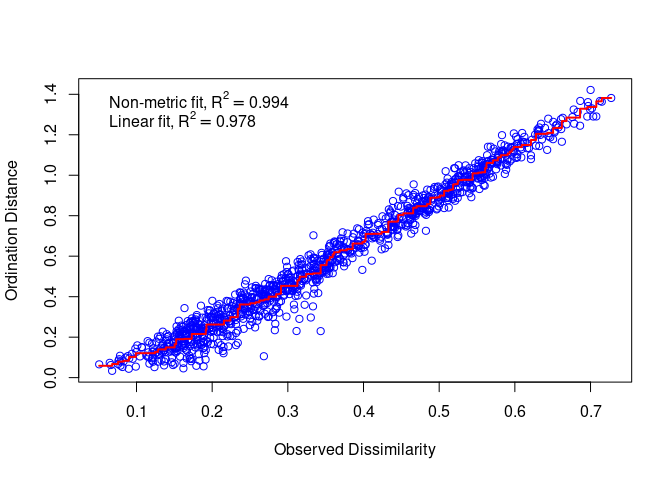
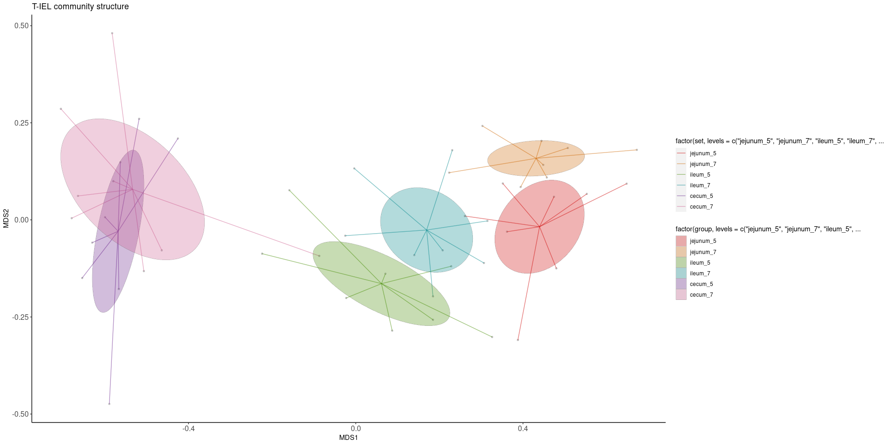
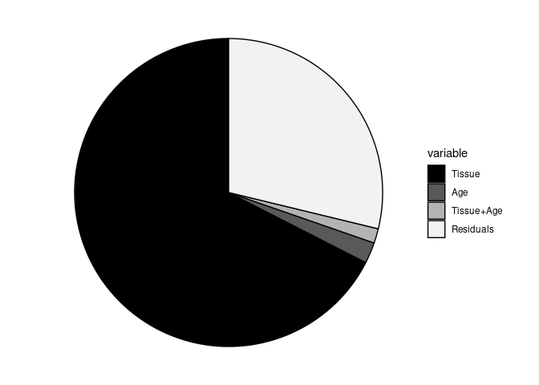
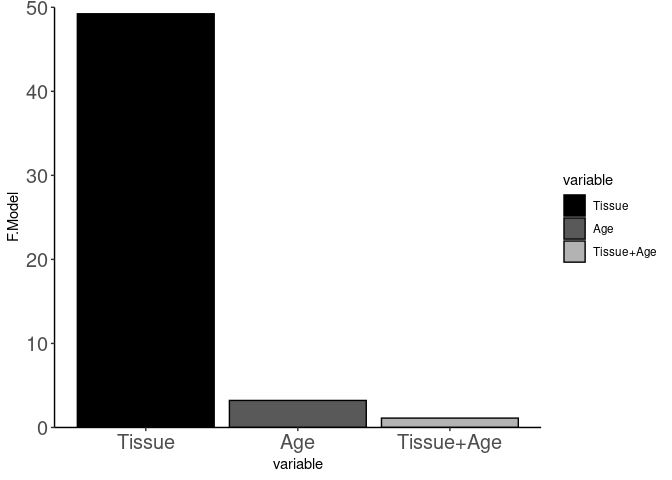

NMDS Visualization & PERMANOVA Statistics
================
Jayne Wiarda
2022April29

# Overview

Epithelial cell fractions were collected from jejunum, ileum, and cecum
of eight pigs 2 and 4 weeks post-weaning. Pigs were weaned at \~3 weeks
of age, so timepoints are equivalent to \~5 or \~7 weeks of age as well.
Epithelial cell fractions were stained via flow cytometry to detect
intraepithelial T cells (CD3e+ lymphocytes) and associated phenotype
markers (CD4, CD8a, CD8b, gdTCR, CD2, CD16, CD27). Samples were
collected and stained across multiple batches.

We have already gated live CD3e+ lymphocytes from flow cytometry samples
imported into FlowJo (FlowJo, LLC). We exported channel values in .csv
format for all CD3e+ cells of each flow sample. What we want to do now
is merge together all the .csv files with channel values from our
different samples while also incorporating pertinent meta data from our
experiment.

We next integrated data to lessen batch effects. While visualizing
integrated data, we noted some CD4 T cells and what appears to be some
cellular debri that we elected to filter out. We are now left with an
equal number of integrated, filtered cells from each sample. At this
point, we elected to use manual gating to define biologically-relevant T
cell populations for further analysis.

We annotated cells into eight major cell populations as follows:

-   CD8a+CD8b- ab T
-   CD8a+CD8b+ ab T
-   CD8a-CD8b+ ab T
-   CD8a-CD8b- ab T
-   CD2-CD8a+ gd T
-   CD2+CD8a+ gd T
-   CD2+CD8a- gd T
-   CD2-CD8a- gd T

The 8 major T cell populations were further analyzed for combinatorial
expression of CD16 and CD27, resulting in functional subsets of
CD16+/CD27+, CD16+/CD27-, CD16-/CD27+, and CD16-/CD27- cells, totaling
32 gated subsets (4 functional subsets for each of the 8 major
populations).

Importantly, cells were classified into MUTUALLY EXCLUSIVE/DISCRETE
populations/subsets, meaning every T cell belongs to only one of the 32
subsets. Additionally, the total of cells assigned to the 32 subsets is
equal to the total number of T cells identified.

The objective of the below analyses is to summarize the T cell community
structures amongst samples/treatments based on classifying cells into 32
cell subsets and comparing the subset frequencies across samples.

## Load required packages

See session information at bottom for further information.

``` r
library(readxl)
library(vegan)
library(funfuns)
library(tidyverse)
library(dplyr)
library(ggplot2)
```

## Organize the data

Set a seed for reproducibility:

``` r
set.seed(123)
```

Read in the counts data for the 32 subsets & organize further:

``` r
data <- read_excel('/home/Jayne.Wiarda/NG10/Dissertation/TIEL_FC/CellGatingAnnotation/TotalCellCountsBySample_32pops.xlsx')
head(data)
```

    ## # A tibble: 6 × 33
    ##   Var2      AB_CD8AnegCD8Bne… AB_CD8AnegCD8Bn… AB_CD8AnegCD8Bn… AB_CD8AnegCD8Bn…
    ##   <chr>                 <dbl>            <dbl>            <dbl>            <dbl>
    ## 1 13cecum                   1                0                1                1
    ## 2 13ileum                  38                3                6                1
    ## 3 13jejunum               119                4               11                2
    ## 4 17cecum                   4                0                3                0
    ## 5 17ileum                  19               11                8                6
    ## 6 17jejunum                47                3               14                4
    ## # … with 28 more variables: AB_CD8AnegCD8Bpos_CD16negCD27neg <dbl>,
    ## #   AB_CD8AnegCD8Bpos_CD16negCD27pos <dbl>,
    ## #   AB_CD8AnegCD8Bpos_CD16posCD27neg <dbl>,
    ## #   AB_CD8AnegCD8Bpos_CD16posCD27pos <dbl>,
    ## #   AB_CD8AposCD8Bneg_CD16negCD27neg <dbl>,
    ## #   AB_CD8AposCD8Bneg_CD16negCD27pos <dbl>,
    ## #   AB_CD8AposCD8Bneg_CD16posCD27neg <dbl>, …

``` r
names <- data$Var2
data <- subset(data, select=-c(Var2))
rownames(data) <- names
data <- as.data.frame(data) # convert to data frame instead of tibble
```

Read in meta data & organize further:

``` r
meta <- read_excel("/home/Jayne.Wiarda/NG10/Dissertation/TIEL_FC/NG10_MetaData_FC.xlsx") # read in meta data
head(meta) # look at meta data... if you don't want to include all metadata columns, subset before next step
```

    ## # A tibble: 6 × 5
    ##   FileName                                      Batch WeeksOfAge Tissue AnimalID
    ##   <chr>                                         <chr>      <dbl> <chr>  <chr>   
    ## 1 1ce_E3_E03_003_CD3e+_CD3EposOnly_ChannelValu… A              5 cecum  1       
    ## 2 1il_E2_E02_002_CD3e+_CD3EposOnly_ChannelValu… A              5 ileum  1       
    ## 3 1jej_E1_E01_001_CD3e+_CD3EposOnly_ChannelVal… A              5 jejun… 1       
    ## 4 5ce_E9_E09_009_CD3e+_CD3EposOnly_ChannelValu… A              5 cecum  5       
    ## 5 5il_E8_E08_008_CD3e+_CD3EposOnly_ChannelValu… A              5 ileum  5       
    ## 6 5jej_E7_E07_007_CD3e+_CD3EposOnly_ChannelVal… A              5 jejun… 5

``` r
meta$WeeksOfAge <- as.character(meta$WeeksOfAge) # convert from numeric to character
meta$ID <- paste0(meta$AnimalID, meta$Tissue)
meta$set <- paste(meta$Tissue, meta$WeeksOfAge, sep = '_')
meta$SampleID <- paste(meta$ID, meta$WeeksOfAge, sep = '_')
meta <- meta[match(names, meta$ID),]
rownames(meta) <- meta$ID  # sets rownames
meta <- as.data.frame(meta) # convert to data frame instead of tibble
head(meta)
```

    ##                                                                FileName Batch
    ## 13cecum    13ce_E9_E09_009_CD3e+_CD3EposOnly_ChannelValues_20220209.csv     B
    ## 13ileum    13il_E8_E08_008_CD3e+_CD3EposOnly_ChannelValues_20220209.csv     B
    ## 13jejunum 13jej_E7_E07_007_CD3e+_CD3EposOnly_ChannelValues_20220209.csv     B
    ## 17cecum    17ce_E3_E03_003_CD3e+_CD3EposOnly_ChannelValues_20220209.csv     C
    ## 17ileum    17il_E2_E02_002_CD3e+_CD3EposOnly_ChannelValues_20220209.csv     C
    ## 17jejunum 17jej_E1_E01_001_CD3e+_CD3EposOnly_ChannelValues_20220209.csv     C
    ##           WeeksOfAge  Tissue AnimalID        ID       set    SampleID
    ## 13cecum            5   cecum       13   13cecum   cecum_5   13cecum_5
    ## 13ileum            5   ileum       13   13ileum   ileum_5   13ileum_5
    ## 13jejunum          5 jejunum       13 13jejunum jejunum_5 13jejunum_5
    ## 17cecum            5   cecum       17   17cecum   cecum_5   17cecum_5
    ## 17ileum            5   ileum       17   17ileum   ileum_5   17ileum_5
    ## 17jejunum          5 jejunum       17 17jejunum jejunum_5 17jejunum_5

Convert counts data to percentages of total CD3e+ T cells:

``` r
rowSums(data) # see that all samples have same number of cells in this case; can still run this analysis even if cell numbers aren't equal since we will calculate percentages
```

    ##   13cecum   13ileum 13jejunum   17cecum   17ileum 17jejunum    1cecum    1ileum 
    ##      3451      3451      3451      3451      3451      3451      3451      3451 
    ##  1jejunum   21cecum   21ileum 21jejunum   25cecum   25ileum 25jejunum   29cecum 
    ##      3451      3451      3451      3451      3451      3451      3451      3451 
    ##   29ileum 29jejunum   33cecum   33ileum 33jejunum   37cecum   37ileum 37jejunum 
    ##      3451      3451      3451      3451      3451      3451      3451      3451 
    ##   41cecum   41ileum 41jejunum   45cecum   45ileum 45jejunum   49cecum   49ileum 
    ##      3451      3451      3451      3451      3451      3451      3451      3451 
    ## 49jejunum   53cecum   53ileum 53jejunum   57cecum   57ileum 57jejunum    5cecum 
    ##      3451      3451      3451      3451      3451      3451      3451      3451 
    ##    5ileum  5jejunum   61cecum   61ileum 61jejunum    9cecum    9ileum  9jejunum 
    ##      3451      3451      3451      3451      3451      3451      3451      3451

``` r
data <- (data / rowSums(data)) * 100
rowSums(data) # should all be equal to 100
```

    ##   13cecum   13ileum 13jejunum   17cecum   17ileum 17jejunum    1cecum    1ileum 
    ##       100       100       100       100       100       100       100       100 
    ##  1jejunum   21cecum   21ileum 21jejunum   25cecum   25ileum 25jejunum   29cecum 
    ##       100       100       100       100       100       100       100       100 
    ##   29ileum 29jejunum   33cecum   33ileum 33jejunum   37cecum   37ileum 37jejunum 
    ##       100       100       100       100       100       100       100       100 
    ##   41cecum   41ileum 41jejunum   45cecum   45ileum 45jejunum   49cecum   49ileum 
    ##       100       100       100       100       100       100       100       100 
    ## 49jejunum   53cecum   53ileum 53jejunum   57cecum   57ileum 57jejunum    5cecum 
    ##       100       100       100       100       100       100       100       100 
    ##    5ileum  5jejunum   61cecum   61ileum 61jejunum    9cecum    9ileum  9jejunum 
    ##       100       100       100       100       100       100       100       100

## Create NMDS plots for visualization

Now that we have converted our counts data to percentages that account
for all of our T cells being classified into 32 subsets, we can use this
information to plot the relationships between treatment groups. We will
do so by creating NMDS plots.

#### Create NMDS plot:

``` r
NMDS <- NMDS_ellipse(metadata = meta, 
                     OTU_table = data, 
                     grouping_set = 'set')
```

    ## Run 0 stress 0.07444176 
    ## Run 1 stress 0.1038303 
    ## Run 2 stress 0.07444176 
    ## ... New best solution
    ## ... Procrustes: rmse 5.471204e-06  max resid 1.775367e-05 
    ## ... Similar to previous best
    ## Run 3 stress 0.09673317 
    ## Run 4 stress 0.09618194 
    ## Run 5 stress 0.07444176 
    ## ... Procrustes: rmse 7.325143e-06  max resid 3.106057e-05 
    ## ... Similar to previous best
    ## Run 6 stress 0.0805549 
    ## Run 7 stress 0.1085583 
    ## Run 8 stress 0.09908645 
    ## Run 9 stress 0.07444176 
    ## ... Procrustes: rmse 4.653731e-06  max resid 1.789218e-05 
    ## ... Similar to previous best
    ## Run 10 stress 0.1043566 
    ## Run 11 stress 0.0805549 
    ## Run 12 stress 0.07444176 
    ## ... Procrustes: rmse 2.470575e-06  max resid 6.680763e-06 
    ## ... Similar to previous best
    ## Run 13 stress 0.1069934 
    ## Run 14 stress 0.1069665 
    ## Run 15 stress 0.07444176 
    ## ... New best solution
    ## ... Procrustes: rmse 4.22901e-06  max resid 1.600295e-05 
    ## ... Similar to previous best
    ## Run 16 stress 0.0805549 
    ## Run 17 stress 0.0907325 
    ## Run 18 stress 0.1100042 
    ## Run 19 stress 0.09215127 
    ## Run 20 stress 0.07444176 
    ## ... Procrustes: rmse 2.30527e-06  max resid 6.219813e-06 
    ## ... Similar to previous best
    ## *** Solution reached
    ## [1] "Ordination stress: 0.0744417629313592"

Check the stress of the NMDS plot to see how well the 2-D ordination
distances can truly represent underlying multidimensional distances.
Stress &lt; 0.1 indicates good 2-D representation, while stress &gt; 0.2
is concerning.

``` r
stressplot(NMDS[[3]])
```

<!-- -->

``` r
NMDS[[3]]$stress
```

    ## [1] 0.07444176

Now finally, make the NMDS plot:

``` r
ggplot(data = NMDS[[1]],aes(x=MDS1, y=MDS2)) +
  geom_point(size=1, alpha = 0.4, fill = 'grey50', , col = 'grey50', shape = 19) +
  geom_segment(aes(xend=centroidX, yend=centroidY, col = factor(set, levels = c('jejunum_5', 'jejunum_7',
                                                                     'ileum_5', 'ileum_7',
                                                                     'cecum_5', 'cecum_7'))),
               linejoin = 'round', size=0.5, alpha = 0.5) + 
  scale_colour_manual(values = c('red3', 'darkorange3', 'chartreuse4', 'turquoise4', 'darkorchid4', 'hotpink3')) +
  geom_polygon(data = NMDS[[2]], aes(x=NMDS1, y=NMDS2, group=group, 
                                     fill = factor(group, levels = c('jejunum_5', 'jejunum_7',
                                                                     'ileum_5', 'ileum_7',
                                                                     'cecum_5', 'cecum_7'))), 
               inherit.aes = FALSE, alpha=0.3, color = 'grey40', lwd = 0.1) +
  scale_fill_manual(values = c('red3', 'darkorange3', 'chartreuse4', 'turquoise4', 'darkorchid4', 'hotpink3')) +
    theme(panel.grid.major = element_blank(), panel.grid.minor = element_blank(),
        panel.background = element_blank(), axis.line = element_line(colour = "black"),
        axis.text.x=element_text(size=12), axis.text.y=element_text(size=12)) +
  labs(title = "T-IEL community structure")
```

<!-- -->

## Perform PERMANOVA analysis

The above NMDS plots can be really handy for getting a first impression
of the data, but now we need numbers to quantify the relationships
between groups! We can start by performing PERMANOVA analysis to
determine if any of our treatment variables have significant singular or
combinatorial effects on the data.

#### Perform PERMANOVA analysis

Perform overall analysis of data:

``` r
adon <- adonis(formula = data ~ (Tissue * WeeksOfAge), data = meta)
adon
```

    ## 
    ## Call:
    ## adonis(formula = data ~ (Tissue * WeeksOfAge), data = meta) 
    ## 
    ## Permutation: free
    ## Number of permutations: 999
    ## 
    ## Terms added sequentially (first to last)
    ## 
    ##                   Df SumsOfSqs MeanSqs F.Model      R2 Pr(>F)    
    ## Tissue             2    2.3559 1.17793  49.229 0.67481  0.001 ***
    ## WeeksOfAge         1    0.0770 0.07695   3.216 0.02204  0.057 .  
    ## Tissue:WeeksOfAge  2    0.0534 0.02668   1.115 0.01529  0.322    
    ## Residuals         42    1.0050 0.02393         0.28786           
    ## Total             47    3.4911                 1.00000           
    ## ---
    ## Signif. codes:  0 '***' 0.001 '**' 0.01 '*' 0.05 '.' 0.1 ' ' 1

Plot R2 statistics:

``` r
df <- as.data.frame(adon$aov.tab[1:4,])
df$variable <- c('Tissue', 'Age', 'Tissue+Age', 'Residuals')
df$variable <- factor(df$variable, levels = c('Tissue', 'Age', 'Tissue+Age', 'Residuals'))
ggplot(df, aes(x = '', y = R2, fill = variable)) +
  geom_bar(stat = 'identity', width = 1, col = 'black') +
  coord_polar("y", start=0) +
  theme_void() +
  scale_fill_manual(values = c('black', 'grey35', 'grey70', 'grey95'))
```

<!-- -->

Plot F statistics:

``` r
df <- df[1:3,] # remove last row with residuals info since not part of F-statistic
ggplot(df, aes(x = variable, y = F.Model, fill = variable)) +
  geom_bar(stat = 'identity', col = 'black') +
  theme_classic() +
  scale_fill_manual(values = c('black', 'grey35', 'grey70')) +
  scale_y_continuous(expand = c(0, 0), lim = c(0, 50)) +
  theme(axis.text.x=element_text(size=15), axis.text.y=element_text(size=15)) 
```

<!-- -->

Perform pairwise comparison of data:

``` r
pwadon <- pairwise.adonis(data, meta$set, p.adjust.m = 'none')
pwadon
```

    ##                     pairs    F.Model         R2 p.value p.adjusted
    ## 1      cecum_5 vs ileum_5 17.7387549 0.55889889   0.001      0.001
    ## 2    cecum_5 vs jejunum_5 42.6280158 0.75277255   0.001      0.001
    ## 3      cecum_5 vs cecum_7  0.8820321 0.05926826   0.510      0.510
    ## 4      cecum_5 vs ileum_7 23.6550345 0.62820377   0.001      0.001
    ## 5    cecum_5 vs jejunum_7 48.6765318 0.77663091   0.001      0.001
    ## 6    ileum_5 vs jejunum_5 11.1044613 0.44233020   0.001      0.001
    ## 7      ileum_5 vs cecum_7 16.0288954 0.53378238   0.001      0.001
    ## 8      ileum_5 vs ileum_7  2.1800938 0.13473925   0.082      0.082
    ## 9    ileum_5 vs jejunum_7 18.4103923 0.56803979   0.001      0.001
    ## 10   jejunum_5 vs cecum_7 38.8938190 0.73531879   0.001      0.001
    ## 11   jejunum_5 vs ileum_7  6.2922649 0.31008194   0.001      0.001
    ## 12 jejunum_5 vs jejunum_7  3.3664051 0.19384583   0.014      0.014
    ## 13     cecum_7 vs ileum_7 20.8109755 0.59782799   0.001      0.001
    ## 14   cecum_7 vs jejunum_7 43.5539017 0.75674977   0.002      0.002
    ## 15   ileum_7 vs jejunum_7  9.7369159 0.41020139   0.001      0.001

Extract only pairwise comparisons of interest (between tissues within a
single treatment/timepoint; between timepoints within a single
tissue/treatment; between treatments within a single tissue/timepoint) &
recalculate the adjusted p-values:

``` r
pwadonsub <- pwadon %>% slice(1:3,6, 8, 12:15)
pwadonsub$p.adjusted <- p.adjust(pwadonsub$p.value, method = 'fdr') 
pwadonsub
```

    ##                    pairs    F.Model         R2 p.value p.adjusted
    ## 1     cecum_5 vs ileum_5 17.7387549 0.55889889   0.001    0.00180
    ## 2   cecum_5 vs jejunum_5 42.6280158 0.75277255   0.001    0.00180
    ## 3     cecum_5 vs cecum_7  0.8820321 0.05926826   0.510    0.51000
    ## 4   ileum_5 vs jejunum_5 11.1044613 0.44233020   0.001    0.00180
    ## 5     ileum_5 vs ileum_7  2.1800938 0.13473925   0.082    0.09225
    ## 6 jejunum_5 vs jejunum_7  3.3664051 0.19384583   0.014    0.01800
    ## 7     cecum_7 vs ileum_7 20.8109755 0.59782799   0.001    0.00180
    ## 8   cecum_7 vs jejunum_7 43.5539017 0.75674977   0.002    0.00300
    ## 9   ileum_7 vs jejunum_7  9.7369159 0.41020139   0.001    0.00180

Save the data:

``` r
setwd('/home/Jayne.Wiarda/NG10/Dissertation/TIEL_FC/')
dir.create('NMDS_PERMANOVA')
setwd('NMDS_PERMANOVA')
write.csv(adon$aov.tab, '/home/Jayne.Wiarda/NG10/Dissertation/TIEL_FC/NMDS_PERMANOVA/PERMANOVA.csv')
write.csv(pwadonsub, '/home/Jayne.Wiarda/NG10/Dissertation/TIEL_FC/NMDS_PERMANOVA/StatsPairwise.csv')
```

### View session information

``` r
sessionInfo()
```

    ## R version 4.1.3 (2022-03-10)
    ## Platform: x86_64-pc-linux-gnu (64-bit)
    ## Running under: Ubuntu 20.04.4 LTS
    ## 
    ## Matrix products: default
    ## BLAS:   /usr/lib/x86_64-linux-gnu/openblas-pthread/libblas.so.3
    ## LAPACK: /usr/lib/x86_64-linux-gnu/openblas-pthread/liblapack.so.3
    ## 
    ## locale:
    ##  [1] LC_CTYPE=en_US.UTF-8       LC_NUMERIC=C              
    ##  [3] LC_TIME=en_US.UTF-8        LC_COLLATE=en_US.UTF-8    
    ##  [5] LC_MONETARY=en_US.UTF-8    LC_MESSAGES=en_US.UTF-8   
    ##  [7] LC_PAPER=en_US.UTF-8       LC_NAME=C                 
    ##  [9] LC_ADDRESS=C               LC_TELEPHONE=C            
    ## [11] LC_MEASUREMENT=en_US.UTF-8 LC_IDENTIFICATION=C       
    ## 
    ## attached base packages:
    ## [1] stats     graphics  grDevices utils     datasets  methods   base     
    ## 
    ## other attached packages:
    ##  [1] forcats_0.5.1   stringr_1.4.0   dplyr_1.0.7     purrr_0.3.4    
    ##  [5] readr_2.0.1     tidyr_1.1.3     tibble_3.1.4    ggplot2_3.3.5  
    ##  [9] tidyverse_1.3.1 funfuns_0.1.2   vegan_2.5-7     lattice_0.20-45
    ## [13] permute_0.9-5   readxl_1.3.1   
    ## 
    ## loaded via a namespace (and not attached):
    ##  [1] Rcpp_1.0.7       lubridate_1.7.10 assertthat_0.2.1 digest_0.6.27   
    ##  [5] utf8_1.2.2       R6_2.5.1         cellranger_1.1.0 backports_1.2.1 
    ##  [9] reprex_2.0.1     evaluate_0.14    highr_0.9        httr_1.4.2      
    ## [13] pillar_1.6.2     rlang_0.4.11     rstudioapi_0.13  Matrix_1.4-1    
    ## [17] rmarkdown_2.11   labeling_0.4.2   splines_4.1.3    munsell_0.5.0   
    ## [21] broom_0.7.9      compiler_4.1.3   modelr_0.1.8     xfun_0.26       
    ## [25] pkgconfig_2.0.3  mgcv_1.8-40      htmltools_0.5.2  tidyselect_1.1.1
    ## [29] fansi_0.5.0      crayon_1.4.1     tzdb_0.1.2       dbplyr_2.1.1    
    ## [33] withr_2.4.2      MASS_7.3-56      grid_4.1.3       nlme_3.1-157    
    ## [37] jsonlite_1.7.2   gtable_0.3.0     lifecycle_1.0.0  DBI_1.1.1       
    ## [41] magrittr_2.0.1   scales_1.1.1     cli_3.0.1        stringi_1.7.4   
    ## [45] farver_2.1.0     fs_1.5.0         xml2_1.3.2       ellipsis_0.3.2  
    ## [49] generics_0.1.0   vctrs_0.3.8      tools_4.1.3      glue_1.4.2      
    ## [53] hms_1.1.0        parallel_4.1.3   fastmap_1.1.0    yaml_2.2.1      
    ## [57] colorspace_2.0-2 cluster_2.1.3    rvest_1.0.1      knitr_1.34      
    ## [61] haven_2.4.3
