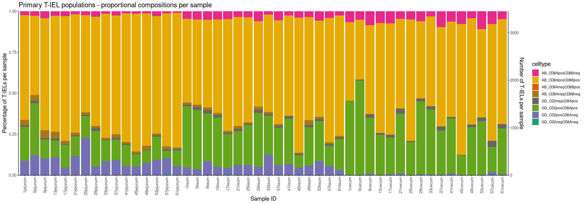
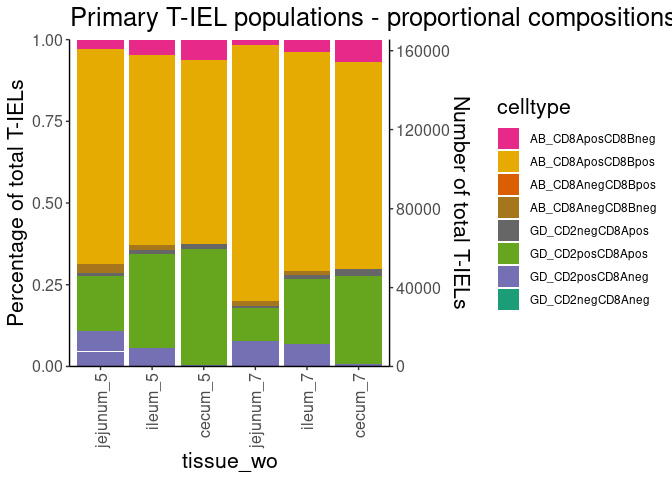
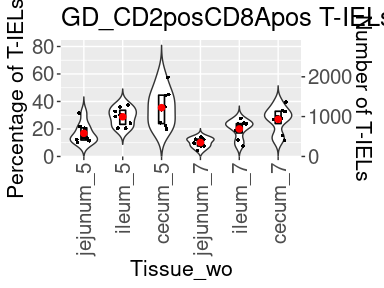
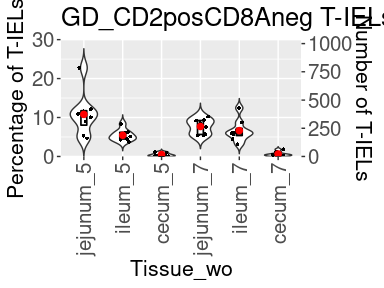
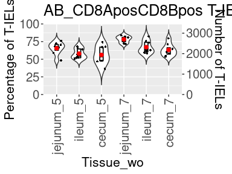
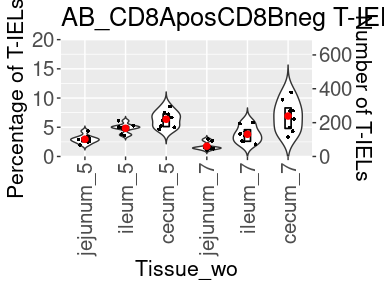
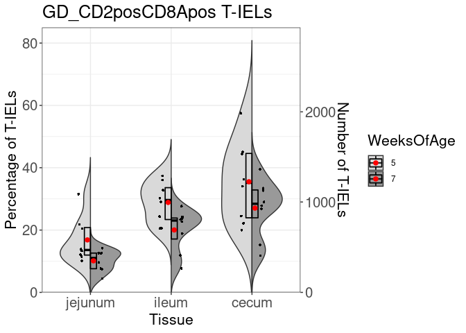
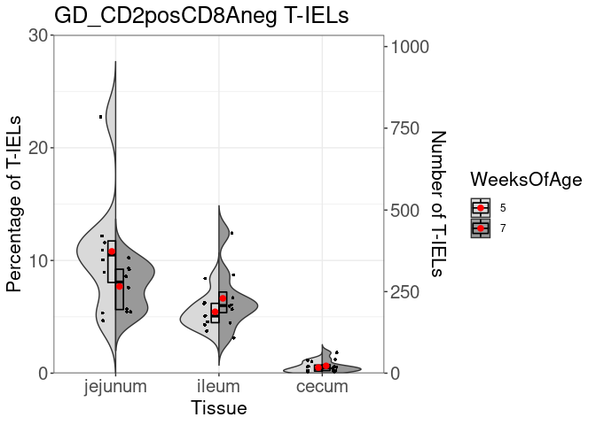
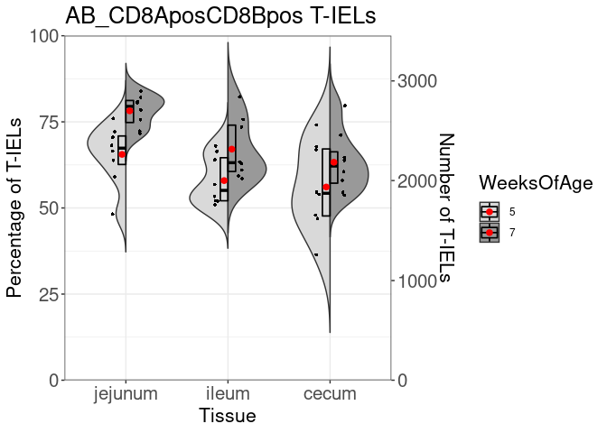
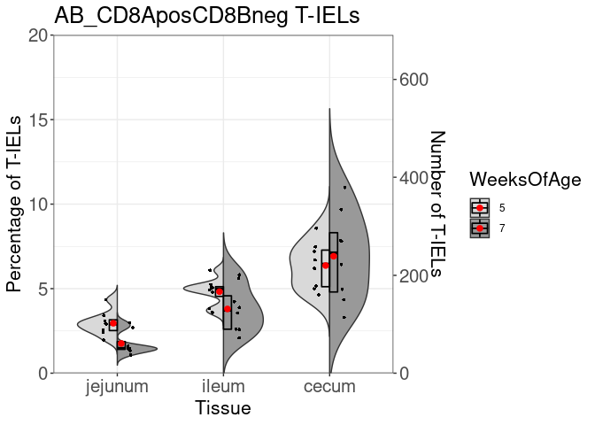

Plotting 8 primary T-IEL populations
================
Jayne Wiarda
2022May03

# Overview

Epithelial cell fractions were collected from jejunum, ileum, and cecum
of eight pigs 2 and 4 weeks post-weaning. Pigs were weaned at \~3 weeks
of age, so timepoints are equivalent to \~5 or \~7 weeks of age as well.
Epithelial cell fractions were stained via flow cytometry to detect
intraepithelial T cells (CD3e+ lymphocytes) and associated phenotype
markers (CD4, CD8a, CD8b, gdTCR, CD2, CD16, CD27). Samples were
collected and stained across multiple batches.

We have already gated live CD3e+ lymphocytes from flow cytometry samples
imported into FlowJo (FlowJo, LLC). We exported channel values in .csv
format for all CD3e+ cells of each flow sample. What we want to do now
is merge together all the .csv files with channel values from our
different samples while also incorporating pertinent meta data from our
experiment.

We next integrated data to lessen batch effects. While visualizing
integrated data, we noted some CD4 T cells and what appears to be some
cellular debri that we elected to filter out. We are now left with an
equal number of integrated, filtered cells from each sample. At this
point, we elected to use manual gating to define biologically-relevant T
cell populations for further analysis.

We annotated cells into eight major cell populations as follows:

-   CD8a+CD8b- ab T
-   CD8a+CD8b+ ab T
-   CD8a-CD8b+ ab T
-   CD8a-CD8b- ab T
-   CD2-CD8a+ gd T
-   CD2+CD8a+ gd T
-   CD2+CD8a- gd T
-   CD2-CD8a- gd T

The objective below analyses is to plot the proportional compositions of
the 8 T-IEL populations.

## Load required packages

See session information at bottom for further information.

``` r
library(readxl)
library(tidyverse)
library(dplyr)
library(ggplot2)
library(Spectre)
```

## Create stacked bar plots of T-IEL population distributions

Read in the counts data for the 8 subsets of T-IELs:

``` r
dat <- as.data.frame(read_excel('/home/Jayne.Wiarda/NG10/Dissertation/TIEL_FC/CellGatingAnnotation/TotalCellCountsBySample_8pops.xlsx'))
rownames(dat) <- dat$Var2
```

Read in meta data & organize further:

``` r
meta.dat <- read_excel("/home/Jayne.Wiarda/NG10/Dissertation/TIEL_FC/NG10_MetaData_FC.xlsx") # read in meta data
meta.dat$Var2 <- paste0(meta.dat$AnimalID, meta.dat$Tissue)
```

Convert counts data to percentages of total T-IELs:

``` r
colnames(dat)
```

    ## [1] "Var2"              "AB_CD8AnegCD8Bneg" "AB_CD8AnegCD8Bpos"
    ## [4] "AB_CD8AposCD8Bneg" "AB_CD8AposCD8Bpos" "GD_CD2negCD8Aneg" 
    ## [7] "GD_CD2negCD8Apos"  "GD_CD2posCD8Aneg"  "GD_CD2posCD8Apos"

``` r
rowSums(dat[2:9])
```

    ##   13cecum   13ileum 13jejunum   17cecum   17ileum 17jejunum    1cecum    1ileum 
    ##      3451      3451      3451      3451      3451      3451      3451      3451 
    ##  1jejunum   21cecum   21ileum 21jejunum   25cecum   25ileum 25jejunum   29cecum 
    ##      3451      3451      3451      3451      3451      3451      3451      3451 
    ##   29ileum 29jejunum   33cecum   33ileum 33jejunum   37cecum   37ileum 37jejunum 
    ##      3451      3451      3451      3451      3451      3451      3451      3451 
    ##   41cecum   41ileum 41jejunum   45cecum   45ileum 45jejunum   49cecum   49ileum 
    ##      3451      3451      3451      3451      3451      3451      3451      3451 
    ## 49jejunum   53cecum   53ileum 53jejunum   57cecum   57ileum 57jejunum    5cecum 
    ##      3451      3451      3451      3451      3451      3451      3451      3451 
    ##    5ileum  5jejunum   61cecum   61ileum 61jejunum    9cecum    9ileum  9jejunum 
    ##      3451      3451      3451      3451      3451      3451      3451      3451

``` r
dat <- (dat[2:9] / rowSums(dat[2:9])) * 100
rowSums(dat) # should all be equal to 100
```

    ##   13cecum   13ileum 13jejunum   17cecum   17ileum 17jejunum    1cecum    1ileum 
    ##       100       100       100       100       100       100       100       100 
    ##  1jejunum   21cecum   21ileum 21jejunum   25cecum   25ileum 25jejunum   29cecum 
    ##       100       100       100       100       100       100       100       100 
    ##   29ileum 29jejunum   33cecum   33ileum 33jejunum   37cecum   37ileum 37jejunum 
    ##       100       100       100       100       100       100       100       100 
    ##   41cecum   41ileum 41jejunum   45cecum   45ileum 45jejunum   49cecum   49ileum 
    ##       100       100       100       100       100       100       100       100 
    ## 49jejunum   53cecum   53ileum 53jejunum   57cecum   57ileum 57jejunum    5cecum 
    ##       100       100       100       100       100       100       100       100 
    ##    5ileum  5jejunum   61cecum   61ileum 61jejunum    9cecum    9ileum  9jejunum 
    ##       100       100       100       100       100       100       100       100

Merge counts and meta data:

``` r
dat$SampleID <- rownames(dat)
dat <- do.add.cols(dat = dat, base.col = "SampleID", add.dat = meta.dat, add.by = "Var2")
```

    ## Loading required package: data.table

    ## 
    ## Attaching package: 'data.table'

    ## The following objects are masked from 'package:dplyr':
    ## 
    ##     between, first, last

    ## The following object is masked from 'package:purrr':
    ## 
    ##     transpose

    ## Step 1/3. Mapping data

    ## Step 2/3. Merging data

    ## Step 3/3. Returning data

``` r
head(dat)
```

    ##    AB_CD8AnegCD8Bneg AB_CD8AnegCD8Bpos AB_CD8AposCD8Bneg AB_CD8AposCD8Bpos
    ## 1:        0.08693132        0.05795422          7.215300          66.93712
    ## 2:        1.39090119        0.02897711          5.070994          56.85309
    ## 3:        3.94088670        0.11590843          2.897711          70.50130
    ## 4:        0.20283976        0.00000000          7.476094          67.74848
    ## 5:        1.27499276        0.02897711          4.926108          67.98030
    ## 6:        1.97044335        0.02897711          3.071573          76.00695
    ##    GD_CD2negCD8Aneg GD_CD2negCD8Apos GD_CD2posCD8Aneg GD_CD2posCD8Apos
    ## 1:       0.05795422        1.0721530       0.05795422         24.51463
    ## 2:       0.02897711        1.3619241       5.04201681         30.22312
    ## 3:       0.08693132        1.4488554      10.92436975         10.08403
    ## 4:       0.11590843        1.6516952       0.60851927         22.19646
    ## 5:       0.20283976        0.7534048       4.28861200         20.54477
    ## 6:       0.00000000        0.3767024       4.66531440         13.88003
    ##     SampleID                                                      FileName
    ## 1:   13cecum  13ce_E9_E09_009_CD3e+_CD3EposOnly_ChannelValues_20220209.csv
    ## 2:   13ileum  13il_E8_E08_008_CD3e+_CD3EposOnly_ChannelValues_20220209.csv
    ## 3: 13jejunum 13jej_E7_E07_007_CD3e+_CD3EposOnly_ChannelValues_20220209.csv
    ## 4:   17cecum  17ce_E3_E03_003_CD3e+_CD3EposOnly_ChannelValues_20220209.csv
    ## 5:   17ileum  17il_E2_E02_002_CD3e+_CD3EposOnly_ChannelValues_20220209.csv
    ## 6: 17jejunum 17jej_E1_E01_001_CD3e+_CD3EposOnly_ChannelValues_20220209.csv
    ##    Batch WeeksOfAge  Tissue AnimalID
    ## 1:     B          5   cecum       13
    ## 2:     B          5   ileum       13
    ## 3:     B          5 jejunum       13
    ## 4:     C          5   cecum       17
    ## 5:     C          5   ileum       17
    ## 6:     C          5 jejunum       17

Change data format:

``` r
colnames(dat)
```

    ##  [1] "AB_CD8AnegCD8Bneg" "AB_CD8AnegCD8Bpos" "AB_CD8AposCD8Bneg"
    ##  [4] "AB_CD8AposCD8Bpos" "GD_CD2negCD8Aneg"  "GD_CD2negCD8Apos" 
    ##  [7] "GD_CD2posCD8Aneg"  "GD_CD2posCD8Apos"  "SampleID"         
    ## [10] "FileName"          "Batch"             "WeeksOfAge"       
    ## [13] "Tissue"            "AnimalID"

``` r
dat <- dat %>% gather(key = "celltype", value = "percentage", 1:8)
head(dat)
```

    ##    SampleID                                                      FileName Batch
    ## 1   13cecum  13ce_E9_E09_009_CD3e+_CD3EposOnly_ChannelValues_20220209.csv     B
    ## 2   13ileum  13il_E8_E08_008_CD3e+_CD3EposOnly_ChannelValues_20220209.csv     B
    ## 3 13jejunum 13jej_E7_E07_007_CD3e+_CD3EposOnly_ChannelValues_20220209.csv     B
    ## 4   17cecum  17ce_E3_E03_003_CD3e+_CD3EposOnly_ChannelValues_20220209.csv     C
    ## 5   17ileum  17il_E2_E02_002_CD3e+_CD3EposOnly_ChannelValues_20220209.csv     C
    ## 6 17jejunum 17jej_E1_E01_001_CD3e+_CD3EposOnly_ChannelValues_20220209.csv     C
    ##   WeeksOfAge  Tissue AnimalID          celltype percentage
    ## 1          5   cecum       13 AB_CD8AnegCD8Bneg 0.08693132
    ## 2          5   ileum       13 AB_CD8AnegCD8Bneg 1.39090119
    ## 3          5 jejunum       13 AB_CD8AnegCD8Bneg 3.94088670
    ## 4          5   cecum       17 AB_CD8AnegCD8Bneg 0.20283976
    ## 5          5   ileum       17 AB_CD8AnegCD8Bneg 1.27499276
    ## 6          5 jejunum       17 AB_CD8AnegCD8Bneg 1.97044335

Specify custom color scheme for plotting:

``` r
cols <- c('#E7298A', '#E6AB02', '#D95F02', '#A6761D', '#666666', '#66A61E', '#7570B3', '#1B9E77')
```

Create and set factor levels for plotted variables:

``` r
dat$celltype <- factor(dat$celltype, levels = c('AB_CD8AposCD8Bneg', 'AB_CD8AposCD8Bpos', 
                                                'AB_CD8AnegCD8Bpos', 'AB_CD8AnegCD8Bneg',
                                                'GD_CD2negCD8Apos', 'GD_CD2posCD8Apos', 
                                                'GD_CD2posCD8Aneg', 'GD_CD2negCD8Aneg'))

dat$SampleID <- factor(dat$SampleID, levels = c('1jejunum', '5jejunum', '9jejunum', '13jejunum', 
                                                '17jejunum', '21jejunum', '25jejunum', '29jejunum',                                 
                                                '33jejunum', '37jejunum', '41jejunum', '45jejunum', 
                                                '49jejunum', '53jejunum', '57jejunum', '61jejunum', 
                                                '1ileum', '5ileum', '9ileum', '13ileum', 
                                                '17ileum', '21ileum', '25ileum', '29ileum',
                                                '33ileum', '37ileum', '41ileum', '45ileum', 
                                                '49ileum', '53ileum', '57ileum', '61ileum',
                                                '1cecum', '5cecum', '9cecum', '13cecum', 
                                                '17cecum', '21cecum', '25cecum', '29cecum',
                                                '33cecum', '37cecum', '41cecum', '45cecum', 
                                                '49cecum', '53cecum', '57cecum', '61cecum'))

dat$set <- paste(dat$Tissue, dat$WeeksOfAge, sep = '_')
dat$set <- factor(dat$set, levels = c('jejunum_5', 'ileum_5', 'cecum_5', 
                                      'jejunum_7', 'ileum_7', 'cecum_7'))
```

Create stacked barplot of each individual sample:

``` r
ggplot(dat, aes(fill=celltype,
                 y=percentage, 
                x=SampleID)) + 
  geom_bar(position="fill", 
           stat="identity") + 
  scale_x_discrete(guide = guide_axis(angle = 90)) +
  scale_fill_manual(values = cols) +
  theme_classic()+ 
  scale_y_continuous(expand = c(0,0), sec.axis = sec_axis(~ . * 3451, name = "Number of T-IELs per sample")) + # 3451 = # of cells in each sample
   labs(x="Sample ID",y="Percentage of T-IELs per sample",
               title="Primary T-IEL populations - proportional compositions per sample") +
  theme(axis.title.x = element_text(size = 14),
        axis.text.x=element_text(size=10), 
        axis.title.y = element_text(size = 14),
        axis.text.y=element_text(size=10),
        legend.title = element_text (size=14),
        title = element_text(size = 14))
```

<!-- -->

Create stacked barplot of grouped samples:

``` r
ggplot(dat, aes(fill=celltype,
                 y=percentage, 
                x=set)) + 
  geom_bar(position="fill", 
           stat="identity") + 
  scale_x_discrete(guide = guide_axis(angle = 90)) +
  scale_fill_manual(values = cols) +
  theme_classic()+ 
  scale_y_continuous(expand = c(0,0), sec.axis = sec_axis(~ . * (3451*48), name = "Number of total T-IELs")) + # 3451*48 = total # of T-IELs analyzed
  labs(x="tissue_wo",y="Percentage of total T-IELs",
               title="Primary T-IEL populations - proportional compositions") +
  theme(axis.title.x = element_text(size = 16),
        axis.text.x=element_text(size=12), 
        axis.title.y = element_text(size = 16),
        axis.text.y=element_text(size=12),
        legend.title = element_text (size=16),
        title = element_text(size = 16))
```

<!-- -->

## Make violin plots of T-IEL population frequencies

Read in the counts data for the 8 subsets of T-IELs:

``` r
dat <- as.data.frame(read_excel('/home/Jayne.Wiarda/NG10/Dissertation/TIEL_FC/CellGatingAnnotation/TotalCellCountsBySample_8pops.xlsx'))
rownames(dat) <- dat$Var2
```

Read in meta data & organize further:

``` r
meta.dat <- read_excel("/home/Jayne.Wiarda/NG10/Dissertation/TIEL_FC/NG10_MetaData_FC.xlsx") # read in meta data
meta.dat$Var2 <- paste0(meta.dat$AnimalID, meta.dat$Tissue)
```

Convert counts data to percentages of total T-IELs:

``` r
colnames(dat)
```

    ## [1] "Var2"              "AB_CD8AnegCD8Bneg" "AB_CD8AnegCD8Bpos"
    ## [4] "AB_CD8AposCD8Bneg" "AB_CD8AposCD8Bpos" "GD_CD2negCD8Aneg" 
    ## [7] "GD_CD2negCD8Apos"  "GD_CD2posCD8Aneg"  "GD_CD2posCD8Apos"

``` r
rowSums(dat[2:9])
```

    ##   13cecum   13ileum 13jejunum   17cecum   17ileum 17jejunum    1cecum    1ileum 
    ##      3451      3451      3451      3451      3451      3451      3451      3451 
    ##  1jejunum   21cecum   21ileum 21jejunum   25cecum   25ileum 25jejunum   29cecum 
    ##      3451      3451      3451      3451      3451      3451      3451      3451 
    ##   29ileum 29jejunum   33cecum   33ileum 33jejunum   37cecum   37ileum 37jejunum 
    ##      3451      3451      3451      3451      3451      3451      3451      3451 
    ##   41cecum   41ileum 41jejunum   45cecum   45ileum 45jejunum   49cecum   49ileum 
    ##      3451      3451      3451      3451      3451      3451      3451      3451 
    ## 49jejunum   53cecum   53ileum 53jejunum   57cecum   57ileum 57jejunum    5cecum 
    ##      3451      3451      3451      3451      3451      3451      3451      3451 
    ##    5ileum  5jejunum   61cecum   61ileum 61jejunum    9cecum    9ileum  9jejunum 
    ##      3451      3451      3451      3451      3451      3451      3451      3451

``` r
dat <- (dat[2:9] / rowSums(dat[2:9])) * 100
rowSums(dat) # should all be equal to 100
```

    ##   13cecum   13ileum 13jejunum   17cecum   17ileum 17jejunum    1cecum    1ileum 
    ##       100       100       100       100       100       100       100       100 
    ##  1jejunum   21cecum   21ileum 21jejunum   25cecum   25ileum 25jejunum   29cecum 
    ##       100       100       100       100       100       100       100       100 
    ##   29ileum 29jejunum   33cecum   33ileum 33jejunum   37cecum   37ileum 37jejunum 
    ##       100       100       100       100       100       100       100       100 
    ##   41cecum   41ileum 41jejunum   45cecum   45ileum 45jejunum   49cecum   49ileum 
    ##       100       100       100       100       100       100       100       100 
    ## 49jejunum   53cecum   53ileum 53jejunum   57cecum   57ileum 57jejunum    5cecum 
    ##       100       100       100       100       100       100       100       100 
    ##    5ileum  5jejunum   61cecum   61ileum 61jejunum    9cecum    9ileum  9jejunum 
    ##       100       100       100       100       100       100       100       100

Merge counts and meta data:

``` r
dat$SampleID <- rownames(dat)
dat <- do.add.cols(dat = dat, base.col = "SampleID", add.dat = meta.dat, add.by = "Var2")
```

    ## Step 1/3. Mapping data

    ## Step 2/3. Merging data

    ## Step 3/3. Returning data

``` r
head(dat)
```

    ##    AB_CD8AnegCD8Bneg AB_CD8AnegCD8Bpos AB_CD8AposCD8Bneg AB_CD8AposCD8Bpos
    ## 1:        0.08693132        0.05795422          7.215300          66.93712
    ## 2:        1.39090119        0.02897711          5.070994          56.85309
    ## 3:        3.94088670        0.11590843          2.897711          70.50130
    ## 4:        0.20283976        0.00000000          7.476094          67.74848
    ## 5:        1.27499276        0.02897711          4.926108          67.98030
    ## 6:        1.97044335        0.02897711          3.071573          76.00695
    ##    GD_CD2negCD8Aneg GD_CD2negCD8Apos GD_CD2posCD8Aneg GD_CD2posCD8Apos
    ## 1:       0.05795422        1.0721530       0.05795422         24.51463
    ## 2:       0.02897711        1.3619241       5.04201681         30.22312
    ## 3:       0.08693132        1.4488554      10.92436975         10.08403
    ## 4:       0.11590843        1.6516952       0.60851927         22.19646
    ## 5:       0.20283976        0.7534048       4.28861200         20.54477
    ## 6:       0.00000000        0.3767024       4.66531440         13.88003
    ##     SampleID                                                      FileName
    ## 1:   13cecum  13ce_E9_E09_009_CD3e+_CD3EposOnly_ChannelValues_20220209.csv
    ## 2:   13ileum  13il_E8_E08_008_CD3e+_CD3EposOnly_ChannelValues_20220209.csv
    ## 3: 13jejunum 13jej_E7_E07_007_CD3e+_CD3EposOnly_ChannelValues_20220209.csv
    ## 4:   17cecum  17ce_E3_E03_003_CD3e+_CD3EposOnly_ChannelValues_20220209.csv
    ## 5:   17ileum  17il_E2_E02_002_CD3e+_CD3EposOnly_ChannelValues_20220209.csv
    ## 6: 17jejunum 17jej_E1_E01_001_CD3e+_CD3EposOnly_ChannelValues_20220209.csv
    ##    Batch WeeksOfAge  Tissue AnimalID
    ## 1:     B          5   cecum       13
    ## 2:     B          5   ileum       13
    ## 3:     B          5 jejunum       13
    ## 4:     C          5   cecum       17
    ## 5:     C          5   ileum       17
    ## 6:     C          5 jejunum       17

Plot violins across tissues, within age groups

``` r
dat$set <- paste(dat$Tissue, dat$WeeksOfAge, sep = '_')
dat$set <- factor(dat$set, levels = c('jejunum_5', 'ileum_5', 'cecum_5', 
                                      'jejunum_7', 'ileum_7', 'cecum_7'))

# CD2posCD8Apos GD:
ggplot(dat, aes( x = set,
                 y = GD_CD2posCD8Apos)) + 
  geom_violin(trim = FALSE, scale = 'width', width = 0.7, fill = 'white') +
  geom_jitter (width = 0.2, shape = 16, size = 1) +
  geom_boxplot(width=0.15, position = position_dodge(width=.15), 
               coef = 0, outliers = NULL, color = 'black', alpha = 0, lwd = 0.6) +
  stat_summary(fun.y="mean", geom="point", size=2,
               position=position_dodge(width=0.15), color="red")+
  scale_y_continuous(expand = c(0,0), 
                     limits = c(0,85), 
                     sec.axis = sec_axis(~ . * 34.51, name = 'Number of T-IELs')) + # left axis is % of total T-IELs; right axis is total # of cells (since each sample had equal starting cell number)
  theme_grey() +
    scale_x_discrete(guide = guide_axis(angle = 90)) +
    labs(x="Tissue_wo",y="Percentage of T-IELs",
               title="GD_CD2posCD8Apos T-IELs") +
  theme(axis.title.x = element_text(size = 16),
        axis.text.x=element_text(size=12), 
        axis.title.y = element_text(size = 16),
        axis.text.y=element_text(size=12),
        legend.title = element_text (size=16),
        title = element_text(size = 16)) +
  theme(axis.text.x=element_text(size=rel(1.75)), axis.text.y=element_text(size=rel(1.75)))
```

<!-- -->

``` r
# CD2posCD8Aneg GD:
ggplot(dat, aes( x = set,
                 y = GD_CD2posCD8Aneg)) + 
  geom_violin(trim = FALSE, scale = 'width', width = 0.7, fill = 'white') +
  geom_jitter (width = 0.2, shape = 16, size = 1) +
  geom_boxplot(width=0.15, position = position_dodge(width=.15), 
               coef = 0, outliers = NULL, color = 'black', alpha = 0, lwd = 0.6) +
  stat_summary(fun.y="mean", geom="point", size=2,
               position=position_dodge(width=0.15), color="red")+
  scale_y_continuous(expand = c(0,0), 
                     limits = c(0,30), 
                     sec.axis = sec_axis(~ . * 34.51, name = 'Number of T-IELs')) + # left axis is % of total T-IELs; right axis is total # of cells (since each sample had equal starting cell number)
  theme_grey() +
    scale_x_discrete(guide = guide_axis(angle = 90)) +
    labs(x="Tissue_wo",y="Percentage of T-IELs",
               title="GD_CD2posCD8Aneg T-IELs") +
  theme(axis.title.x = element_text(size = 16),
        axis.text.x=element_text(size=12), 
        axis.title.y = element_text(size = 16),
        axis.text.y=element_text(size=12),
        legend.title = element_text (size=16),
        title = element_text(size = 16)) +
  theme(axis.text.x=element_text(size=rel(1.75)), axis.text.y=element_text(size=rel(1.75)))
```

<!-- -->

``` r
# CD8AposCD8Bpos AB:
ggplot(dat, aes( x = set,
                 y = AB_CD8AposCD8Bpos)) + 
  geom_violin(trim = FALSE, scale = 'width', width = 0.7, fill = 'white') +
  geom_jitter (width = 0.2, shape = 16, size = 1) +
  geom_boxplot(width=0.15, position = position_dodge(width=.15), 
               coef = 0, outliers = NULL, color = 'black', alpha = 0, lwd = 0.6) +
  stat_summary(fun.y="mean", geom="point", size=2,
               position=position_dodge(width=0.15), color="red")+
  scale_y_continuous(expand = c(0,0), 
                     limits = c(0,100), 
                     sec.axis = sec_axis(~ . * 34.51, name = 'Number of T-IELs')) + # left axis is % of total T-IELs; right axis is total # of cells (since each sample had equal starting cell number)
  theme_grey() +
    scale_x_discrete(guide = guide_axis(angle = 90)) +
    labs(x="Tissue_wo",y="Percentage of T-IELs",
               title="AB_CD8AposCD8Bpos T-IELs") +
  theme(axis.title.x = element_text(size = 16),
        axis.text.x=element_text(size=12), 
        axis.title.y = element_text(size = 16),
        axis.text.y=element_text(size=12),
        legend.title = element_text (size=16),
        title = element_text(size = 16)) +
  theme(axis.text.x=element_text(size=rel(1.75)), axis.text.y=element_text(size=rel(1.75)))
```

<!-- -->

``` r
# CD8AposCD8Bneg AB:
ggplot(dat, aes( x = set,
                 y = AB_CD8AposCD8Bneg)) + 
  geom_violin(trim = FALSE, scale = 'width', width = 0.7, fill = 'white') +
  geom_jitter (width = 0.2, shape = 16, size = 1) +
  geom_boxplot(width=0.15, position = position_dodge(width=.15), 
               coef = 0, outliers = NULL, color = 'black', alpha = 0, lwd = 0.6) +
  stat_summary(fun.y="mean", geom="point", size=2,
               position=position_dodge(width=0.15), color="red")+
  scale_y_continuous(expand = c(0,0), 
                     limits = c(0,20), 
                     sec.axis = sec_axis(~ . * 34.51, name = 'Number of T-IELs')) + # left axis is % of total T-IELs; right axis is total # of cells (since each sample had equal starting cell number)
  theme_grey() +
    scale_x_discrete(guide = guide_axis(angle = 90)) +
    labs(x="Tissue_wo",y="Percentage of T-IELs",
               title="AB_CD8AposCD8Bneg T-IELs") +
  theme(axis.title.x = element_text(size = 16),
        axis.text.x=element_text(size=12), 
        axis.title.y = element_text(size = 16),
        axis.text.y=element_text(size=12),
        legend.title = element_text (size=16),
        title = element_text(size = 16)) +
  theme(axis.text.x=element_text(size=rel(1.75)), axis.text.y=element_text(size=rel(1.75)))
```

<!-- -->

Make split violins to compare age groups within tissues:

``` r
GeomSplitViolin <- ggproto("GeomSplitViolin", GeomViolin, draw_group = function(self, data, ..., draw_quantiles = NULL){
    data <- transform(data, xminv = x - violinwidth * (x - xmin), xmaxv = x + violinwidth * (xmax - x))
    grp <- data[1,'group']
    newdata <- plyr::arrange(transform(data, x = if(grp%%2==1) xminv else xmaxv), if(grp%%2==1) y else -y)
    newdata <- rbind(newdata[1, ], newdata, newdata[nrow(newdata), ], newdata[1, ])
    newdata[c(1,nrow(newdata)-1,nrow(newdata)), 'x'] <- round(newdata[1, 'x']) 
    if (length(draw_quantiles) > 0 & !scales::zero_range(range(data$y))) {
      stopifnot(all(draw_quantiles >= 0), all(draw_quantiles <= 
                                                1))
      quantiles <- ggplot2:::create_quantile_segment_frame(data, draw_quantiles)
      aesthetics <- data[rep(1, nrow(quantiles)), setdiff(names(data), c("x", "y")), drop = FALSE]
      aesthetics$alpha <- rep(1, nrow(quantiles))
      both <- cbind(quantiles, aesthetics)
      quantile_grob <- GeomPath$draw_panel(both, ...)
      ggplot2:::ggname("geom_split_violin", grid::grobTree(GeomPolygon$draw_panel(newdata, ...), quantile_grob))
    }
    else {
      ggplot2:::ggname("geom_split_violin", GeomPolygon$draw_panel(newdata, ...))
    }
  })
geom_split_violin <- function (mapping = NULL, data = NULL, stat = "ydensity", position = "identity", ..., draw_quantiles = NULL, trim = TRUE, scale = "area", na.rm = FALSE, show.legend = NA, inherit.aes = TRUE) {
  layer(data = data, mapping = mapping, stat = stat, geom = GeomSplitViolin, position = position, show.legend = show.legend, inherit.aes = inherit.aes, params = list(trim = trim, scale = scale, draw_quantiles = draw_quantiles, na.rm = na.rm, ...))
}

dat$WeeksOfAge <- as.character(dat$WeeksOfAge)
dat$Tissue <- factor(dat$Tissue, levels = c('jejunum', 'ileum', 'cecum'))

# CD2posCD8Apos GD:
ggplot(dat, aes(x=Tissue,
                y=GD_CD2posCD8Apos, 
                fill = WeeksOfAge)) + 
    geom_split_violin(trim = FALSE, scale = 'width', width = 0.75) +
    theme_bw() +
    geom_point(shape=16, position = position_jitterdodge(jitter.width=.05, dodge.width = 0.5), size = 1) + 
    geom_boxplot(width=0.15, position = position_dodge(width=.15), 
                 coef = 0, outliers = NULL, color = 'black', alpha = 0, lwd = 0.6) +
    stat_summary(fun.y="mean", geom="point", size=2,
                 position=position_dodge(width=0.15), 
                 color="red")+
    scale_fill_manual(values=c("grey85", "grey60")) + 
    scale_y_continuous(expand = c(0,0), 
                       limits = c(0,85), 
                       sec.axis = sec_axis(~ . * 34.51, name = "Number of T-IELs")) + # left axis is % of total T-IELs; right axis is total # of cells (since each sample had equal starting cell number)
    theme(axis.text.x=element_text(size=rel(1.75)), 
          axis.text.y=element_text(size=rel(1.75)))+ 
  labs(x="Tissue",y="Percentage of T-IELs",
               title="GD_CD2posCD8Apos T-IELs") +
  theme(axis.title.x = element_text(size = 16),
        axis.text.x=element_text(size=12), 
        axis.title.y = element_text(size = 16),
        axis.text.y=element_text(size=12),
        legend.title = element_text (size=16),
        title = element_text(size = 16)) +
  theme(axis.text.x=element_text(size=rel(1.75)), axis.text.y=element_text(size=rel(1.75)))
```

<!-- -->

``` r
# CD2posCD8Aneg GD:
ggplot(dat, aes(x=Tissue,
                y=GD_CD2posCD8Aneg, 
                fill = WeeksOfAge)) + 
    geom_split_violin(trim = FALSE, scale = 'width', width = 0.75) +
    theme_bw() +
    geom_point(shape=16, position = position_jitterdodge(jitter.width=.05, dodge.width = 0.5), size = 1) + 
    geom_boxplot(width=0.15, position = position_dodge(width=.15), 
                 coef = 0, outliers = NULL, color = 'black', alpha = 0, lwd = 0.6) +
    stat_summary(fun.y="mean", geom="point", size=2,
                 position=position_dodge(width=0.15), 
                 color="red")+
    scale_fill_manual(values=c("grey85", "grey60")) + 
    scale_y_continuous(expand = c(0,0), 
                       limits = c(0,30), 
                       sec.axis = sec_axis(~ . * 34.51, name = "Number of T-IELs")) + # left axis is % of total T-IELs; right axis is total # of cells (since each sample had equal starting cell number)
    theme(axis.text.x=element_text(size=rel(1.75)), 
          axis.text.y=element_text(size=rel(1.75)))+ 
  labs(x="Tissue",y="Percentage of T-IELs",
               title="GD_CD2posCD8Aneg T-IELs") +
  theme(axis.title.x = element_text(size = 16),
        axis.text.x=element_text(size=12), 
        axis.title.y = element_text(size = 16),
        axis.text.y=element_text(size=12),
        legend.title = element_text (size=16),
        title = element_text(size = 16)) +
  theme(axis.text.x=element_text(size=rel(1.75)), axis.text.y=element_text(size=rel(1.75)))
```

<!-- -->

``` r
# CD8AposCD8Bpos AB:
ggplot(dat, aes(x=Tissue,
                y=AB_CD8AposCD8Bpos, 
                fill = WeeksOfAge)) + 
    geom_split_violin(trim = FALSE, scale = 'width', width = 0.75) +
    theme_bw() +
    geom_point(shape=16, position = position_jitterdodge(jitter.width=.05, dodge.width = 0.5), size = 1) + 
    geom_boxplot(width=0.15, position = position_dodge(width=.15), 
                 coef = 0, outliers = NULL, color = 'black', alpha = 0, lwd = 0.6) +
    stat_summary(fun.y="mean", geom="point", size=2,
                 position=position_dodge(width=0.15), 
                 color="red")+
    scale_fill_manual(values=c("grey85", "grey60")) + 
    scale_y_continuous(expand = c(0,0), 
                       limits = c(0,100), 
                       sec.axis = sec_axis(~ . * 34.51, name = "Number of T-IELs")) + # left axis is % of total T-IELs; right axis is total # of cells (since each sample had equal starting cell number)
    theme(axis.text.x=element_text(size=rel(1.75)), 
          axis.text.y=element_text(size=rel(1.75)))+ 
  labs(x="Tissue",y="Percentage of T-IELs",
               title="AB_CD8AposCD8Bpos T-IELs") +
  theme(axis.title.x = element_text(size = 16),
        axis.text.x=element_text(size=12), 
        axis.title.y = element_text(size = 16),
        axis.text.y=element_text(size=12),
        legend.title = element_text (size=16),
        title = element_text(size = 16)) +
  theme(axis.text.x=element_text(size=rel(1.75)), axis.text.y=element_text(size=rel(1.75)))
```

<!-- -->

``` r
# CD8AposCD8Bneg AB:
ggplot(dat, aes(x=Tissue,
                y=AB_CD8AposCD8Bneg, 
                fill = WeeksOfAge)) + 
    geom_split_violin(trim = FALSE, scale = 'width', width = 0.75) +
    theme_bw() +
    geom_point(shape=16, position = position_jitterdodge(jitter.width=.05, dodge.width = 0.5), size = 1) + 
    geom_boxplot(width=0.15, position = position_dodge(width=.15), 
                 coef = 0, outliers = NULL, color = 'black', alpha = 0, lwd = 0.6) +
    stat_summary(fun.y="mean", geom="point", size=2,
                 position=position_dodge(width=0.15), 
                 color="red")+
    scale_fill_manual(values=c("grey85", "grey60")) + 
    scale_y_continuous(expand = c(0,0), 
                       limits = c(0,20), 
                       sec.axis = sec_axis(~ . * 34.51, name = "Number of T-IELs")) + # left axis is % of total T-IELs; right axis is total # of cells (since each sample had equal starting cell number)
    theme(axis.text.x=element_text(size=rel(1.75)), 
          axis.text.y=element_text(size=rel(1.75)))+ 
  labs(x="Tissue",y="Percentage of T-IELs",
               title="AB_CD8AposCD8Bneg T-IELs") +
  theme(axis.title.x = element_text(size = 16),
        axis.text.x=element_text(size=12), 
        axis.title.y = element_text(size = 16),
        axis.text.y=element_text(size=12),
        legend.title = element_text (size=16),
        title = element_text(size = 16)) +
  theme(axis.text.x=element_text(size=rel(1.75)), axis.text.y=element_text(size=rel(1.75)))
```

<!-- -->

### View session information

``` r
sessionInfo()
```

    ## R version 4.1.3 (2022-03-10)
    ## Platform: x86_64-pc-linux-gnu (64-bit)
    ## Running under: Ubuntu 20.04.4 LTS
    ## 
    ## Matrix products: default
    ## BLAS:   /usr/lib/x86_64-linux-gnu/openblas-pthread/libblas.so.3
    ## LAPACK: /usr/lib/x86_64-linux-gnu/openblas-pthread/liblapack.so.3
    ## 
    ## locale:
    ##  [1] LC_CTYPE=en_US.UTF-8       LC_NUMERIC=C              
    ##  [3] LC_TIME=en_US.UTF-8        LC_COLLATE=en_US.UTF-8    
    ##  [5] LC_MONETARY=en_US.UTF-8    LC_MESSAGES=en_US.UTF-8   
    ##  [7] LC_PAPER=en_US.UTF-8       LC_NAME=C                 
    ##  [9] LC_ADDRESS=C               LC_TELEPHONE=C            
    ## [11] LC_MEASUREMENT=en_US.UTF-8 LC_IDENTIFICATION=C       
    ## 
    ## attached base packages:
    ## [1] stats     graphics  grDevices utils     datasets  methods   base     
    ## 
    ## other attached packages:
    ##  [1] data.table_1.14.0 Spectre_0.4.1     forcats_0.5.1     stringr_1.4.0    
    ##  [5] dplyr_1.0.7       purrr_0.3.4       readr_2.0.1       tidyr_1.1.3      
    ##  [9] tibble_3.1.4      ggplot2_3.3.5     tidyverse_1.3.1   readxl_1.3.1     
    ## 
    ## loaded via a namespace (and not attached):
    ##  [1] tidyselect_1.1.1 xfun_0.26        haven_2.4.3      colorspace_2.0-2
    ##  [5] vctrs_0.3.8      generics_0.1.0   htmltools_0.5.2  yaml_2.2.1      
    ##  [9] utf8_1.2.2       rlang_0.4.11     pillar_1.6.2     glue_1.4.2      
    ## [13] withr_2.4.2      DBI_1.1.1        dbplyr_2.1.1     modelr_0.1.8    
    ## [17] plyr_1.8.6       lifecycle_1.0.0  munsell_0.5.0    gtable_0.3.0    
    ## [21] cellranger_1.1.0 rvest_1.0.1      evaluate_0.14    labeling_0.4.2  
    ## [25] knitr_1.34       tzdb_0.1.2       fastmap_1.1.0    fansi_0.5.0     
    ## [29] highr_0.9        broom_0.7.9      Rcpp_1.0.7       backports_1.2.1 
    ## [33] scales_1.1.1     jsonlite_1.7.2   farver_2.1.0     fs_1.5.0        
    ## [37] hms_1.1.0        digest_0.6.27    stringi_1.7.4    grid_4.1.3      
    ## [41] cli_3.0.1        tools_4.1.3      magrittr_2.0.1   crayon_1.4.1    
    ## [45] pkgconfig_2.0.3  ellipsis_0.3.2   xml2_1.3.2       reprex_2.0.1    
    ## [49] lubridate_1.7.10 rstudioapi_0.13  assertthat_0.2.1 rmarkdown_2.11  
    ## [53] httr_1.4.2       R6_2.5.1         compiler_4.1.3
