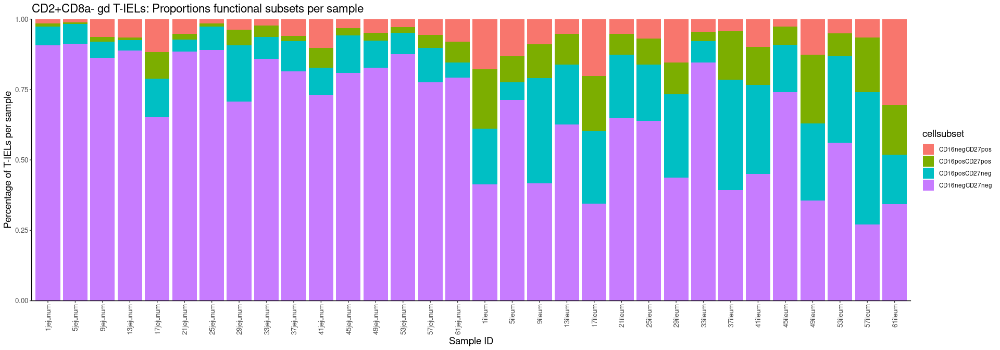
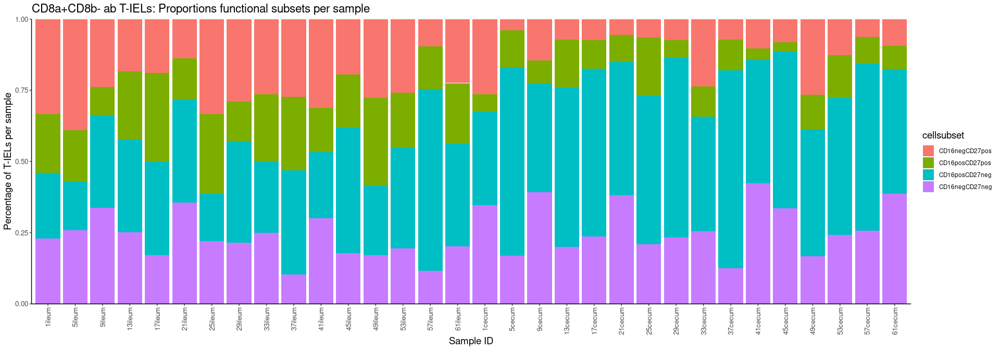
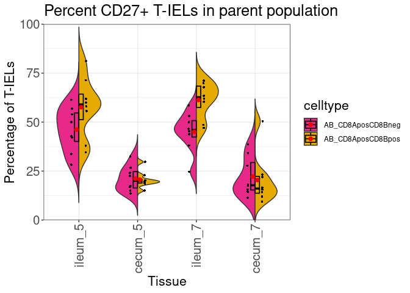
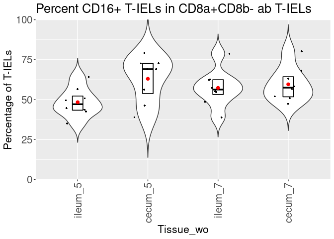

Plotting 8 primary T-IEL populations
================
Jayne Wiarda
2022May03

# Overview

Epithelial cell fractions were collected from jejunum, ileum, and cecum
of eight pigs 2 and 4 weeks post-weaning. Pigs were weaned at \~3 weeks
of age, so timepoints are equivalent to \~5 or \~7 weeks of age as well.
Epithelial cell fractions were stained via flow cytometry to detect
intraepithelial T cells (CD3e+ lymphocytes) and associated phenotype
markers (CD4, CD8a, CD8b, gdTCR, CD2, CD16, CD27). Samples were
collected and stained across multiple batches.

We have already gated live CD3e+ lymphocytes from flow cytometry samples
imported into FlowJo (FlowJo, LLC). We exported channel values in .csv
format for all CD3e+ cells of each flow sample. What we want to do now
is merge together all the .csv files with channel values from our
different samples while also incorporating pertinent meta data from our
experiment.

We next integrated data to lessen batch effects. While visualizing
integrated data, we noted some CD4 T cells and what appears to be some
cellular debri that we elected to filter out. We are now left with an
equal number of integrated, filtered cells from each sample. At this
point, we elected to use manual gating to define biologically-relevant T
cell populations for further analysis.

We annotated cells into eight major cell populations as follows:

-   CD8a+CD8b- ab T
-   CD8a+CD8b+ ab T
-   CD8a-CD8b+ ab T
-   CD8a-CD8b- ab T
-   CD2-CD8a+ gd T
-   CD2+CD8a+ gd T
-   CD2+CD8a- gd T
-   CD2-CD8a- gd T

We further classified cells within eight major T-IEL populations as:

-   CD16+CD27+
-   CD16+CD27-
-   CD16-CD27-
-   CD16-CD27+

The objective below analyses is to plot the proportional compositions of
the functional T-IEL subsets (CD126/CD27 subsets) within different T-IEL
populations.

## Load required packages

See session information at bottom for further information.

``` r
library(readxl)
library(tidyverse)
library(dplyr)
library(ggplot2)
library(Spectre)
```

## Set directory:

``` r
setwd('/home/Jayne.Wiarda/NG10/Dissertation/TIEL_FC/') # set working directory
dir.create('FunctionalSubsets')
setwd('FunctionalSubsets')
```

## Organize data

Read in the counts data for the 8 subsets of T-IELs:

``` r
dat <- as.data.frame(read_excel('/home/Jayne.Wiarda/NG10/Dissertation/TIEL_FC/CellGatingAnnotation/TotalCellCountsBySample_32pops.xlsx'))
rownames(dat) <- dat$Var2
```

Read in meta data & organize further:

``` r
meta.dat <- read_excel("/home/Jayne.Wiarda/NG10/Dissertation/TIEL_FC/NG10_MetaData_FC.xlsx") # read in meta data
meta.dat$Var2 <- paste0(meta.dat$AnimalID, meta.dat$Tissue)
```

Convert counts data to percentages of total T-IELs:

Calculate as %CD16/CD27 subsets within parent T-IEL population

``` r
colnames(dat)
```

    ##  [1] "Var2"                             "AB_CD8AnegCD8Bneg_CD16negCD27neg"
    ##  [3] "AB_CD8AnegCD8Bneg_CD16negCD27pos" "AB_CD8AnegCD8Bneg_CD16posCD27neg"
    ##  [5] "AB_CD8AnegCD8Bneg_CD16posCD27pos" "AB_CD8AnegCD8Bpos_CD16negCD27neg"
    ##  [7] "AB_CD8AnegCD8Bpos_CD16negCD27pos" "AB_CD8AnegCD8Bpos_CD16posCD27neg"
    ##  [9] "AB_CD8AnegCD8Bpos_CD16posCD27pos" "AB_CD8AposCD8Bneg_CD16negCD27neg"
    ## [11] "AB_CD8AposCD8Bneg_CD16negCD27pos" "AB_CD8AposCD8Bneg_CD16posCD27neg"
    ## [13] "AB_CD8AposCD8Bneg_CD16posCD27pos" "AB_CD8AposCD8Bpos_CD16negCD27neg"
    ## [15] "AB_CD8AposCD8Bpos_CD16negCD27pos" "AB_CD8AposCD8Bpos_CD16posCD27neg"
    ## [17] "AB_CD8AposCD8Bpos_CD16posCD27pos" "GD_CD2negCD8Aneg_CD16negCD27neg" 
    ## [19] "GD_CD2negCD8Aneg_CD16negCD27pos"  "GD_CD2negCD8Aneg_CD16posCD27neg" 
    ## [21] "GD_CD2negCD8Aneg_CD16posCD27pos"  "GD_CD2negCD8Apos_CD16negCD27neg" 
    ## [23] "GD_CD2negCD8Apos_CD16negCD27pos"  "GD_CD2negCD8Apos_CD16posCD27neg" 
    ## [25] "GD_CD2negCD8Apos_CD16posCD27pos"  "GD_CD2posCD8Aneg_CD16negCD27neg" 
    ## [27] "GD_CD2posCD8Aneg_CD16negCD27pos"  "GD_CD2posCD8Aneg_CD16posCD27neg" 
    ## [29] "GD_CD2posCD8Aneg_CD16posCD27pos"  "GD_CD2posCD8Apos_CD16negCD27neg" 
    ## [31] "GD_CD2posCD8Apos_CD16negCD27pos"  "GD_CD2posCD8Apos_CD16posCD27neg" 
    ## [33] "GD_CD2posCD8Apos_CD16posCD27pos"

``` r
dat <- dat %>% select(1, 10:17, 26:33) # select only counts data for four major T-IEL primary populations
dat <- do.add.cols(dat = dat, base.col = "Var2", add.dat = meta.dat, add.by = "Var2") # add meta data
```

    ## Loading required package: data.table

    ## 
    ## Attaching package: 'data.table'

    ## The following objects are masked from 'package:dplyr':
    ## 
    ##     between, first, last

    ## The following object is masked from 'package:purrr':
    ## 
    ##     transpose

    ## Step 1/3. Mapping data

    ## Step 2/3. Merging data

    ## Step 3/3. Returning data

``` r
dat$SampleID <- dat$Var2
colnames(dat)
```

    ##  [1] "Var2"                             "AB_CD8AposCD8Bneg_CD16negCD27neg"
    ##  [3] "AB_CD8AposCD8Bneg_CD16negCD27pos" "AB_CD8AposCD8Bneg_CD16posCD27neg"
    ##  [5] "AB_CD8AposCD8Bneg_CD16posCD27pos" "AB_CD8AposCD8Bpos_CD16negCD27neg"
    ##  [7] "AB_CD8AposCD8Bpos_CD16negCD27pos" "AB_CD8AposCD8Bpos_CD16posCD27neg"
    ##  [9] "AB_CD8AposCD8Bpos_CD16posCD27pos" "GD_CD2posCD8Aneg_CD16negCD27neg" 
    ## [11] "GD_CD2posCD8Aneg_CD16negCD27pos"  "GD_CD2posCD8Aneg_CD16posCD27neg" 
    ## [13] "GD_CD2posCD8Aneg_CD16posCD27pos"  "GD_CD2posCD8Apos_CD16negCD27neg" 
    ## [15] "GD_CD2posCD8Apos_CD16negCD27pos"  "GD_CD2posCD8Apos_CD16posCD27neg" 
    ## [17] "GD_CD2posCD8Apos_CD16posCD27pos"  "FileName"                        
    ## [19] "Batch"                            "WeeksOfAge"                      
    ## [21] "Tissue"                           "AnimalID"                        
    ## [23] "SampleID"

``` r
subdat1 <- dat %>% select(2:5) 
subdat1 <- (subdat1 / rowSums(subdat1)) * 100 # calculate percentages of each CD16/CD27 subset within total population
rowSums(subdat1) # should all be equal to 100
```

    ##  [1] 100 100 100 100 100 100 100 100 100 100 100 100 100 100 100 100 100 100 100
    ## [20] 100 100 100 100 100 100 100 100 100 100 100 100 100 100 100 100 100 100 100
    ## [39] 100 100 100 100 100 100 100 100 100 100

``` r
subdat2 <- dat %>% select(6:9) 
subdat2 <- (subdat2 / rowSums(subdat2)) * 100 # calculate percentages of each CD16/CD27 subset within total population
rowSums(subdat2) # should all be equal to 100
```

    ##  [1] 100 100 100 100 100 100 100 100 100 100 100 100 100 100 100 100 100 100 100
    ## [20] 100 100 100 100 100 100 100 100 100 100 100 100 100 100 100 100 100 100 100
    ## [39] 100 100 100 100 100 100 100 100 100 100

``` r
subdat3 <- dat %>% select(10:13) 
subdat3 <- (subdat3 / rowSums(subdat3)) * 100 # calculate percentages of each CD16/CD27 subset within total population
rowSums(subdat3) # should all be equal to 100
```

    ##  [1] 100 100 100 100 100 100 100 100 100 100 100 100 100 100 100 100 100 100 100
    ## [20] 100 100 100 100 100 100 100 100 100 100 100 100 100 100 100 100 100 100 100
    ## [39] 100 100 100 100 100 100 100 100 100 100

``` r
subdat4 <- dat %>% select(14:17) 
subdat4 <- (subdat4 / rowSums(subdat4)) * 100 # calculate percentages of each CD16/CD27 subset within total population
rowSums(subdat4) # should all be equal to 100
```

    ##  [1] 100 100 100 100 100 100 100 100 100 100 100 100 100 100 100 100 100 100 100
    ## [20] 100 100 100 100 100 100 100 100 100 100 100 100 100 100 100 100 100 100 100
    ## [39] 100 100 100 100 100 100 100 100 100 100

``` r
colnames(dat)
```

    ##  [1] "Var2"                             "AB_CD8AposCD8Bneg_CD16negCD27neg"
    ##  [3] "AB_CD8AposCD8Bneg_CD16negCD27pos" "AB_CD8AposCD8Bneg_CD16posCD27neg"
    ##  [5] "AB_CD8AposCD8Bneg_CD16posCD27pos" "AB_CD8AposCD8Bpos_CD16negCD27neg"
    ##  [7] "AB_CD8AposCD8Bpos_CD16negCD27pos" "AB_CD8AposCD8Bpos_CD16posCD27neg"
    ##  [9] "AB_CD8AposCD8Bpos_CD16posCD27pos" "GD_CD2posCD8Aneg_CD16negCD27neg" 
    ## [11] "GD_CD2posCD8Aneg_CD16negCD27pos"  "GD_CD2posCD8Aneg_CD16posCD27neg" 
    ## [13] "GD_CD2posCD8Aneg_CD16posCD27pos"  "GD_CD2posCD8Apos_CD16negCD27neg" 
    ## [15] "GD_CD2posCD8Apos_CD16negCD27pos"  "GD_CD2posCD8Apos_CD16posCD27neg" 
    ## [17] "GD_CD2posCD8Apos_CD16posCD27pos"  "FileName"                        
    ## [19] "Batch"                            "WeeksOfAge"                      
    ## [21] "Tissue"                           "AnimalID"                        
    ## [23] "SampleID"

``` r
dat <- cbind(dat[,20:23], subdat1, subdat2, subdat3, subdat4) # combine T-IEL percentages back with meta data
head(dat)
```

    ##    WeeksOfAge  Tissue AnimalID  SampleID AB_CD8AposCD8Bneg_CD16negCD27neg
    ## 1:          5   cecum       13   13cecum                         20.08032
    ## 2:          5   ileum       13   13ileum                         25.14286
    ## 3:          5 jejunum       13 13jejunum                         27.00000
    ## 4:          5   cecum       17   17cecum                         23.64341
    ## 5:          5   ileum       17   17ileum                         17.05882
    ## 6:          5 jejunum       17 17jejunum                         42.45283
    ##    AB_CD8AposCD8Bneg_CD16negCD27pos AB_CD8AposCD8Bneg_CD16posCD27neg
    ## 1:                         7.228916                         55.82329
    ## 2:                        18.285714                         32.57143
    ## 3:                        32.000000                         23.00000
    ## 4:                         7.364341                         58.91473
    ## 5:                        18.823529                         32.94118
    ## 6:                        16.037736                         26.41509
    ##    AB_CD8AposCD8Bneg_CD16posCD27pos AB_CD8AposCD8Bpos_CD16negCD27neg
    ## 1:                         16.86747                         35.10823
    ## 2:                         24.00000                         27.01325
    ## 3:                         18.00000                         10.97411
    ## 4:                         10.07752                         49.61506
    ## 5:                         31.17647                         26.00171
    ## 6:                         15.09434                         25.84827
    ##    AB_CD8AposCD8Bpos_CD16negCD27pos AB_CD8AposCD8Bpos_CD16posCD27neg
    ## 1:                         21.25541                        35.194805
    ## 2:                         44.95413                        17.278287
    ## 3:                         83.76490                         1.972873
    ## 4:                         14.41403                        31.822070
    ## 5:                         46.67519                        15.899403
    ## 6:                         67.21311                         3.240564
    ##    AB_CD8AposCD8Bpos_CD16posCD27pos GD_CD2posCD8Aneg_CD16negCD27neg
    ## 1:                         8.441558                        50.00000
    ## 2:                        10.754332                        62.64368
    ## 3:                         3.288122                        88.85942
    ## 4:                         4.148845                        52.38095
    ## 5:                        11.423700                        34.45946
    ## 6:                         3.698056                        65.21739
    ##    GD_CD2posCD8Aneg_CD16negCD27pos GD_CD2posCD8Aneg_CD16posCD27neg
    ## 1:                        0.000000                       50.000000
    ## 2:                        5.172414                       21.264368
    ## 3:                        6.631300                        3.713528
    ## 4:                       19.047619                       28.571429
    ## 5:                       20.270270                       25.675676
    ## 6:                       11.801242                       13.664596
    ##    GD_CD2posCD8Aneg_CD16posCD27pos GD_CD2posCD8Apos_CD16negCD27neg
    ## 1:                        0.000000                       19.976359
    ## 2:                       10.919540                       15.436242
    ## 3:                        0.795756                       18.390805
    ## 4:                        0.000000                       32.898172
    ## 5:                       19.594595                        5.500705
    ## 6:                        9.316770                       18.580376
    ##    GD_CD2posCD8Apos_CD16negCD27pos GD_CD2posCD8Apos_CD16posCD27neg
    ## 1:                        8.865248                        52.95508
    ## 2:                       31.160115                        26.74976
    ## 3:                       37.068966                        15.51724
    ## 4:                       13.446475                        40.86162
    ## 5:                       36.671368                        20.73343
    ## 6:                       35.699374                        17.32777
    ##    GD_CD2posCD8Apos_CD16posCD27pos
    ## 1:                        18.20331
    ## 2:                        26.65388
    ## 3:                        29.02299
    ## 4:                        12.79373
    ## 5:                        37.09450
    ## 6:                        28.39248

Change data format:

``` r
colnames(dat)
```

    ##  [1] "WeeksOfAge"                       "Tissue"                          
    ##  [3] "AnimalID"                         "SampleID"                        
    ##  [5] "AB_CD8AposCD8Bneg_CD16negCD27neg" "AB_CD8AposCD8Bneg_CD16negCD27pos"
    ##  [7] "AB_CD8AposCD8Bneg_CD16posCD27neg" "AB_CD8AposCD8Bneg_CD16posCD27pos"
    ##  [9] "AB_CD8AposCD8Bpos_CD16negCD27neg" "AB_CD8AposCD8Bpos_CD16negCD27pos"
    ## [11] "AB_CD8AposCD8Bpos_CD16posCD27neg" "AB_CD8AposCD8Bpos_CD16posCD27pos"
    ## [13] "GD_CD2posCD8Aneg_CD16negCD27neg"  "GD_CD2posCD8Aneg_CD16negCD27pos" 
    ## [15] "GD_CD2posCD8Aneg_CD16posCD27neg"  "GD_CD2posCD8Aneg_CD16posCD27pos" 
    ## [17] "GD_CD2posCD8Apos_CD16negCD27neg"  "GD_CD2posCD8Apos_CD16negCD27pos" 
    ## [19] "GD_CD2posCD8Apos_CD16posCD27neg"  "GD_CD2posCD8Apos_CD16posCD27pos"

``` r
dat <- dat %>% gather(key = "subset", value = "Percentages", 5:20)
dat$celltype <- sub("^([^_]*_[^_]*).*", "\\1", dat$subset)
dat$cellsubset <- sub("^.*\\_","",dat$subset)
head(dat)
```

    ##   WeeksOfAge  Tissue AnimalID  SampleID                           subset
    ## 1          5   cecum       13   13cecum AB_CD8AposCD8Bneg_CD16negCD27neg
    ## 2          5   ileum       13   13ileum AB_CD8AposCD8Bneg_CD16negCD27neg
    ## 3          5 jejunum       13 13jejunum AB_CD8AposCD8Bneg_CD16negCD27neg
    ## 4          5   cecum       17   17cecum AB_CD8AposCD8Bneg_CD16negCD27neg
    ## 5          5   ileum       17   17ileum AB_CD8AposCD8Bneg_CD16negCD27neg
    ## 6          5 jejunum       17 17jejunum AB_CD8AposCD8Bneg_CD16negCD27neg
    ##   Percentages          celltype     cellsubset
    ## 1    20.08032 AB_CD8AposCD8Bneg CD16negCD27neg
    ## 2    25.14286 AB_CD8AposCD8Bneg CD16negCD27neg
    ## 3    27.00000 AB_CD8AposCD8Bneg CD16negCD27neg
    ## 4    23.64341 AB_CD8AposCD8Bneg CD16negCD27neg
    ## 5    17.05882 AB_CD8AposCD8Bneg CD16negCD27neg
    ## 6    42.45283 AB_CD8AposCD8Bneg CD16negCD27neg

``` r
dat$set <- paste(dat$Tissue, dat$WeeksOfAge, sep = '_')
dat <- select(dat, c(celltype, Percentages, cellsubset, set, SampleID, Tissue, WeeksOfAge))
```

Create and set factor levels for plotted variables:

``` r
dat$celltype <- factor(dat$celltype, levels = c('AB_CD8AposCD8Bneg', 'AB_CD8AposCD8Bpos',
                                                'GD_CD2posCD8Apos', 'GD_CD2posCD8Aneg'))

dat$SampleID <- factor(dat$SampleID, levels = c('1jejunum', '5jejunum', '9jejunum', '13jejunum', 
                                                '17jejunum', '21jejunum', '25jejunum', '29jejunum',                                 
                                                '33jejunum', '37jejunum', '41jejunum', '45jejunum', 
                                                '49jejunum', '53jejunum', '57jejunum', '61jejunum', 
                                                '1ileum', '5ileum', '9ileum', '13ileum', 
                                                '17ileum', '21ileum', '25ileum', '29ileum',
                                                '33ileum', '37ileum', '41ileum', '45ileum', 
                                                '49ileum', '53ileum', '57ileum', '61ileum',
                                                '1cecum', '5cecum', '9cecum', '13cecum', 
                                                '17cecum', '21cecum', '25cecum', '29cecum',
                                                '33cecum', '37cecum', '41cecum', '45cecum', 
                                                '49cecum', '53cecum', '57cecum', '61cecum'))

dat$set <- factor(dat$set, levels = c('jejunum_5', 'ileum_5', 'cecum_5', 
                                      'jejunum_7', 'ileum_7', 'cecum_7'))

dat$cellsubset <- factor(dat$cellsubset, levels = c('CD16negCD27pos', 'CD16posCD27pos', 'CD16posCD27neg', 'CD16negCD27neg'))

dat$cat <- paste(dat$set, dat$celltype, sep = '_')
dat$cat <- factor(dat$cat, 
                  levels = c('jejunum_5_AB_CD8AposCD8Bneg', 'jejunum_5_AB_CD8AposCD8Bpos',
                             'jejunum_5_GD_CD2posCD8Apos', 'jejunum_5_GD_CD2posCD8Aneg',
                             'ileum_5_AB_CD8AposCD8Bneg', 'ileum_5_AB_CD8AposCD8Bpos',
                             'ileum_5_GD_CD2posCD8Apos', 'ileum_5_GD_CD2posCD8Aneg',
                             'cecum_5_AB_CD8AposCD8Bneg', 'cecum_5_AB_CD8AposCD8Bpos',
                             'cecum_5_GD_CD2posCD8Apos', 'cecum_5_GD_CD2posCD8Aneg',
                             'jejunum_7_AB_CD8AposCD8Bneg', 'jejunum_7_AB_CD8AposCD8Bpos',
                             'jejunum_7_GD_CD2posCD8Apos', 'jejunum_7_GD_CD2posCD8Aneg',
                             'ileum_7_AB_CD8AposCD8Bneg', 'ileum_7_AB_CD8AposCD8Bpos',
                             'ileum_7_GD_CD2posCD8Apos', 'ileum_7_GD_CD2posCD8Aneg',
                             'cecum_7_AB_CD8AposCD8Bneg', 'cecum_7_AB_CD8AposCD8Bpos',
                             'cecum_7_GD_CD2posCD8Apos', 'cecum_7_GD_CD2posCD8Aneg'))
```

## Create heatmap

Show average CD16/CD27 subset percentages within primary populations of
each tissue/age

``` r
exp <- spread(dat, key=cellsubset, value=Percentages)
exp <- subset(exp, cat!='jejunum_5_AB_CD8AposCD8Bneg' &
                     cat!='jejunum_7_AB_CD8AposCD8Bneg' &
                     cat!='cecum_5_GD_CD2posCD8Aneg' &
                     cat!='cecum_7_GD_CD2posCD8Aneg')
exp <- aggregate(exp[,c(7:10)], list(exp$cat), FUN = mean)
head(exp)
```

    ##                       Group.1 CD16negCD27pos CD16posCD27pos CD16posCD27neg
    ## 1 jejunum_5_AB_CD8AposCD8Bpos      72.689375       4.137671       2.609177
    ## 2  jejunum_5_GD_CD2posCD8Apos      34.768586      25.760091      19.443804
    ## 3  jejunum_5_GD_CD2posCD8Aneg       4.770526       2.733747       8.714967
    ## 4   ileum_5_AB_CD8AposCD8Bneg      26.171322      19.987416      28.381531
    ## 5   ileum_5_AB_CD8AposCD8Bpos      51.257782       6.335443      11.914787
    ## 6    ileum_5_GD_CD2posCD8Apos      38.458730      26.217395      22.013412
    ##   CD16negCD27neg
    ## 1       20.56378
    ## 2       20.02752
    ## 3       83.78076
    ## 4       25.45973
    ## 5       30.49199
    ## 6       13.31046

``` r
make.pheatmap(dat = exp, 
                   sample.col = 'Group.1', 
                   plot.cols = colnames(exp[,c(2:5)]), 
                   standard.colours = 'Greys',
              normalise = FALSE,
                   path = '/home/Jayne.Wiarda/NG10/Dissertation/TIEL_FC/FunctionalSubsets/')
```

    ## Loading required package: pheatmap

    ## Loading required package: RColorBrewer

    ## Loading required package: scales

    ## 
    ## Attaching package: 'scales'

    ## The following object is masked from 'package:purrr':
    ## 
    ##     discard

    ## The following object is masked from 'package:readr':
    ## 
    ##     col_factor

    ## A pheatmap has been saved to your working directory

## Create stacked barplots

Plot proportional of functional subsets within each T-IEL primary
population

Create stacked barplot of each individual sample:

``` r
# CD2posCD8Apos gd:
sub <- subset(dat, celltype == 'GD_CD2posCD8Apos')
ggplot(sub, aes(fill=cellsubset,
                 y=Percentages, 
                x=SampleID)) + 
  geom_bar(position="fill", 
           stat="identity") + 
  scale_x_discrete(guide = guide_axis(angle = 90)) +
  theme_classic()+ 
  scale_y_continuous(expand = c(0,0)) + # 3451 = # of cells in each sample
   labs(x="Sample ID",y="Percentage of T-IELs per sample",
               title="CD2+CD8a+ gd T-IELs: Proportions functional subsets per sample") +
  theme(axis.title.x = element_text(size = 14),
        axis.text.x=element_text(size=10), 
        axis.title.y = element_text(size = 14),
        axis.text.y=element_text(size=10),
        legend.title = element_text (size=14),
        title = element_text(size = 14))
```

<!-- -->

``` r
# CD2posCD8Aneg gd:
sub <- subset(dat, celltype == 'GD_CD2posCD8Aneg' & (Tissue == 'jejunum' | Tissue == 'ileum'))
ggplot(sub, aes(fill=cellsubset,
                 y=Percentages, 
                x=SampleID)) + 
  geom_bar(position="fill", 
           stat="identity") + 
  scale_x_discrete(guide = guide_axis(angle = 90)) +
  theme_classic()+ 
  scale_y_continuous(expand = c(0,0)) + # 3451 = # of cells in each sample
   labs(x="Sample ID",y="Percentage of T-IELs per sample",
               title="CD2+CD8a- gd T-IELs: Proportions functional subsets per sample") +
  theme(axis.title.x = element_text(size = 14),
        axis.text.x=element_text(size=10), 
        axis.title.y = element_text(size = 14),
        axis.text.y=element_text(size=10),
        legend.title = element_text (size=14),
        title = element_text(size = 14))
```

<!-- -->

``` r
# CD8AposBD8Bpos ab:
sub <- subset(dat, celltype == 'AB_CD8AposCD8Bpos')
ggplot(sub, aes(fill=cellsubset,
                 y=Percentages, 
                x=SampleID)) + 
  geom_bar(position="fill", 
           stat="identity") + 
  scale_x_discrete(guide = guide_axis(angle = 90)) +
  theme_classic()+ 
  scale_y_continuous(expand = c(0,0)) + # 3451 = # of cells in each sample
   labs(x="Sample ID",y="Percentage of T-IELs per sample",
               title="CD8a+CD8b+ ab T-IELs: Proportions functional subsets per sample") +
  theme(axis.title.x = element_text(size = 14),
        axis.text.x=element_text(size=10), 
        axis.title.y = element_text(size = 14),
        axis.text.y=element_text(size=10),
        legend.title = element_text (size=14),
        title = element_text(size = 14))
```

<!-- -->

``` r
# CD8AposBD8Bpos ab:
sub <- subset(dat, celltype == 'AB_CD8AposCD8Bneg' & (Tissue == 'ileum' | Tissue == 'cecum'))
ggplot(sub, aes(fill=cellsubset,
                 y=Percentages, 
                x=SampleID)) + 
  geom_bar(position="fill", 
           stat="identity") + 
  scale_x_discrete(guide = guide_axis(angle = 90)) +
  theme_classic()+ 
  scale_y_continuous(expand = c(0,0)) + # 3451 = # of cells in each sample
   labs(x="Sample ID",y="Percentage of T-IELs per sample",
               title="CD8a+CD8b- ab T-IELs: Proportions functional subsets per sample") +
  theme(axis.title.x = element_text(size = 14),
        axis.text.x=element_text(size=10), 
        axis.title.y = element_text(size = 14),
        axis.text.y=element_text(size=10),
        legend.title = element_text (size=14),
        title = element_text(size = 14))
```

<!-- -->

Create stacked barplot of grouped samples:

``` r
# CD2posCD8Apos gd:
sub <- subset(dat, celltype == 'GD_CD2posCD8Apos')
ggplot(sub, aes(fill=cellsubset,
                 y=Percentages, 
                x=set)) + 
  geom_bar(position="fill", 
           stat="identity") + 
  scale_x_discrete(guide = guide_axis(angle = 90)) +
  theme_classic()+ 
  scale_y_continuous(expand = c(0,0)) + # 3451 = # of cells in each sample
   labs(x="Sample ID",y="Percentage of T-IELs per sample",
               title="CD2+CD8a+ gd T-IELs: Proportions functional subsets") +
  theme(axis.title.x = element_text(size = 14),
        axis.text.x=element_text(size=10), 
        axis.title.y = element_text(size = 14),
        axis.text.y=element_text(size=10),
        legend.title = element_text (size=14),
        title = element_text(size = 14))
```

<!-- -->

``` r
# CD2posCD8Aneg gd:
sub <- subset(dat, celltype == 'GD_CD2posCD8Aneg' & (Tissue == 'jejunum' | Tissue == 'ileum'))
ggplot(sub, aes(fill=cellsubset,
                 y=Percentages, 
                x=set)) + 
  geom_bar(position="fill", 
           stat="identity") + 
  scale_x_discrete(guide = guide_axis(angle = 90)) +
  theme_classic()+ 
  scale_y_continuous(expand = c(0,0)) + # 3451 = # of cells in each sample
   labs(x="Sample ID",y="Percentage of T-IELs per sample",
               title="CD2+CD8a- gd T-IELs: Proportions functional subsets") +
  theme(axis.title.x = element_text(size = 14),
        axis.text.x=element_text(size=10), 
        axis.title.y = element_text(size = 14),
        axis.text.y=element_text(size=10),
        legend.title = element_text (size=14),
        title = element_text(size = 14))
```

<!-- -->

``` r
# CD8AposBD8Bpos ab:
sub <- subset(dat, celltype == 'AB_CD8AposCD8Bpos')
ggplot(sub, aes(fill=cellsubset,
                 y=Percentages, 
                x=set)) + 
  geom_bar(position="fill", 
           stat="identity") + 
  scale_x_discrete(guide = guide_axis(angle = 90)) +
  theme_classic()+ 
  scale_y_continuous(expand = c(0,0)) + # 3451 = # of cells in each sample
   labs(x="Sample ID",y="Percentage of T-IELs per sample",
               title="CD8a+CD8b+ ab T-IELs: Proportions functional subsets") +
  theme(axis.title.x = element_text(size = 14),
        axis.text.x=element_text(size=10), 
        axis.title.y = element_text(size = 14),
        axis.text.y=element_text(size=10),
        legend.title = element_text (size=14),
        title = element_text(size = 14))
```

<!-- -->

``` r
# CD8AposBD8Bpos ab:
sub <- subset(dat, celltype == 'AB_CD8AposCD8Bneg' & (Tissue == 'ileum' | Tissue == 'cecum'))
ggplot(sub, aes(fill=cellsubset,
                 y=Percentages, 
                x=set)) + 
  geom_bar(position="fill", 
           stat="identity") + 
  scale_x_discrete(guide = guide_axis(angle = 90)) +
  theme_classic()+ 
  scale_y_continuous(expand = c(0,0)) + # 3451 = # of cells in each sample
   labs(x="Sample ID",y="Percentage of T-IELs per sample",
               title="CD8a+CD8b- ab T-IELs: Proportions functional subsets") +
  theme(axis.title.x = element_text(size = 14),
        axis.text.x=element_text(size=10), 
        axis.title.y = element_text(size = 14),
        axis.text.y=element_text(size=10),
        legend.title = element_text (size=14),
        title = element_text(size = 14))
```

<!-- -->

## Make split violin plots to compare primary populations

Compare CD16/CD27 expression between primary populations within gd or ab
T cell lineages

Reorganize data:

``` r
dat <- spread(dat, key=cellsubset, value= Percentages)
dat$CD16pos <- dat$CD16posCD27neg + dat$CD16posCD27pos
dat$CD27pos <- dat$CD16negCD27pos + dat$CD16posCD27pos
```

Make plots:

``` r
GeomSplitViolin <- ggproto("GeomSplitViolin", GeomViolin, draw_group = function(self, data, ..., draw_quantiles = NULL){
    data <- transform(data, xminv = x - violinwidth * (x - xmin), xmaxv = x + violinwidth * (xmax - x))
    grp <- data[1,'group']
    newdata <- plyr::arrange(transform(data, x = if(grp%%2==1) xminv else xmaxv), if(grp%%2==1) y else -y)
    newdata <- rbind(newdata[1, ], newdata, newdata[nrow(newdata), ], newdata[1, ])
    newdata[c(1,nrow(newdata)-1,nrow(newdata)), 'x'] <- round(newdata[1, 'x']) 
    if (length(draw_quantiles) > 0 & !scales::zero_range(range(data$y))) {
      stopifnot(all(draw_quantiles >= 0), all(draw_quantiles <= 
                                                1))
      quantiles <- ggplot2:::create_quantile_segment_frame(data, draw_quantiles)
      aesthetics <- data[rep(1, nrow(quantiles)), setdiff(names(data), c("x", "y")), drop = FALSE]
      aesthetics$alpha <- rep(1, nrow(quantiles))
      both <- cbind(quantiles, aesthetics)
      quantile_grob <- GeomPath$draw_panel(both, ...)
      ggplot2:::ggname("geom_split_violin", grid::grobTree(GeomPolygon$draw_panel(newdata, ...), quantile_grob))
    }
    else {
      ggplot2:::ggname("geom_split_violin", GeomPolygon$draw_panel(newdata, ...))
    }
  })
geom_split_violin <- function (mapping = NULL, data = NULL, stat = "ydensity", position = "identity", ..., draw_quantiles = NULL, trim = TRUE, scale = "area", na.rm = FALSE, show.legend = NA, inherit.aes = TRUE) {
  layer(data = data, mapping = mapping, stat = stat, geom = GeomSplitViolin, position = position, show.legend = show.legend, inherit.aes = inherit.aes, params = list(trim = trim, scale = scale, draw_quantiles = draw_quantiles, na.rm = na.rm, ...))
}
```

gd T cells:

``` r
sub <- subset(dat, (celltype == 'GD_CD2posCD8Apos' | celltype == 'GD_CD2posCD8Aneg') & (Tissue == 'jejunum' | Tissue == 'ileum'))
ggplot(sub, aes(x=set,
                y=CD16pos, 
                fill = celltype)) + 
    geom_split_violin(trim = FALSE, scale = 'width', width = 0.75) +
    theme_bw() +
    geom_point(shape=16, position = position_jitterdodge(jitter.width=.05, dodge.width = 0.5), size = 1) + 
    geom_boxplot(width=0.15, position = position_dodge(width=.15), 
                 coef = 0, outliers = NULL, color = 'black', alpha = 0, lwd = 0.6) +
    stat_summary(fun.y="mean", geom="point", size=2,
                 position=position_dodge(width=0.15), 
                 color="red")+
    scale_fill_manual(values=c('#66A61E', '#7570B3')) + 
  scale_x_discrete(guide = guide_axis(angle = 90)) +
    scale_y_continuous(expand = c(0,0), 
                       limits = c(0,100)) + 
    theme(axis.text.x=element_text(size=rel(1.75)), 
          axis.text.y=element_text(size=rel(1.75)))+ 
  labs(x="Tissue",y="Percentage of T-IELs",
               title="Percent CD16+ T-IELs in parent population") +
  theme(axis.title.x = element_text(size = 16),
        axis.text.x=element_text(size=12), 
        axis.title.y = element_text(size = 16),
        axis.text.y=element_text(size=12),
        legend.title = element_text (size=16),
        title = element_text(size = 16)) +
  theme(axis.text.x=element_text(size=rel(1.75)), axis.text.y=element_text(size=rel(1.75)))
```

<!-- -->

``` r
ggplot(sub, aes(x=set,
                y=CD27pos, 
                fill = celltype)) + 
    geom_split_violin(trim = FALSE, scale = 'width', width = 0.75) +
    theme_bw() +
    geom_point(shape=16, position = position_jitterdodge(jitter.width=.05, dodge.width = 0.5), size = 1) + 
    geom_boxplot(width=0.15, position = position_dodge(width=.15), 
                 coef = 0, outliers = NULL, color = 'black', alpha = 0, lwd = 0.6) +
    stat_summary(fun.y="mean", geom="point", size=2,
                 position=position_dodge(width=0.15), 
                 color="red")+
    scale_fill_manual(values=c('#66A61E', '#7570B3')) + 
  scale_x_discrete(guide = guide_axis(angle = 90)) +
    scale_y_continuous(expand = c(0,0), 
                       limits = c(0,100)) + 
    theme(axis.text.x=element_text(size=rel(1.75)), 
          axis.text.y=element_text(size=rel(1.75)))+ 
  labs(x="Tissue",y="Percentage of T-IELs",
               title="Percent CD27+ T-IELs in parent population") +
  theme(axis.title.x = element_text(size = 16),
        axis.text.x=element_text(size=12), 
        axis.title.y = element_text(size = 16),
        axis.text.y=element_text(size=12),
        legend.title = element_text (size=16),
        title = element_text(size = 16)) +
  theme(axis.text.x=element_text(size=rel(1.75)), axis.text.y=element_text(size=rel(1.75)))
```

<!-- -->

``` r
ggplot(sub, aes(x=set,
                y=CD16posCD27pos, 
                fill = celltype)) + 
    geom_split_violin(trim = FALSE, scale = 'width', width = 0.75) +
    theme_bw() +
    geom_point(shape=16, position = position_jitterdodge(jitter.width=.05, dodge.width = 0.5), size = 1) + 
    geom_boxplot(width=0.15, position = position_dodge(width=.15), 
                 coef = 0, outliers = NULL, color = 'black', alpha = 0, lwd = 0.6) +
    stat_summary(fun.y="mean", geom="point", size=2,
                 position=position_dodge(width=0.15), 
                 color="red")+
    scale_fill_manual(values=c('#66A61E', '#7570B3')) + 
  scale_x_discrete(guide = guide_axis(angle = 90)) +
    scale_y_continuous(expand = c(0,0), 
                       limits = c(0,50)) + 
    theme(axis.text.x=element_text(size=rel(1.75)), 
          axis.text.y=element_text(size=rel(1.75)))+ 
  labs(x="Tissue",y="Percentage of T-IELs",
               title="Percent CD16+CD27+ T-IELs in parent population") +
  theme(axis.title.x = element_text(size = 16),
        axis.text.x=element_text(size=12), 
        axis.title.y = element_text(size = 16),
        axis.text.y=element_text(size=12),
        legend.title = element_text (size=16),
        title = element_text(size = 16)) +
  theme(axis.text.x=element_text(size=rel(1.75)), axis.text.y=element_text(size=rel(1.75)))
```

<!-- -->

``` r
ggplot(sub, aes(x=set,
                y=CD16posCD27neg, 
                fill = celltype)) + 
    geom_split_violin(trim = FALSE, scale = 'width', width = 0.75) +
    theme_bw() +
    geom_point(shape=16, position = position_jitterdodge(jitter.width=.05, dodge.width = 0.5), size = 1) + 
    geom_boxplot(width=0.15, position = position_dodge(width=.15), 
                 coef = 0, outliers = NULL, color = 'black', alpha = 0, lwd = 0.6) +
    stat_summary(fun.y="mean", geom="point", size=2,
                 position=position_dodge(width=0.15), 
                 color="red")+
    scale_fill_manual(values=c('#66A61E', '#7570B3')) + 
  scale_x_discrete(guide = guide_axis(angle = 90)) +
    scale_y_continuous(expand = c(0,0), 
                       limits = c(0,70)) + 
    theme(axis.text.x=element_text(size=rel(1.75)), 
          axis.text.y=element_text(size=rel(1.75)))+ 
  labs(x="Tissue",y="Percentage of T-IELs",
               title="Percent CD16+CD27- T-IELs in parent population") +
  theme(axis.title.x = element_text(size = 16),
        axis.text.x=element_text(size=12), 
        axis.title.y = element_text(size = 16),
        axis.text.y=element_text(size=12),
        legend.title = element_text (size=16),
        title = element_text(size = 16)) +
  theme(axis.text.x=element_text(size=rel(1.75)), axis.text.y=element_text(size=rel(1.75)))
```

<!-- -->

``` r
ggplot(sub, aes(x=set,
                y=CD16negCD27pos, 
                fill = celltype)) + 
    geom_split_violin(trim = FALSE, scale = 'width', width = 0.75) +
    theme_bw() +
    geom_point(shape=16, position = position_jitterdodge(jitter.width=.05, dodge.width = 0.5), size = 1) + 
    geom_boxplot(width=0.15, position = position_dodge(width=.15), 
                 coef = 0, outliers = NULL, color = 'black', alpha = 0, lwd = 0.6) +
    stat_summary(fun.y="mean", geom="point", size=2,
                 position=position_dodge(width=0.15), 
                 color="red")+
    scale_fill_manual(values=c('#66A61E', '#7570B3')) + 
  scale_x_discrete(guide = guide_axis(angle = 90)) +
    scale_y_continuous(expand = c(0,0), 
                       limits = c(0,65)) + 
    theme(axis.text.x=element_text(size=rel(1.75)), 
          axis.text.y=element_text(size=rel(1.75)))+ 
  labs(x="Tissue",y="Percentage of T-IELs",
               title="Percent CD16-CD27+ T-IELs in parent population") +
  theme(axis.title.x = element_text(size = 16),
        axis.text.x=element_text(size=12), 
        axis.title.y = element_text(size = 16),
        axis.text.y=element_text(size=12),
        legend.title = element_text (size=16),
        title = element_text(size = 16)) +
  theme(axis.text.x=element_text(size=rel(1.75)), axis.text.y=element_text(size=rel(1.75)))
```

<!-- -->

``` r
ggplot(sub, aes(x=set,
                y=CD16negCD27neg, 
                fill = celltype)) + 
    geom_split_violin(trim = FALSE, scale = 'width', width = 0.75) +
    theme_bw() +
    geom_point(shape=16, position = position_jitterdodge(jitter.width=.05, dodge.width = 0.5), size = 1) + 
    geom_boxplot(width=0.15, position = position_dodge(width=.15), 
                 coef = 0, outliers = NULL, color = 'black', alpha = 0, lwd = 0.6) +
    stat_summary(fun.y="mean", geom="point", size=2,
                 position=position_dodge(width=0.15), 
                 color="red")+
    scale_fill_manual(values=c('#66A61E', '#7570B3')) + 
  scale_x_discrete(guide = guide_axis(angle = 90)) +
    scale_y_continuous(expand = c(0,0), 
                       limits = c(0,100)) + 
    theme(axis.text.x=element_text(size=rel(1.75)), 
          axis.text.y=element_text(size=rel(1.75)))+ 
  labs(x="Tissue",y="Percentage of T-IELs",
               title="Percent CD16-CD27- T-IELs in parent population") +
  theme(axis.title.x = element_text(size = 16),
        axis.text.x=element_text(size=12), 
        axis.title.y = element_text(size = 16),
        axis.text.y=element_text(size=12),
        legend.title = element_text (size=16),
        title = element_text(size = 16)) +
  theme(axis.text.x=element_text(size=rel(1.75)), axis.text.y=element_text(size=rel(1.75)))
```

<!-- -->

ab T cells:

``` r
sub <- subset(dat, (celltype == 'AB_CD8AposCD8Bpos' | celltype == 'AB_CD8AposCD8Bneg') & (Tissue == 'cecum' | Tissue == 'ileum'))
ggplot(sub, aes(x=set,
                y=CD16pos, 
                fill = celltype)) + 
    geom_split_violin(trim = FALSE, scale = 'width', width = 0.75) +
    theme_bw() +
    geom_point(shape=16, position = position_jitterdodge(jitter.width=.05, dodge.width = 0.5), size = 1) + 
    geom_boxplot(width=0.15, position = position_dodge(width=.15), 
                 coef = 0, outliers = NULL, color = 'black', alpha = 0, lwd = 0.6) +
    stat_summary(fun.y="mean", geom="point", size=2,
                 position=position_dodge(width=0.15), 
                 color="red")+
    scale_fill_manual(values=c('#E7298A', '#E6AB02')) + 
  scale_x_discrete(guide = guide_axis(angle = 90)) +
    scale_y_continuous(expand = c(0,0), 
                       limits = c(0,100)) + 
    theme(axis.text.x=element_text(size=rel(1.75)), 
          axis.text.y=element_text(size=rel(1.75)))+ 
  labs(x="Tissue",y="Percentage of T-IELs",
               title="Percent CD16+ T-IELs in parent population") +
  theme(axis.title.x = element_text(size = 16),
        axis.text.x=element_text(size=12), 
        axis.title.y = element_text(size = 16),
        axis.text.y=element_text(size=12),
        legend.title = element_text (size=16),
        title = element_text(size = 16)) +
  theme(axis.text.x=element_text(size=rel(1.75)), axis.text.y=element_text(size=rel(1.75)))
```

<!-- -->

``` r
ggplot(sub, aes(x=set,
                y=CD27pos, 
                fill = celltype)) + 
    geom_split_violin(trim = FALSE, scale = 'width', width = 0.75) +
    theme_bw() +
    geom_point(shape=16, position = position_jitterdodge(jitter.width=.05, dodge.width = 0.5), size = 1) + 
    geom_boxplot(width=0.15, position = position_dodge(width=.15), 
                 coef = 0, outliers = NULL, color = 'black', alpha = 0, lwd = 0.6) +
    stat_summary(fun.y="mean", geom="point", size=2,
                 position=position_dodge(width=0.15), 
                 color="red")+
    scale_fill_manual(values=c('#E7298A', '#E6AB02')) + 
  scale_x_discrete(guide = guide_axis(angle = 90)) +
    scale_y_continuous(expand = c(0,0), 
                       limits = c(0,100)) + 
    theme(axis.text.x=element_text(size=rel(1.75)), 
          axis.text.y=element_text(size=rel(1.75)))+ 
  labs(x="Tissue",y="Percentage of T-IELs",
               title="Percent CD27+ T-IELs in parent population") +
  theme(axis.title.x = element_text(size = 16),
        axis.text.x=element_text(size=12), 
        axis.title.y = element_text(size = 16),
        axis.text.y=element_text(size=12),
        legend.title = element_text (size=16),
        title = element_text(size = 16)) +
  theme(axis.text.x=element_text(size=rel(1.75)), axis.text.y=element_text(size=rel(1.75)))
```

<!-- -->

``` r
ggplot(sub, aes(x=set,
                y=CD16posCD27pos, 
                fill = celltype)) + 
    geom_split_violin(trim = FALSE, scale = 'width', width = 0.75) +
    theme_bw() +
    geom_point(shape=16, position = position_jitterdodge(jitter.width=.05, dodge.width = 0.5), size = 1) + 
    geom_boxplot(width=0.15, position = position_dodge(width=.15), 
                 coef = 0, outliers = NULL, color = 'black', alpha = 0, lwd = 0.6) +
    stat_summary(fun.y="mean", geom="point", size=2,
                 position=position_dodge(width=0.15), 
                 color="red")+
    scale_fill_manual(values=c('#E7298A', '#E6AB02')) + 
  scale_x_discrete(guide = guide_axis(angle = 90)) +
    scale_y_continuous(expand = c(0,0), 
                       limits = c(0,45)) + 
    theme(axis.text.x=element_text(size=rel(1.75)), 
          axis.text.y=element_text(size=rel(1.75)))+ 
  labs(x="Tissue",y="Percentage of T-IELs",
               title="Percent CD16+CD27+ T-IELs in parent population") +
  theme(axis.title.x = element_text(size = 16),
        axis.text.x=element_text(size=12), 
        axis.title.y = element_text(size = 16),
        axis.text.y=element_text(size=12),
        legend.title = element_text (size=16),
        title = element_text(size = 16)) +
  theme(axis.text.x=element_text(size=rel(1.75)), axis.text.y=element_text(size=rel(1.75)))
```

<!-- -->

``` r
ggplot(sub, aes(x=set,
                y=CD16posCD27neg, 
                fill = celltype)) + 
    geom_split_violin(trim = FALSE, scale = 'width', width = 0.75) +
    theme_bw() +
    geom_point(shape=16, position = position_jitterdodge(jitter.width=.05, dodge.width = 0.5), size = 1) + 
    geom_boxplot(width=0.15, position = position_dodge(width=.15), 
                 coef = 0, outliers = NULL, color = 'black', alpha = 0, lwd = 0.6) +
    stat_summary(fun.y="mean", geom="point", size=2,
                 position=position_dodge(width=0.15), 
                 color="red")+
    scale_fill_manual(values=c('#E7298A', '#E6AB02')) + 
  scale_x_discrete(guide = guide_axis(angle = 90)) +
    scale_y_continuous(expand = c(0,0), 
                       limits = c(0,85)) + 
    theme(axis.text.x=element_text(size=rel(1.75)), 
          axis.text.y=element_text(size=rel(1.75)))+ 
  labs(x="Tissue",y="Percentage of T-IELs",
               title="Percent CD16+CD27- T-IELs in parent population") +
  theme(axis.title.x = element_text(size = 16),
        axis.text.x=element_text(size=12), 
        axis.title.y = element_text(size = 16),
        axis.text.y=element_text(size=12),
        legend.title = element_text (size=16),
        title = element_text(size = 16)) +
  theme(axis.text.x=element_text(size=rel(1.75)), axis.text.y=element_text(size=rel(1.75)))
```

<!-- -->

``` r
ggplot(sub, aes(x=set,
                y=CD16negCD27pos, 
                fill = celltype)) + 
    geom_split_violin(trim = FALSE, scale = 'width', width = 0.75) +
    theme_bw() +
    geom_point(shape=16, position = position_jitterdodge(jitter.width=.05, dodge.width = 0.5), size = 1) + 
    geom_boxplot(width=0.15, position = position_dodge(width=.15), 
                 coef = 0, outliers = NULL, color = 'black', alpha = 0, lwd = 0.6) +
    stat_summary(fun.y="mean", geom="point", size=2,
                 position=position_dodge(width=0.15), 
                 color="red")+
    scale_fill_manual(values=c('#E7298A', '#E6AB02')) + 
  scale_x_discrete(guide = guide_axis(angle = 90)) +
    scale_y_continuous(expand = c(0,0), 
                       limits = c(0,100)) + 
    theme(axis.text.x=element_text(size=rel(1.75)), 
          axis.text.y=element_text(size=rel(1.75)))+ 
  labs(x="Tissue",y="Percentage of T-IELs",
               title="Percent CD16-CD27+ T-IELs in parent population") +
  theme(axis.title.x = element_text(size = 16),
        axis.text.x=element_text(size=12), 
        axis.title.y = element_text(size = 16),
        axis.text.y=element_text(size=12),
        legend.title = element_text (size=16),
        title = element_text(size = 16)) +
  theme(axis.text.x=element_text(size=rel(1.75)), axis.text.y=element_text(size=rel(1.75)))
```

<!-- -->

``` r
ggplot(sub, aes(x=set,
                y=CD16negCD27neg, 
                fill = celltype)) + 
    geom_split_violin(trim = FALSE, scale = 'width', width = 0.75) +
    theme_bw() +
    geom_point(shape=16, position = position_jitterdodge(jitter.width=.05, dodge.width = 0.5), size = 1) + 
    geom_boxplot(width=0.15, position = position_dodge(width=.15), 
                 coef = 0, outliers = NULL, color = 'black', alpha = 0, lwd = 0.6) +
    stat_summary(fun.y="mean", geom="point", size=2,
                 position=position_dodge(width=0.15), 
                 color="red")+
    scale_fill_manual(values=c('#E7298A', '#E6AB02')) + 
  scale_x_discrete(guide = guide_axis(angle = 90)) +
    scale_y_continuous(expand = c(0,0), 
                       limits = c(0,90)) + 
    theme(axis.text.x=element_text(size=rel(1.75)), 
          axis.text.y=element_text(size=rel(1.75)))+ 
  labs(x="Tissue",y="Percentage of T-IELs",
               title="Percent CD16-CD27- T-IELs in parent population") +
  theme(axis.title.x = element_text(size = 16),
        axis.text.x=element_text(size=12), 
        axis.title.y = element_text(size = 16),
        axis.text.y=element_text(size=12),
        legend.title = element_text (size=16),
        title = element_text(size = 16)) +
  theme(axis.text.x=element_text(size=rel(1.75)), axis.text.y=element_text(size=rel(1.75)))
```

<!-- -->
\#\# Make split violin plots to compare age groups

Set factors:

``` r
dat$WeeksOfAge <- as.character(dat$WeeksOfAge)
dat$Tissue <- factor(dat$Tissue, levels = c('jejunum', 'ileum', 'cecum'))
```

Make plots:

``` r
# CD2+CD8a+ gd:
sub <- subset(dat, celltype == 'GD_CD2posCD8Apos')
ggplot(sub, aes(x=Tissue,
                y=CD16pos, 
                fill = WeeksOfAge)) + 
    geom_split_violin(trim = FALSE, scale = 'width', width = 0.75) +
    theme_bw() +
    geom_point(shape=16, position = position_jitterdodge(jitter.width=.05, dodge.width = 0.5), size = 1) + 
    geom_boxplot(width=0.15, position = position_dodge(width=.15), 
                 coef = 0, outliers = NULL, color = 'black', alpha = 0, lwd = 0.6) +
    stat_summary(fun.y="mean", geom="point", size=2,
                 position=position_dodge(width=0.15), 
                 color="red")+
    scale_fill_manual(values=c("grey85", "grey60")) + 
  scale_x_discrete(guide = guide_axis(angle = 90)) +
    scale_y_continuous(expand = c(0,0), 
                       limits = c(0,100)) + 
    theme(axis.text.x=element_text(size=rel(1.75)), 
          axis.text.y=element_text(size=rel(1.75)))+ 
  labs(x="Tissue",y="Percentage of T-IELs",
               title="Percent CD16+ T-IELs in CD2+CD8a+ gd T-IELs") +
  theme(axis.title.x = element_text(size = 16),
        axis.text.x=element_text(size=12), 
        axis.title.y = element_text(size = 16),
        axis.text.y=element_text(size=12),
        legend.title = element_text (size=16),
        title = element_text(size = 16)) +
  theme(axis.text.x=element_text(size=rel(1.75)), axis.text.y=element_text(size=rel(1.75)))
```

<!-- -->

``` r
ggplot(sub, aes(x=Tissue,
                y=CD27pos, 
                fill = WeeksOfAge)) + 
    geom_split_violin(trim = FALSE, scale = 'width', width = 0.75) +
    theme_bw() +
    geom_point(shape=16, position = position_jitterdodge(jitter.width=.05, dodge.width = 0.5), size = 1) + 
    geom_boxplot(width=0.15, position = position_dodge(width=.15), 
                 coef = 0, outliers = NULL, color = 'black', alpha = 0, lwd = 0.6) +
    stat_summary(fun.y="mean", geom="point", size=2,
                 position=position_dodge(width=0.15), 
                 color="red")+
    scale_fill_manual(values=c("grey85", "grey60")) + 
  scale_x_discrete(guide = guide_axis(angle = 90)) +
    scale_y_continuous(expand = c(0,0), 
                       limits = c(0,100)) + 
    theme(axis.text.x=element_text(size=rel(1.75)), 
          axis.text.y=element_text(size=rel(1.75)))+ 
  labs(x="Tissue",y="Percentage of T-IELs",
               title="Percent CD27+ T-IELs in CD2+CD8a+ gd T-IELs") +
  theme(axis.title.x = element_text(size = 16),
        axis.text.x=element_text(size=12), 
        axis.title.y = element_text(size = 16),
        axis.text.y=element_text(size=12),
        legend.title = element_text (size=16),
        title = element_text(size = 16)) +
  theme(axis.text.x=element_text(size=rel(1.75)), axis.text.y=element_text(size=rel(1.75)))
```

<!-- -->

``` r
ggplot(sub, aes(x=Tissue,
                y=CD16posCD27pos, 
                fill = WeeksOfAge)) + 
    geom_split_violin(trim = FALSE, scale = 'width', width = 0.75) +
    theme_bw() +
    geom_point(shape=16, position = position_jitterdodge(jitter.width=.05, dodge.width = 0.5), size = 1) + 
    geom_boxplot(width=0.15, position = position_dodge(width=.15), 
                 coef = 0, outliers = NULL, color = 'black', alpha = 0, lwd = 0.6) +
    stat_summary(fun.y="mean", geom="point", size=2,
                 position=position_dodge(width=0.15), 
                 color="red")+
    scale_fill_manual(values=c("grey85", "grey60")) + 
  scale_x_discrete(guide = guide_axis(angle = 90)) +
    scale_y_continuous(expand = c(0,0), 
                       limits = c(0,50)) + 
    theme(axis.text.x=element_text(size=rel(1.75)), 
          axis.text.y=element_text(size=rel(1.75)))+ 
  labs(x="Tissue",y="Percentage of T-IELs",
               title="Percent CD16+27+ T-IELs in CD2+CD8a+ gd T-IELs") +
  theme(axis.title.x = element_text(size = 16),
        axis.text.x=element_text(size=12), 
        axis.title.y = element_text(size = 16),
        axis.text.y=element_text(size=12),
        legend.title = element_text (size=16),
        title = element_text(size = 16)) +
  theme(axis.text.x=element_text(size=rel(1.75)), axis.text.y=element_text(size=rel(1.75)))
```

<!-- -->

``` r
ggplot(sub, aes(x=Tissue,
                y=CD16posCD27neg, 
                fill = WeeksOfAge)) + 
    geom_split_violin(trim = FALSE, scale = 'width', width = 0.75) +
    theme_bw() +
    geom_point(shape=16, position = position_jitterdodge(jitter.width=.05, dodge.width = 0.5), size = 1) + 
    geom_boxplot(width=0.15, position = position_dodge(width=.15), 
                 coef = 0, outliers = NULL, color = 'black', alpha = 0, lwd = 0.6) +
    stat_summary(fun.y="mean", geom="point", size=2,
                 position=position_dodge(width=0.15), 
                 color="red")+
    scale_fill_manual(values=c("grey85", "grey60")) + 
  scale_x_discrete(guide = guide_axis(angle = 90)) +
    scale_y_continuous(expand = c(0,0), 
                       limits = c(0,85)) + 
    theme(axis.text.x=element_text(size=rel(1.75)), 
          axis.text.y=element_text(size=rel(1.75)))+ 
  labs(x="Tissue",y="Percentage of T-IELs",
               title="Percent CD16+CD27- T-IELs in CD2+CD8a+ gd T-IELs") +
  theme(axis.title.x = element_text(size = 16),
        axis.text.x=element_text(size=12), 
        axis.title.y = element_text(size = 16),
        axis.text.y=element_text(size=12),
        legend.title = element_text (size=16),
        title = element_text(size = 16)) +
  theme(axis.text.x=element_text(size=rel(1.75)), axis.text.y=element_text(size=rel(1.75)))
```

<!-- -->

``` r
ggplot(sub, aes(x=Tissue,
                y=CD16negCD27neg, 
                fill = WeeksOfAge)) + 
    geom_split_violin(trim = FALSE, scale = 'width', width = 0.75) +
    theme_bw() +
    geom_point(shape=16, position = position_jitterdodge(jitter.width=.05, dodge.width = 0.5), size = 1) + 
    geom_boxplot(width=0.15, position = position_dodge(width=.15), 
                 coef = 0, outliers = NULL, color = 'black', alpha = 0, lwd = 0.6) +
    stat_summary(fun.y="mean", geom="point", size=2,
                 position=position_dodge(width=0.15), 
                 color="red")+
    scale_fill_manual(values=c("grey85", "grey60")) + 
  scale_x_discrete(guide = guide_axis(angle = 90)) +
    scale_y_continuous(expand = c(0,0), 
                       limits = c(0,65)) + 
    theme(axis.text.x=element_text(size=rel(1.75)), 
          axis.text.y=element_text(size=rel(1.75)))+ 
  labs(x="Tissue",y="Percentage of T-IELs",
               title="Percent CD16-CD27- T-IELs in CD2+CD8a+ gd T-IELs") +
  theme(axis.title.x = element_text(size = 16),
        axis.text.x=element_text(size=12), 
        axis.title.y = element_text(size = 16),
        axis.text.y=element_text(size=12),
        legend.title = element_text (size=16),
        title = element_text(size = 16)) +
  theme(axis.text.x=element_text(size=rel(1.75)), axis.text.y=element_text(size=rel(1.75)))
```

<!-- -->

``` r
ggplot(sub, aes(x=Tissue,
                y=CD16negCD27pos, 
                fill = WeeksOfAge)) + 
    geom_split_violin(trim = FALSE, scale = 'width', width = 0.75) +
    theme_bw() +
    geom_point(shape=16, position = position_jitterdodge(jitter.width=.05, dodge.width = 0.5), size = 1) + 
    geom_boxplot(width=0.15, position = position_dodge(width=.15), 
                 coef = 0, outliers = NULL, color = 'black', alpha = 0, lwd = 0.6) +
    stat_summary(fun.y="mean", geom="point", size=2,
                 position=position_dodge(width=0.15), 
                 color="red")+
    scale_fill_manual(values=c("grey85", "grey60")) + 
  scale_x_discrete(guide = guide_axis(angle = 90)) +
    scale_y_continuous(expand = c(0,0), 
                       limits = c(0,65)) + 
    theme(axis.text.x=element_text(size=rel(1.75)), 
          axis.text.y=element_text(size=rel(1.75)))+ 
  labs(x="Tissue",y="Percentage of T-IELs",
               title="Percent CD16-CD27+ T-IELs in CD2+CD8a+ gd T-IELs") +
  theme(axis.title.x = element_text(size = 16),
        axis.text.x=element_text(size=12), 
        axis.title.y = element_text(size = 16),
        axis.text.y=element_text(size=12),
        legend.title = element_text (size=16),
        title = element_text(size = 16)) +
  theme(axis.text.x=element_text(size=rel(1.75)), axis.text.y=element_text(size=rel(1.75)))
```

<!-- -->

``` r
# CD2+CD8a- gd:
sub <- subset(dat, celltype == 'GD_CD2posCD8Aneg' & (Tissue == 'jejunum' | Tissue == 'ileum'))
ggplot(sub, aes(x=Tissue,
                y=CD16pos, 
                fill = WeeksOfAge)) + 
    geom_split_violin(trim = FALSE, scale = 'width', width = 0.75) +
    theme_bw() +
    geom_point(shape=16, position = position_jitterdodge(jitter.width=.05, dodge.width = 0.5), size = 1) + 
    geom_boxplot(width=0.15, position = position_dodge(width=.15), 
                 coef = 0, outliers = NULL, color = 'black', alpha = 0, lwd = 0.6) +
    stat_summary(fun.y="mean", geom="point", size=2,
                 position=position_dodge(width=0.15), 
                 color="red")+
    scale_fill_manual(values=c("grey85", "grey60")) + 
  scale_x_discrete(guide = guide_axis(angle = 90)) +
    scale_y_continuous(expand = c(0,0), 
                       limits = c(0,100)) + 
    theme(axis.text.x=element_text(size=rel(1.75)), 
          axis.text.y=element_text(size=rel(1.75)))+ 
  labs(x="Tissue",y="Percentage of T-IELs",
               title="Percent CD16+ T-IELs in CD2+CD8a- gd T-IELs") +
  theme(axis.title.x = element_text(size = 16),
        axis.text.x=element_text(size=12), 
        axis.title.y = element_text(size = 16),
        axis.text.y=element_text(size=12),
        legend.title = element_text (size=16),
        title = element_text(size = 16)) +
  theme(axis.text.x=element_text(size=rel(1.75)), axis.text.y=element_text(size=rel(1.75)))
```

<!-- -->

``` r
ggplot(sub, aes(x=Tissue,
                y=CD27pos, 
                fill = WeeksOfAge)) + 
    geom_split_violin(trim = FALSE, scale = 'width', width = 0.75) +
    theme_bw() +
    geom_point(shape=16, position = position_jitterdodge(jitter.width=.05, dodge.width = 0.5), size = 1) + 
    geom_boxplot(width=0.15, position = position_dodge(width=.15), 
                 coef = 0, outliers = NULL, color = 'black', alpha = 0, lwd = 0.6) +
    stat_summary(fun.y="mean", geom="point", size=2,
                 position=position_dodge(width=0.15), 
                 color="red")+
    scale_fill_manual(values=c("grey85", "grey60")) + 
  scale_x_discrete(guide = guide_axis(angle = 90)) +
    scale_y_continuous(expand = c(0,0), 
                       limits = c(0,75)) + 
    theme(axis.text.x=element_text(size=rel(1.75)), 
          axis.text.y=element_text(size=rel(1.75)))+ 
  labs(x="Tissue",y="Percentage of T-IELs",
               title="Percent CD27+ T-IELs in CD2+CD8a- gd T-IELs") +
  theme(axis.title.x = element_text(size = 16),
        axis.text.x=element_text(size=12), 
        axis.title.y = element_text(size = 16),
        axis.text.y=element_text(size=12),
        legend.title = element_text (size=16),
        title = element_text(size = 16)) +
  theme(axis.text.x=element_text(size=rel(1.75)), axis.text.y=element_text(size=rel(1.75)))
```

<!-- -->

``` r
ggplot(sub, aes(x=Tissue,
                y=CD16posCD27pos, 
                fill = WeeksOfAge)) + 
    geom_split_violin(trim = FALSE, scale = 'width', width = 0.75) +
    theme_bw() +
    geom_point(shape=16, position = position_jitterdodge(jitter.width=.05, dodge.width = 0.5), size = 1) + 
    geom_boxplot(width=0.15, position = position_dodge(width=.15), 
                 coef = 0, outliers = NULL, color = 'black', alpha = 0, lwd = 0.6) +
    stat_summary(fun.y="mean", geom="point", size=2,
                 position=position_dodge(width=0.15), 
                 color="red")+
    scale_fill_manual(values=c("grey85", "grey60")) + 
  scale_x_discrete(guide = guide_axis(angle = 90)) +
    scale_y_continuous(expand = c(0,0), 
                       limits = c(0,40)) + 
    theme(axis.text.x=element_text(size=rel(1.75)), 
          axis.text.y=element_text(size=rel(1.75)))+ 
  labs(x="Tissue",y="Percentage of T-IELs",
               title="Percent CD16+27+ T-IELs in CD2+CD8a- gd T-IELs") +
  theme(axis.title.x = element_text(size = 16),
        axis.text.x=element_text(size=12), 
        axis.title.y = element_text(size = 16),
        axis.text.y=element_text(size=12),
        legend.title = element_text (size=16),
        title = element_text(size = 16)) +
  theme(axis.text.x=element_text(size=rel(1.75)), axis.text.y=element_text(size=rel(1.75)))
```

<!-- -->

``` r
ggplot(sub, aes(x=Tissue,
                y=CD16posCD27neg, 
                fill = WeeksOfAge)) + 
    geom_split_violin(trim = FALSE, scale = 'width', width = 0.75) +
    theme_bw() +
    geom_point(shape=16, position = position_jitterdodge(jitter.width=.05, dodge.width = 0.5), size = 1) + 
    geom_boxplot(width=0.15, position = position_dodge(width=.15), 
                 coef = 0, outliers = NULL, color = 'black', alpha = 0, lwd = 0.6) +
    stat_summary(fun.y="mean", geom="point", size=2,
                 position=position_dodge(width=0.15), 
                 color="red")+
    scale_fill_manual(values=c("grey85", "grey60")) + 
  scale_x_discrete(guide = guide_axis(angle = 90)) +
    scale_y_continuous(expand = c(0,0), 
                       limits = c(0,70)) + 
    theme(axis.text.x=element_text(size=rel(1.75)), 
          axis.text.y=element_text(size=rel(1.75)))+ 
  labs(x="Tissue",y="Percentage of T-IELs",
               title="Percent CD16+CD27- T-IELs in CD2+CD8a- gd T-IELs") +
  theme(axis.title.x = element_text(size = 16),
        axis.text.x=element_text(size=12), 
        axis.title.y = element_text(size = 16),
        axis.text.y=element_text(size=12),
        legend.title = element_text (size=16),
        title = element_text(size = 16)) +
  theme(axis.text.x=element_text(size=rel(1.75)), axis.text.y=element_text(size=rel(1.75)))
```

<!-- -->

``` r
ggplot(sub, aes(x=Tissue,
                y=CD16negCD27neg, 
                fill = WeeksOfAge)) + 
    geom_split_violin(trim = FALSE, scale = 'width', width = 0.75) +
    theme_bw() +
    geom_point(shape=16, position = position_jitterdodge(jitter.width=.05, dodge.width = 0.5), size = 1) + 
    geom_boxplot(width=0.15, position = position_dodge(width=.15), 
                 coef = 0, outliers = NULL, color = 'black', alpha = 0, lwd = 0.6) +
    stat_summary(fun.y="mean", geom="point", size=2,
                 position=position_dodge(width=0.15), 
                 color="red")+
    scale_fill_manual(values=c("grey85", "grey60")) + 
  scale_x_discrete(guide = guide_axis(angle = 90)) +
    scale_y_continuous(expand = c(0,0), 
                       limits = c(0,100)) + 
    theme(axis.text.x=element_text(size=rel(1.75)), 
          axis.text.y=element_text(size=rel(1.75)))+ 
  labs(x="Tissue",y="Percentage of T-IELs",
               title="Percent CD16-CD27- T-IELs in CD2+CD8a- gd T-IELs") +
  theme(axis.title.x = element_text(size = 16),
        axis.text.x=element_text(size=12), 
        axis.title.y = element_text(size = 16),
        axis.text.y=element_text(size=12),
        legend.title = element_text (size=16),
        title = element_text(size = 16)) +
  theme(axis.text.x=element_text(size=rel(1.75)), axis.text.y=element_text(size=rel(1.75)))
```

<!-- -->

``` r
ggplot(sub, aes(x=Tissue,
                y=CD16negCD27pos, 
                fill = WeeksOfAge)) + 
    geom_split_violin(trim = FALSE, scale = 'width', width = 0.75) +
    theme_bw() +
    geom_point(shape=16, position = position_jitterdodge(jitter.width=.05, dodge.width = 0.5), size = 1) + 
    geom_boxplot(width=0.15, position = position_dodge(width=.15), 
                 coef = 0, outliers = NULL, color = 'black', alpha = 0, lwd = 0.6) +
    stat_summary(fun.y="mean", geom="point", size=2,
                 position=position_dodge(width=0.15), 
                 color="red")+
    scale_fill_manual(values=c("grey85", "grey60")) + 
  scale_x_discrete(guide = guide_axis(angle = 90)) +
    scale_y_continuous(expand = c(0,0), 
                       limits = c(0,40)) + 
    theme(axis.text.x=element_text(size=rel(1.75)), 
          axis.text.y=element_text(size=rel(1.75)))+ 
  labs(x="Tissue",y="Percentage of T-IELs",
               title="Percent CD16-CD27+ T-IELs in CD2+CD8a- gd T-IELs") +
  theme(axis.title.x = element_text(size = 16),
        axis.text.x=element_text(size=12), 
        axis.title.y = element_text(size = 16),
        axis.text.y=element_text(size=12),
        legend.title = element_text (size=16),
        title = element_text(size = 16)) +
  theme(axis.text.x=element_text(size=rel(1.75)), axis.text.y=element_text(size=rel(1.75)))
```

<!-- -->

``` r
# CD8a+CD8b+ ab:
sub <- subset(dat, celltype == 'AB_CD8AposCD8Bpos')
ggplot(sub, aes(x=Tissue,
                y=CD16pos, 
                fill = WeeksOfAge)) + 
    geom_split_violin(trim = FALSE, scale = 'width', width = 0.75) +
    theme_bw() +
    geom_point(shape=16, position = position_jitterdodge(jitter.width=.05, dodge.width = 0.5), size = 1) + 
    geom_boxplot(width=0.15, position = position_dodge(width=.15), 
                 coef = 0, outliers = NULL, color = 'black', alpha = 0, lwd = 0.6) +
    stat_summary(fun.y="mean", geom="point", size=2,
                 position=position_dodge(width=0.15), 
                 color="red")+
    scale_fill_manual(values=c("grey85", "grey60")) + 
  scale_x_discrete(guide = guide_axis(angle = 90)) +
    scale_y_continuous(expand = c(0,0), 
                       limits = c(0,65)) + 
    theme(axis.text.x=element_text(size=rel(1.75)), 
          axis.text.y=element_text(size=rel(1.75)))+ 
  labs(x="Tissue",y="Percentage of T-IELs",
               title="Percent CD16+ T-IELs in CD8a+CD8b+ ab T-IELs") +
  theme(axis.title.x = element_text(size = 16),
        axis.text.x=element_text(size=12), 
        axis.title.y = element_text(size = 16),
        axis.text.y=element_text(size=12),
        legend.title = element_text (size=16),
        title = element_text(size = 16)) +
  theme(axis.text.x=element_text(size=rel(1.75)), axis.text.y=element_text(size=rel(1.75)))
```

<!-- -->

``` r
ggplot(sub, aes(x=Tissue,
                y=CD27pos, 
                fill = WeeksOfAge)) + 
    geom_split_violin(trim = FALSE, scale = 'width', width = 0.75) +
    theme_bw() +
    geom_point(shape=16, position = position_jitterdodge(jitter.width=.05, dodge.width = 0.5), size = 1) + 
    geom_boxplot(width=0.15, position = position_dodge(width=.15), 
                 coef = 0, outliers = NULL, color = 'black', alpha = 0, lwd = 0.6) +
    stat_summary(fun.y="mean", geom="point", size=2,
                 position=position_dodge(width=0.15), 
                 color="red")+
    scale_fill_manual(values=c("grey85", "grey60")) + 
  scale_x_discrete(guide = guide_axis(angle = 90)) +
    scale_y_continuous(expand = c(0,0), 
                       limits = c(0,100)) + 
    theme(axis.text.x=element_text(size=rel(1.75)), 
          axis.text.y=element_text(size=rel(1.75)))+ 
  labs(x="Tissue",y="Percentage of T-IELs",
               title="Percent CD27+ T-IELs in CD8a+CD8b+ ab T-IELs") +
  theme(axis.title.x = element_text(size = 16),
        axis.text.x=element_text(size=12), 
        axis.title.y = element_text(size = 16),
        axis.text.y=element_text(size=12),
        legend.title = element_text (size=16),
        title = element_text(size = 16)) +
  theme(axis.text.x=element_text(size=rel(1.75)), axis.text.y=element_text(size=rel(1.75)))
```

<!-- -->

``` r
ggplot(sub, aes(x=Tissue,
                y=CD16posCD27pos, 
                fill = WeeksOfAge)) + 
    geom_split_violin(trim = FALSE, scale = 'width', width = 0.75) +
    theme_bw() +
    geom_point(shape=16, position = position_jitterdodge(jitter.width=.05, dodge.width = 0.5), size = 1) + 
    geom_boxplot(width=0.15, position = position_dodge(width=.15), 
                 coef = 0, outliers = NULL, color = 'black', alpha = 0, lwd = 0.6) +
    stat_summary(fun.y="mean", geom="point", size=2,
                 position=position_dodge(width=0.15), 
                 color="red")+
    scale_fill_manual(values=c("grey85", "grey60")) + 
  scale_x_discrete(guide = guide_axis(angle = 90)) +
    scale_y_continuous(expand = c(0,0), 
                       limits = c(0,15)) + 
    theme(axis.text.x=element_text(size=rel(1.75)), 
          axis.text.y=element_text(size=rel(1.75)))+ 
  labs(x="Tissue",y="Percentage of T-IELs",
               title="Percent CD16+27+ T-IELs in CD8a+CD8b+ ab T-IELs") +
  theme(axis.title.x = element_text(size = 16),
        axis.text.x=element_text(size=12), 
        axis.title.y = element_text(size = 16),
        axis.text.y=element_text(size=12),
        legend.title = element_text (size=16),
        title = element_text(size = 16)) +
  theme(axis.text.x=element_text(size=rel(1.75)), axis.text.y=element_text(size=rel(1.75)))
```

<!-- -->

``` r
ggplot(sub, aes(x=Tissue,
                y=CD16posCD27neg, 
                fill = WeeksOfAge)) + 
    geom_split_violin(trim = FALSE, scale = 'width', width = 0.75) +
    theme_bw() +
    geom_point(shape=16, position = position_jitterdodge(jitter.width=.05, dodge.width = 0.5), size = 1) + 
    geom_boxplot(width=0.15, position = position_dodge(width=.15), 
                 coef = 0, outliers = NULL, color = 'black', alpha = 0, lwd = 0.6) +
    stat_summary(fun.y="mean", geom="point", size=2,
                 position=position_dodge(width=0.15), 
                 color="red")+
    scale_fill_manual(values=c("grey85", "grey60")) + 
  scale_x_discrete(guide = guide_axis(angle = 90)) +
    scale_y_continuous(expand = c(0,0), 
                       limits = c(0,60)) + 
    theme(axis.text.x=element_text(size=rel(1.75)), 
          axis.text.y=element_text(size=rel(1.75)))+ 
  labs(x="Tissue",y="Percentage of T-IELs",
               title="Percent CD16+CD27- T-IELs in CD8a+CD8b+ ab T-IELs") +
  theme(axis.title.x = element_text(size = 16),
        axis.text.x=element_text(size=12), 
        axis.title.y = element_text(size = 16),
        axis.text.y=element_text(size=12),
        legend.title = element_text (size=16),
        title = element_text(size = 16)) +
  theme(axis.text.x=element_text(size=rel(1.75)), axis.text.y=element_text(size=rel(1.75)))
```

<!-- -->

``` r
ggplot(sub, aes(x=Tissue,
                y=CD16negCD27neg, 
                fill = WeeksOfAge)) + 
    geom_split_violin(trim = FALSE, scale = 'width', width = 0.75) +
    theme_bw() +
    geom_point(shape=16, position = position_jitterdodge(jitter.width=.05, dodge.width = 0.5), size = 1) + 
    geom_boxplot(width=0.15, position = position_dodge(width=.15), 
                 coef = 0, outliers = NULL, color = 'black', alpha = 0, lwd = 0.6) +
    stat_summary(fun.y="mean", geom="point", size=2,
                 position=position_dodge(width=0.15), 
                 color="red")+
    scale_fill_manual(values=c("grey85", "grey60")) + 
  scale_x_discrete(guide = guide_axis(angle = 90)) +
    scale_y_continuous(expand = c(0,0), 
                       limits = c(0,90)) + 
    theme(axis.text.x=element_text(size=rel(1.75)), 
          axis.text.y=element_text(size=rel(1.75)))+ 
  labs(x="Tissue",y="Percentage of T-IELs",
               title="Percent CD16-CD27- T-IELs in CD8a+CD8b+ ab T-IELs") +
  theme(axis.title.x = element_text(size = 16),
        axis.text.x=element_text(size=12), 
        axis.title.y = element_text(size = 16),
        axis.text.y=element_text(size=12),
        legend.title = element_text (size=16),
        title = element_text(size = 16)) +
  theme(axis.text.x=element_text(size=rel(1.75)), axis.text.y=element_text(size=rel(1.75)))
```

<!-- -->

``` r
ggplot(sub, aes(x=Tissue,
                y=CD16negCD27pos, 
                fill = WeeksOfAge)) + 
    geom_split_violin(trim = FALSE, scale = 'width', width = 0.75) +
    theme_bw() +
    geom_point(shape=16, position = position_jitterdodge(jitter.width=.05, dodge.width = 0.5), size = 1) + 
    geom_boxplot(width=0.15, position = position_dodge(width=.15), 
                 coef = 0, outliers = NULL, color = 'black', alpha = 0, lwd = 0.6) +
    stat_summary(fun.y="mean", geom="point", size=2,
                 position=position_dodge(width=0.15), 
                 color="red")+
    scale_fill_manual(values=c("grey85", "grey60")) + 
  scale_x_discrete(guide = guide_axis(angle = 90)) +
    scale_y_continuous(expand = c(0,0), 
                       limits = c(0,100)) + 
    theme(axis.text.x=element_text(size=rel(1.75)), 
          axis.text.y=element_text(size=rel(1.75)))+ 
  labs(x="Tissue",y="Percentage of T-IELs",
               title="Percent CD16-CD27+ T-IELs in CD8a+CD8b+ ab T-IELs") +
  theme(axis.title.x = element_text(size = 16),
        axis.text.x=element_text(size=12), 
        axis.title.y = element_text(size = 16),
        axis.text.y=element_text(size=12),
        legend.title = element_text (size=16),
        title = element_text(size = 16)) +
  theme(axis.text.x=element_text(size=rel(1.75)), axis.text.y=element_text(size=rel(1.75)))
```

<!-- -->

``` r
# CD8a+CD8b- ab:
sub <- subset(dat, celltype == 'AB_CD8AposCD8Bneg' & (Tissue == 'ileum' | Tissue == 'cecum'))
ggplot(sub, aes(x=Tissue,
                y=CD16pos, 
                fill = WeeksOfAge)) + 
    geom_split_violin(trim = FALSE, scale = 'width', width = 0.75) +
    theme_bw() +
    geom_point(shape=16, position = position_jitterdodge(jitter.width=.05, dodge.width = 0.5), size = 1) + 
    geom_boxplot(width=0.15, position = position_dodge(width=.15), 
                 coef = 0, outliers = NULL, color = 'black', alpha = 0, lwd = 0.6) +
    stat_summary(fun.y="mean", geom="point", size=2,
                 position=position_dodge(width=0.15), 
                 color="red")+
    scale_fill_manual(values=c("grey85", "grey60")) + 
  scale_x_discrete(guide = guide_axis(angle = 90)) +
    scale_y_continuous(expand = c(0,0), 
                       limits = c(0,100)) + 
    theme(axis.text.x=element_text(size=rel(1.75)), 
          axis.text.y=element_text(size=rel(1.75)))+ 
  labs(x="Tissue",y="Percentage of T-IELs",
               title="Percent CD16+ T-IELs in CD8a+CD8b- ab T-IELs") +
  theme(axis.title.x = element_text(size = 16),
        axis.text.x=element_text(size=12), 
        axis.title.y = element_text(size = 16),
        axis.text.y=element_text(size=12),
        legend.title = element_text (size=16),
        title = element_text(size = 16)) +
  theme(axis.text.x=element_text(size=rel(1.75)), axis.text.y=element_text(size=rel(1.75)))
```

<!-- -->

``` r
ggplot(sub, aes(x=Tissue,
                y=CD27pos, 
                fill = WeeksOfAge)) + 
    geom_split_violin(trim = FALSE, scale = 'width', width = 0.75) +
    theme_bw() +
    geom_point(shape=16, position = position_jitterdodge(jitter.width=.05, dodge.width = 0.5), size = 1) + 
    geom_boxplot(width=0.15, position = position_dodge(width=.15), 
                 coef = 0, outliers = NULL, color = 'black', alpha = 0, lwd = 0.6) +
    stat_summary(fun.y="mean", geom="point", size=2,
                 position=position_dodge(width=0.15), 
                 color="red")+
    scale_fill_manual(values=c("grey85", "grey60")) + 
  scale_x_discrete(guide = guide_axis(angle = 90)) +
    scale_y_continuous(expand = c(0,0), 
                       limits = c(0,80)) + 
    theme(axis.text.x=element_text(size=rel(1.75)), 
          axis.text.y=element_text(size=rel(1.75)))+ 
  labs(x="Tissue",y="Percentage of T-IELs",
               title="Percent CD27+ T-IELs in CD8a+CD8b- ab T-IELs") +
  theme(axis.title.x = element_text(size = 16),
        axis.text.x=element_text(size=12), 
        axis.title.y = element_text(size = 16),
        axis.text.y=element_text(size=12),
        legend.title = element_text (size=16),
        title = element_text(size = 16)) +
  theme(axis.text.x=element_text(size=rel(1.75)), axis.text.y=element_text(size=rel(1.75)))
```

<!-- -->

``` r
ggplot(sub, aes(x=Tissue,
                y=CD16posCD27pos, 
                fill = WeeksOfAge)) + 
    geom_split_violin(trim = FALSE, scale = 'width', width = 0.75) +
    theme_bw() +
    geom_point(shape=16, position = position_jitterdodge(jitter.width=.05, dodge.width = 0.5), size = 1) + 
    geom_boxplot(width=0.15, position = position_dodge(width=.15), 
                 coef = 0, outliers = NULL, color = 'black', alpha = 0, lwd = 0.6) +
    stat_summary(fun.y="mean", geom="point", size=2,
                 position=position_dodge(width=0.15), 
                 color="red")+
    scale_fill_manual(values=c("grey85", "grey60")) + 
  scale_x_discrete(guide = guide_axis(angle = 90)) +
    scale_y_continuous(expand = c(0,0), 
                       limits = c(0,45)) + 
    theme(axis.text.x=element_text(size=rel(1.75)), 
          axis.text.y=element_text(size=rel(1.75)))+ 
  labs(x="Tissue",y="Percentage of T-IELs",
               title="Percent CD16+27+ T-IELs in CD8a+CD8b- ab T-IELs") +
  theme(axis.title.x = element_text(size = 16),
        axis.text.x=element_text(size=12), 
        axis.title.y = element_text(size = 16),
        axis.text.y=element_text(size=12),
        legend.title = element_text (size=16),
        title = element_text(size = 16)) +
  theme(axis.text.x=element_text(size=rel(1.75)), axis.text.y=element_text(size=rel(1.75)))
```

<!-- -->

``` r
ggplot(sub, aes(x=Tissue,
                y=CD16posCD27neg, 
                fill = WeeksOfAge)) + 
    geom_split_violin(trim = FALSE, scale = 'width', width = 0.75) +
    theme_bw() +
    geom_point(shape=16, position = position_jitterdodge(jitter.width=.05, dodge.width = 0.5), size = 1) + 
    geom_boxplot(width=0.15, position = position_dodge(width=.15), 
                 coef = 0, outliers = NULL, color = 'black', alpha = 0, lwd = 0.6) +
    stat_summary(fun.y="mean", geom="point", size=2,
                 position=position_dodge(width=0.15), 
                 color="red")+
    scale_fill_manual(values=c("grey85", "grey60")) + 
  scale_x_discrete(guide = guide_axis(angle = 90)) +
    scale_y_continuous(expand = c(0,0), 
                       limits = c(0,85)) + 
    theme(axis.text.x=element_text(size=rel(1.75)), 
          axis.text.y=element_text(size=rel(1.75)))+ 
  labs(x="Tissue",y="Percentage of T-IELs",
               title="Percent CD16+CD27- T-IELs in CD8a+CD8b- ab T-IELs") +
  theme(axis.title.x = element_text(size = 16),
        axis.text.x=element_text(size=12), 
        axis.title.y = element_text(size = 16),
        axis.text.y=element_text(size=12),
        legend.title = element_text (size=16),
        title = element_text(size = 16)) +
  theme(axis.text.x=element_text(size=rel(1.75)), axis.text.y=element_text(size=rel(1.75)))
```

<!-- -->

``` r
ggplot(sub, aes(x=Tissue,
                y=CD16negCD27neg, 
                fill = WeeksOfAge)) + 
    geom_split_violin(trim = FALSE, scale = 'width', width = 0.75) +
    theme_bw() +
    geom_point(shape=16, position = position_jitterdodge(jitter.width=.05, dodge.width = 0.5), size = 1) + 
    geom_boxplot(width=0.15, position = position_dodge(width=.15), 
                 coef = 0, outliers = NULL, color = 'black', alpha = 0, lwd = 0.6) +
    stat_summary(fun.y="mean", geom="point", size=2,
                 position=position_dodge(width=0.15), 
                 color="red")+
    scale_fill_manual(values=c("grey85", "grey60")) + 
  scale_x_discrete(guide = guide_axis(angle = 90)) +
    scale_y_continuous(expand = c(0,0), 
                       limits = c(0,60)) + 
    theme(axis.text.x=element_text(size=rel(1.75)), 
          axis.text.y=element_text(size=rel(1.75)))+ 
  labs(x="Tissue",y="Percentage of T-IELs",
               title="Percent CD16-CD27- T-IELs in CD8a+CD8b- ab T-IELs") +
  theme(axis.title.x = element_text(size = 16),
        axis.text.x=element_text(size=12), 
        axis.title.y = element_text(size = 16),
        axis.text.y=element_text(size=12),
        legend.title = element_text (size=16),
        title = element_text(size = 16)) +
  theme(axis.text.x=element_text(size=rel(1.75)), axis.text.y=element_text(size=rel(1.75)))
```

<!-- -->

``` r
ggplot(sub, aes(x=Tissue,
                y=CD16negCD27pos, 
                fill = WeeksOfAge)) + 
    geom_split_violin(trim = FALSE, scale = 'width', width = 0.75) +
    theme_bw() +
    geom_point(shape=16, position = position_jitterdodge(jitter.width=.05, dodge.width = 0.5), size = 1) + 
    geom_boxplot(width=0.15, position = position_dodge(width=.15), 
                 coef = 0, outliers = NULL, color = 'black', alpha = 0, lwd = 0.6) +
    stat_summary(fun.y="mean", geom="point", size=2,
                 position=position_dodge(width=0.15), 
                 color="red")+
    scale_fill_manual(values=c("grey85", "grey60")) + 
  scale_x_discrete(guide = guide_axis(angle = 90)) +
    scale_y_continuous(expand = c(0,0), 
                       limits = c(0,55)) + 
    theme(axis.text.x=element_text(size=rel(1.75)), 
          axis.text.y=element_text(size=rel(1.75)))+ 
  labs(x="Tissue",y="Percentage of T-IELs",
               title="Percent CD16-CD27+ T-IELs in CD8a+CD8b- ab T-IELs") +
  theme(axis.title.x = element_text(size = 16),
        axis.text.x=element_text(size=12), 
        axis.title.y = element_text(size = 16),
        axis.text.y=element_text(size=12),
        legend.title = element_text (size=16),
        title = element_text(size = 16)) +
  theme(axis.text.x=element_text(size=rel(1.75)), axis.text.y=element_text(size=rel(1.75)))
```

<!-- -->

## Make violin plots to compare tissues

``` r
# CD2+CD8a+ gd:
sub <- subset(dat, celltype == 'GD_CD2posCD8Apos')
ggplot(sub, aes( x = set,
                 y = CD16pos)) + 
  geom_violin(trim = FALSE, scale = 'width', width = 0.7, fill = 'white') +
  geom_jitter (width = 0.2, shape = 16, size = 1) +
  geom_boxplot(width=0.15, position = position_dodge(width=.15), 
               coef = 0, outliers = NULL, color = 'black', alpha = 0, lwd = 0.6) +
  stat_summary(fun.y="mean", geom="point", size=2,
               position=position_dodge(width=0.15), color="red")+
  scale_y_continuous(expand = c(0,0), 
                     limits = c(0,100)) +
  theme_grey() +
    scale_x_discrete(guide = guide_axis(angle = 90)) +
    labs(x="Tissue_wo",y="Percentage of T-IELs",
               title="Percent CD16+ T-IELs in CD2+CD8a+ gd T-IELs") +
  theme(axis.title.x = element_text(size = 16),
        axis.text.x=element_text(size=12), 
        axis.title.y = element_text(size = 16),
        axis.text.y=element_text(size=12),
        legend.title = element_text (size=16),
        title = element_text(size = 16)) +
  theme(axis.text.x=element_text(size=rel(1.75)), axis.text.y=element_text(size=rel(1.75)))
```

<!-- -->

``` r
ggplot(sub, aes( x = set,
                 y = CD27pos)) + 
  geom_violin(trim = FALSE, scale = 'width', width = 0.7, fill = 'white') +
  geom_jitter (width = 0.2, shape = 16, size = 1) +
  geom_boxplot(width=0.15, position = position_dodge(width=.15), 
               coef = 0, outliers = NULL, color = 'black', alpha = 0, lwd = 0.6) +
  stat_summary(fun.y="mean", geom="point", size=2,
               position=position_dodge(width=0.15), color="red")+
  scale_y_continuous(expand = c(0,0), 
                     limits = c(0,100)) +
  theme_grey() +
    scale_x_discrete(guide = guide_axis(angle = 90)) +
    labs(x="Tissue_wo",y="Percentage of T-IELs",
               title="Percent CD27+ T-IELs in CD2+CD8a+ gd T-IELs") +
  theme(axis.title.x = element_text(size = 16),
        axis.text.x=element_text(size=12), 
        axis.title.y = element_text(size = 16),
        axis.text.y=element_text(size=12),
        legend.title = element_text (size=16),
        title = element_text(size = 16)) +
  theme(axis.text.x=element_text(size=rel(1.75)), axis.text.y=element_text(size=rel(1.75)))
```

<!-- -->

``` r
ggplot(sub, aes( x = set,
                 y = CD16posCD27pos)) + 
  geom_violin(trim = FALSE, scale = 'width', width = 0.7, fill = 'white') +
  geom_jitter (width = 0.2, shape = 16, size = 1) +
  geom_boxplot(width=0.15, position = position_dodge(width=.15), 
               coef = 0, outliers = NULL, color = 'black', alpha = 0, lwd = 0.6) +
  stat_summary(fun.y="mean", geom="point", size=2,
               position=position_dodge(width=0.15), color="red")+
  scale_y_continuous(expand = c(0,0), 
                     limits = c(0,50)) +
  theme_grey() +
    scale_x_discrete(guide = guide_axis(angle = 90)) +
    labs(x="Tissue_wo",y="Percentage of T-IELs",
               title="Percent CD16+CD27+ T-IELs in CD2+CD8a+ gd T-IELs") +
  theme(axis.title.x = element_text(size = 16),
        axis.text.x=element_text(size=12), 
        axis.title.y = element_text(size = 16),
        axis.text.y=element_text(size=12),
        legend.title = element_text (size=16),
        title = element_text(size = 16)) +
  theme(axis.text.x=element_text(size=rel(1.75)), axis.text.y=element_text(size=rel(1.75)))
```

<!-- -->

``` r
ggplot(sub, aes( x = set,
                 y = CD16posCD27neg)) + 
  geom_violin(trim = FALSE, scale = 'width', width = 0.7, fill = 'white') +
  geom_jitter (width = 0.2, shape = 16, size = 1) +
  geom_boxplot(width=0.15, position = position_dodge(width=.15), 
               coef = 0, outliers = NULL, color = 'black', alpha = 0, lwd = 0.6) +
  stat_summary(fun.y="mean", geom="point", size=2,
               position=position_dodge(width=0.15), color="red")+
  scale_y_continuous(expand = c(0,0), 
                     limits = c(0,85)) +
  theme_grey() +
    scale_x_discrete(guide = guide_axis(angle = 90)) +
    labs(x="Tissue_wo",y="Percentage of T-IELs",
               title="Percent CD16+CD27- T-IELs in CD2+CD8a+ gd T-IELs") +
  theme(axis.title.x = element_text(size = 16),
        axis.text.x=element_text(size=12), 
        axis.title.y = element_text(size = 16),
        axis.text.y=element_text(size=12),
        legend.title = element_text (size=16),
        title = element_text(size = 16)) +
  theme(axis.text.x=element_text(size=rel(1.75)), axis.text.y=element_text(size=rel(1.75)))
```

<!-- -->

``` r
ggplot(sub, aes( x = set,
                 y = CD16negCD27neg)) + 
  geom_violin(trim = FALSE, scale = 'width', width = 0.7, fill = 'white') +
  geom_jitter (width = 0.2, shape = 16, size = 1) +
  geom_boxplot(width=0.15, position = position_dodge(width=.15), 
               coef = 0, outliers = NULL, color = 'black', alpha = 0, lwd = 0.6) +
  stat_summary(fun.y="mean", geom="point", size=2,
               position=position_dodge(width=0.15), color="red")+
  scale_y_continuous(expand = c(0,0), 
                     limits = c(0,65)) +
  theme_grey() +
    scale_x_discrete(guide = guide_axis(angle = 90)) +
    labs(x="Tissue_wo",y="Percentage of T-IELs",
               title="Percent CD16-CD27- T-IELs in CD2+CD8a+ gd T-IELs") +
  theme(axis.title.x = element_text(size = 16),
        axis.text.x=element_text(size=12), 
        axis.title.y = element_text(size = 16),
        axis.text.y=element_text(size=12),
        legend.title = element_text (size=16),
        title = element_text(size = 16)) +
  theme(axis.text.x=element_text(size=rel(1.75)), axis.text.y=element_text(size=rel(1.75)))
```

<!-- -->

``` r
ggplot(sub, aes( x = set,
                 y = CD16negCD27pos)) + 
  geom_violin(trim = FALSE, scale = 'width', width = 0.7, fill = 'white') +
  geom_jitter (width = 0.2, shape = 16, size = 1) +
  geom_boxplot(width=0.15, position = position_dodge(width=.15), 
               coef = 0, outliers = NULL, color = 'black', alpha = 0, lwd = 0.6) +
  stat_summary(fun.y="mean", geom="point", size=2,
               position=position_dodge(width=0.15), color="red")+
  scale_y_continuous(expand = c(0,0), 
                     limits = c(0,65)) +
  theme_grey() +
    scale_x_discrete(guide = guide_axis(angle = 90)) +
    labs(x="Tissue_wo",y="Percentage of T-IELs",
               title="Percent CD16-CD27+ T-IELs in CD2+CD8a+ gd T-IELs") +
  theme(axis.title.x = element_text(size = 16),
        axis.text.x=element_text(size=12), 
        axis.title.y = element_text(size = 16),
        axis.text.y=element_text(size=12),
        legend.title = element_text (size=16),
        title = element_text(size = 16)) +
  theme(axis.text.x=element_text(size=rel(1.75)), axis.text.y=element_text(size=rel(1.75)))
```

<!-- -->

``` r
# CD2+CD8a- gd:
sub <- subset(dat, celltype == 'GD_CD2posCD8Aneg' & (Tissue == 'jejunum' | Tissue == 'ileum'))
ggplot(sub, aes( x = set,
                 y = CD16pos)) + 
  geom_violin(trim = FALSE, scale = 'width', width = 0.7, fill = 'white') +
  geom_jitter (width = 0.2, shape = 16, size = 1) +
  geom_boxplot(width=0.15, position = position_dodge(width=.15), 
               coef = 0, outliers = NULL, color = 'black', alpha = 0, lwd = 0.6) +
  stat_summary(fun.y="mean", geom="point", size=2,
               position=position_dodge(width=0.15), color="red")+
  scale_y_continuous(expand = c(0,0), 
                     limits = c(0,100)) +
  theme_grey() +
    scale_x_discrete(guide = guide_axis(angle = 90)) +
    labs(x="Tissue_wo",y="Percentage of T-IELs",
               title="Percent CD16+ T-IELs in CD2+CD8a- gd T-IELs") +
  theme(axis.title.x = element_text(size = 16),
        axis.text.x=element_text(size=12), 
        axis.title.y = element_text(size = 16),
        axis.text.y=element_text(size=12),
        legend.title = element_text (size=16),
        title = element_text(size = 16)) +
  theme(axis.text.x=element_text(size=rel(1.75)), axis.text.y=element_text(size=rel(1.75)))
```

<!-- -->

``` r
ggplot(sub, aes( x = set,
                 y = CD27pos)) + 
  geom_violin(trim = FALSE, scale = 'width', width = 0.7, fill = 'white') +
  geom_jitter (width = 0.2, shape = 16, size = 1) +
  geom_boxplot(width=0.15, position = position_dodge(width=.15), 
               coef = 0, outliers = NULL, color = 'black', alpha = 0, lwd = 0.6) +
  stat_summary(fun.y="mean", geom="point", size=2,
               position=position_dodge(width=0.15), color="red")+
  scale_y_continuous(expand = c(0,0), 
                     limits = c(0,75)) +
  theme_grey() +
    scale_x_discrete(guide = guide_axis(angle = 90)) +
    labs(x="Tissue_wo",y="Percentage of T-IELs",
               title="Percent CD27+ T-IELs in CD2+CD8a- gd T-IELs") +
  theme(axis.title.x = element_text(size = 16),
        axis.text.x=element_text(size=12), 
        axis.title.y = element_text(size = 16),
        axis.text.y=element_text(size=12),
        legend.title = element_text (size=16),
        title = element_text(size = 16)) +
  theme(axis.text.x=element_text(size=rel(1.75)), axis.text.y=element_text(size=rel(1.75)))
```

<!-- -->

``` r
ggplot(sub, aes( x = set,
                 y = CD16posCD27pos)) + 
  geom_violin(trim = FALSE, scale = 'width', width = 0.7, fill = 'white') +
  geom_jitter (width = 0.2, shape = 16, size = 1) +
  geom_boxplot(width=0.15, position = position_dodge(width=.15), 
               coef = 0, outliers = NULL, color = 'black', alpha = 0, lwd = 0.6) +
  stat_summary(fun.y="mean", geom="point", size=2,
               position=position_dodge(width=0.15), color="red")+
  scale_y_continuous(expand = c(0,0), 
                     limits = c(0,40)) +
  theme_grey() +
    scale_x_discrete(guide = guide_axis(angle = 90)) +
    labs(x="Tissue_wo",y="Percentage of T-IELs",
               title="Percent CD16+CD27+ T-IELs in CD2+CD8a- gd T-IELs") +
  theme(axis.title.x = element_text(size = 16),
        axis.text.x=element_text(size=12), 
        axis.title.y = element_text(size = 16),
        axis.text.y=element_text(size=12),
        legend.title = element_text (size=16),
        title = element_text(size = 16)) +
  theme(axis.text.x=element_text(size=rel(1.75)), axis.text.y=element_text(size=rel(1.75)))
```

<!-- -->

``` r
ggplot(sub, aes( x = set,
                 y = CD16posCD27neg)) + 
  geom_violin(trim = FALSE, scale = 'width', width = 0.7, fill = 'white') +
  geom_jitter (width = 0.2, shape = 16, size = 1) +
  geom_boxplot(width=0.15, position = position_dodge(width=.15), 
               coef = 0, outliers = NULL, color = 'black', alpha = 0, lwd = 0.6) +
  stat_summary(fun.y="mean", geom="point", size=2,
               position=position_dodge(width=0.15), color="red")+
  scale_y_continuous(expand = c(0,0), 
                     limits = c(0,70)) +
  theme_grey() +
    scale_x_discrete(guide = guide_axis(angle = 90)) +
    labs(x="Tissue_wo",y="Percentage of T-IELs",
               title="Percent CD16+CD27- T-IELs in CD2+CD8a- gd T-IELs") +
  theme(axis.title.x = element_text(size = 16),
        axis.text.x=element_text(size=12), 
        axis.title.y = element_text(size = 16),
        axis.text.y=element_text(size=12),
        legend.title = element_text (size=16),
        title = element_text(size = 16)) +
  theme(axis.text.x=element_text(size=rel(1.75)), axis.text.y=element_text(size=rel(1.75)))
```

<!-- -->

``` r
ggplot(sub, aes( x = set,
                 y = CD16negCD27neg)) + 
  geom_violin(trim = FALSE, scale = 'width', width = 0.7, fill = 'white') +
  geom_jitter (width = 0.2, shape = 16, size = 1) +
  geom_boxplot(width=0.15, position = position_dodge(width=.15), 
               coef = 0, outliers = NULL, color = 'black', alpha = 0, lwd = 0.6) +
  stat_summary(fun.y="mean", geom="point", size=2,
               position=position_dodge(width=0.15), color="red")+
  scale_y_continuous(expand = c(0,0), 
                     limits = c(0,100)) +
  theme_grey() +
    scale_x_discrete(guide = guide_axis(angle = 90)) +
    labs(x="Tissue_wo",y="Percentage of T-IELs",
               title="Percent CD16-CD27- T-IELs in CD2+CD8a- gd T-IELs") +
  theme(axis.title.x = element_text(size = 16),
        axis.text.x=element_text(size=12), 
        axis.title.y = element_text(size = 16),
        axis.text.y=element_text(size=12),
        legend.title = element_text (size=16),
        title = element_text(size = 16)) +
  theme(axis.text.x=element_text(size=rel(1.75)), axis.text.y=element_text(size=rel(1.75)))
```

<!-- -->

``` r
ggplot(sub, aes( x = set,
                 y = CD16negCD27pos)) + 
  geom_violin(trim = FALSE, scale = 'width', width = 0.7, fill = 'white') +
  geom_jitter (width = 0.2, shape = 16, size = 1) +
  geom_boxplot(width=0.15, position = position_dodge(width=.15), 
               coef = 0, outliers = NULL, color = 'black', alpha = 0, lwd = 0.6) +
  stat_summary(fun.y="mean", geom="point", size=2,
               position=position_dodge(width=0.15), color="red")+
  scale_y_continuous(expand = c(0,0), 
                     limits = c(0,40)) +
  theme_grey() +
    scale_x_discrete(guide = guide_axis(angle = 90)) +
    labs(x="Tissue_wo",y="Percentage of T-IELs",
               title="Percent CD16-CD27+ T-IELs in CD2+CD8a- gd T-IELs") +
  theme(axis.title.x = element_text(size = 16),
        axis.text.x=element_text(size=12), 
        axis.title.y = element_text(size = 16),
        axis.text.y=element_text(size=12),
        legend.title = element_text (size=16),
        title = element_text(size = 16)) +
  theme(axis.text.x=element_text(size=rel(1.75)), axis.text.y=element_text(size=rel(1.75)))
```

<!-- -->

``` r
# CD8a+CD8b+ ab:
sub <- subset(dat, celltype == 'AB_CD8AposCD8Bpos')
ggplot(sub, aes( x = set,
                 y = CD16pos)) + 
  geom_violin(trim = FALSE, scale = 'width', width = 0.7, fill = 'white') +
  geom_jitter (width = 0.2, shape = 16, size = 1) +
  geom_boxplot(width=0.15, position = position_dodge(width=.15), 
               coef = 0, outliers = NULL, color = 'black', alpha = 0, lwd = 0.6) +
  stat_summary(fun.y="mean", geom="point", size=2,
               position=position_dodge(width=0.15), color="red")+
  scale_y_continuous(expand = c(0,0), 
                     limits = c(0,65)) +
  theme_grey() +
    scale_x_discrete(guide = guide_axis(angle = 90)) +
    labs(x="Tissue_wo",y="Percentage of T-IELs",
               title="Percent CD16+ T-IELs in CD8a+CD8b+ ab T-IELs") +
  theme(axis.title.x = element_text(size = 16),
        axis.text.x=element_text(size=12), 
        axis.title.y = element_text(size = 16),
        axis.text.y=element_text(size=12),
        legend.title = element_text (size=16),
        title = element_text(size = 16)) +
  theme(axis.text.x=element_text(size=rel(1.75)), axis.text.y=element_text(size=rel(1.75)))
```

<!-- -->

``` r
ggplot(sub, aes( x = set,
                 y = CD27pos)) + 
  geom_violin(trim = FALSE, scale = 'width', width = 0.7, fill = 'white') +
  geom_jitter (width = 0.2, shape = 16, size = 1) +
  geom_boxplot(width=0.15, position = position_dodge(width=.15), 
               coef = 0, outliers = NULL, color = 'black', alpha = 0, lwd = 0.6) +
  stat_summary(fun.y="mean", geom="point", size=2,
               position=position_dodge(width=0.15), color="red")+
  scale_y_continuous(expand = c(0,0), 
                     limits = c(0,100)) +
  theme_grey() +
    scale_x_discrete(guide = guide_axis(angle = 90)) +
    labs(x="Tissue_wo",y="Percentage of T-IELs",
               title="Percent CD27+ T-IELs in CD8a+CD8b+ ab  T-IELs") +
  theme(axis.title.x = element_text(size = 16),
        axis.text.x=element_text(size=12), 
        axis.title.y = element_text(size = 16),
        axis.text.y=element_text(size=12),
        legend.title = element_text (size=16),
        title = element_text(size = 16)) +
  theme(axis.text.x=element_text(size=rel(1.75)), axis.text.y=element_text(size=rel(1.75)))
```

<!-- -->

``` r
ggplot(sub, aes( x = set,
                 y = CD16posCD27pos)) + 
  geom_violin(trim = FALSE, scale = 'width', width = 0.7, fill = 'white') +
  geom_jitter (width = 0.2, shape = 16, size = 1) +
  geom_boxplot(width=0.15, position = position_dodge(width=.15), 
               coef = 0, outliers = NULL, color = 'black', alpha = 0, lwd = 0.6) +
  stat_summary(fun.y="mean", geom="point", size=2,
               position=position_dodge(width=0.15), color="red")+
  scale_y_continuous(expand = c(0,0), 
                     limits = c(0,15)) +
  theme_grey() +
    scale_x_discrete(guide = guide_axis(angle = 90)) +
    labs(x="Tissue_wo",y="Percentage of T-IELs",
               title="Percent CD16+CD27+ T-IELs in CD8a+CD8b+ ab  T-IELs") +
  theme(axis.title.x = element_text(size = 16),
        axis.text.x=element_text(size=12), 
        axis.title.y = element_text(size = 16),
        axis.text.y=element_text(size=12),
        legend.title = element_text (size=16),
        title = element_text(size = 16)) +
  theme(axis.text.x=element_text(size=rel(1.75)), axis.text.y=element_text(size=rel(1.75)))
```

<!-- -->

``` r
ggplot(sub, aes( x = set,
                 y = CD16posCD27neg)) + 
  geom_violin(trim = FALSE, scale = 'width', width = 0.7, fill = 'white') +
  geom_jitter (width = 0.2, shape = 16, size = 1) +
  geom_boxplot(width=0.15, position = position_dodge(width=.15), 
               coef = 0, outliers = NULL, color = 'black', alpha = 0, lwd = 0.6) +
  stat_summary(fun.y="mean", geom="point", size=2,
               position=position_dodge(width=0.15), color="red")+
  scale_y_continuous(expand = c(0,0), 
                     limits = c(0,60)) +
  theme_grey() +
    scale_x_discrete(guide = guide_axis(angle = 90)) +
    labs(x="Tissue_wo",y="Percentage of T-IELs",
               title="Percent CD16+CD27- T-IELs in CD8a+CD8b+ ab T-IELs") +
  theme(axis.title.x = element_text(size = 16),
        axis.text.x=element_text(size=12), 
        axis.title.y = element_text(size = 16),
        axis.text.y=element_text(size=12),
        legend.title = element_text (size=16),
        title = element_text(size = 16)) +
  theme(axis.text.x=element_text(size=rel(1.75)), axis.text.y=element_text(size=rel(1.75)))
```

<!-- -->

``` r
ggplot(sub, aes( x = set,
                 y = CD16negCD27neg)) + 
  geom_violin(trim = FALSE, scale = 'width', width = 0.7, fill = 'white') +
  geom_jitter (width = 0.2, shape = 16, size = 1) +
  geom_boxplot(width=0.15, position = position_dodge(width=.15), 
               coef = 0, outliers = NULL, color = 'black', alpha = 0, lwd = 0.6) +
  stat_summary(fun.y="mean", geom="point", size=2,
               position=position_dodge(width=0.15), color="red")+
  scale_y_continuous(expand = c(0,0), 
                     limits = c(0,90)) +
  theme_grey() +
    scale_x_discrete(guide = guide_axis(angle = 90)) +
    labs(x="Tissue_wo",y="Percentage of T-IELs",
               title="Percent CD16-CD27- T-IELs in CD8a+CD8b+ ab T-IELs") +
  theme(axis.title.x = element_text(size = 16),
        axis.text.x=element_text(size=12), 
        axis.title.y = element_text(size = 16),
        axis.text.y=element_text(size=12),
        legend.title = element_text (size=16),
        title = element_text(size = 16)) +
  theme(axis.text.x=element_text(size=rel(1.75)), axis.text.y=element_text(size=rel(1.75)))
```

<!-- -->

``` r
ggplot(sub, aes( x = set,
                 y = CD16negCD27pos)) + 
  geom_violin(trim = FALSE, scale = 'width', width = 0.7, fill = 'white') +
  geom_jitter (width = 0.2, shape = 16, size = 1) +
  geom_boxplot(width=0.15, position = position_dodge(width=.15), 
               coef = 0, outliers = NULL, color = 'black', alpha = 0, lwd = 0.6) +
  stat_summary(fun.y="mean", geom="point", size=2,
               position=position_dodge(width=0.15), color="red")+
  scale_y_continuous(expand = c(0,0), 
                     limits = c(0,100)) +
  theme_grey() +
    scale_x_discrete(guide = guide_axis(angle = 90)) +
    labs(x="Tissue_wo",y="Percentage of T-IELs",
               title="Percent CD16-CD27+ T-IELs in CD8a+CD8b+ ab T-IELs") +
  theme(axis.title.x = element_text(size = 16),
        axis.text.x=element_text(size=12), 
        axis.title.y = element_text(size = 16),
        axis.text.y=element_text(size=12),
        legend.title = element_text (size=16),
        title = element_text(size = 16)) +
  theme(axis.text.x=element_text(size=rel(1.75)), axis.text.y=element_text(size=rel(1.75)))
```

<!-- -->

``` r
# CD8a+CD8b+ ab:
sub <- subset(dat, celltype == 'AB_CD8AposCD8Bneg' & (Tissue == 'ileum' | Tissue == 'cecum'))
ggplot(sub, aes( x = set,
                 y = CD16pos)) + 
  geom_violin(trim = FALSE, scale = 'width', width = 0.7, fill = 'white') +
  geom_jitter (width = 0.2, shape = 16, size = 1) +
  geom_boxplot(width=0.15, position = position_dodge(width=.15), 
               coef = 0, outliers = NULL, color = 'black', alpha = 0, lwd = 0.6) +
  stat_summary(fun.y="mean", geom="point", size=2,
               position=position_dodge(width=0.15), color="red")+
  scale_y_continuous(expand = c(0,0), 
                     limits = c(0,100)) +
  theme_grey() +
    scale_x_discrete(guide = guide_axis(angle = 90)) +
    labs(x="Tissue_wo",y="Percentage of T-IELs",
               title="Percent CD16+ T-IELs in CD8a+CD8b- ab T-IELs") +
  theme(axis.title.x = element_text(size = 16),
        axis.text.x=element_text(size=12), 
        axis.title.y = element_text(size = 16),
        axis.text.y=element_text(size=12),
        legend.title = element_text (size=16),
        title = element_text(size = 16)) +
  theme(axis.text.x=element_text(size=rel(1.75)), axis.text.y=element_text(size=rel(1.75)))
```

<!-- -->

``` r
ggplot(sub, aes( x = set,
                 y = CD27pos)) + 
  geom_violin(trim = FALSE, scale = 'width', width = 0.7, fill = 'white') +
  geom_jitter (width = 0.2, shape = 16, size = 1) +
  geom_boxplot(width=0.15, position = position_dodge(width=.15), 
               coef = 0, outliers = NULL, color = 'black', alpha = 0, lwd = 0.6) +
  stat_summary(fun.y="mean", geom="point", size=2,
               position=position_dodge(width=0.15), color="red")+
  scale_y_continuous(expand = c(0,0), 
                     limits = c(0,80)) +
  theme_grey() +
    scale_x_discrete(guide = guide_axis(angle = 90)) +
    labs(x="Tissue_wo",y="Percentage of T-IELs",
               title="Percent CD27+ T-IELs in CD8a+CD8b- ab  T-IELs") +
  theme(axis.title.x = element_text(size = 16),
        axis.text.x=element_text(size=12), 
        axis.title.y = element_text(size = 16),
        axis.text.y=element_text(size=12),
        legend.title = element_text (size=16),
        title = element_text(size = 16)) +
  theme(axis.text.x=element_text(size=rel(1.75)), axis.text.y=element_text(size=rel(1.75)))
```

<!-- -->

``` r
ggplot(sub, aes( x = set,
                 y = CD16posCD27pos)) + 
  geom_violin(trim = FALSE, scale = 'width', width = 0.7, fill = 'white') +
  geom_jitter (width = 0.2, shape = 16, size = 1) +
  geom_boxplot(width=0.15, position = position_dodge(width=.15), 
               coef = 0, outliers = NULL, color = 'black', alpha = 0, lwd = 0.6) +
  stat_summary(fun.y="mean", geom="point", size=2,
               position=position_dodge(width=0.15), color="red")+
  scale_y_continuous(expand = c(0,0), 
                     limits = c(0,45)) +
  theme_grey() +
    scale_x_discrete(guide = guide_axis(angle = 90)) +
    labs(x="Tissue_wo",y="Percentage of T-IELs",
               title="Percent CD16+CD27+ T-IELs in CD8a+CD8b- ab  T-IELs") +
  theme(axis.title.x = element_text(size = 16),
        axis.text.x=element_text(size=12), 
        axis.title.y = element_text(size = 16),
        axis.text.y=element_text(size=12),
        legend.title = element_text (size=16),
        title = element_text(size = 16)) +
  theme(axis.text.x=element_text(size=rel(1.75)), axis.text.y=element_text(size=rel(1.75)))
```

<!-- -->

``` r
ggplot(sub, aes( x = set,
                 y = CD16posCD27neg)) + 
  geom_violin(trim = FALSE, scale = 'width', width = 0.7, fill = 'white') +
  geom_jitter (width = 0.2, shape = 16, size = 1) +
  geom_boxplot(width=0.15, position = position_dodge(width=.15), 
               coef = 0, outliers = NULL, color = 'black', alpha = 0, lwd = 0.6) +
  stat_summary(fun.y="mean", geom="point", size=2,
               position=position_dodge(width=0.15), color="red")+
  scale_y_continuous(expand = c(0,0), 
                     limits = c(0,85)) +
  theme_grey() +
    scale_x_discrete(guide = guide_axis(angle = 90)) +
    labs(x="Tissue_wo",y="Percentage of T-IELs",
               title="Percent CD16+CD27- T-IELs in CD8a+CD8b- ab T-IELs") +
  theme(axis.title.x = element_text(size = 16),
        axis.text.x=element_text(size=12), 
        axis.title.y = element_text(size = 16),
        axis.text.y=element_text(size=12),
        legend.title = element_text (size=16),
        title = element_text(size = 16)) +
  theme(axis.text.x=element_text(size=rel(1.75)), axis.text.y=element_text(size=rel(1.75)))
```

<!-- -->

``` r
ggplot(sub, aes( x = set,
                 y = CD16negCD27neg)) + 
  geom_violin(trim = FALSE, scale = 'width', width = 0.7, fill = 'white') +
  geom_jitter (width = 0.2, shape = 16, size = 1) +
  geom_boxplot(width=0.15, position = position_dodge(width=.15), 
               coef = 0, outliers = NULL, color = 'black', alpha = 0, lwd = 0.6) +
  stat_summary(fun.y="mean", geom="point", size=2,
               position=position_dodge(width=0.15), color="red")+
  scale_y_continuous(expand = c(0,0), 
                     limits = c(0,60)) +
  theme_grey() +
    scale_x_discrete(guide = guide_axis(angle = 90)) +
    labs(x="Tissue_wo",y="Percentage of T-IELs",
               title="Percent CD16-CD27- T-IELs in CD8a+CD8b- ab T-IELs") +
  theme(axis.title.x = element_text(size = 16),
        axis.text.x=element_text(size=12), 
        axis.title.y = element_text(size = 16),
        axis.text.y=element_text(size=12),
        legend.title = element_text (size=16),
        title = element_text(size = 16)) +
  theme(axis.text.x=element_text(size=rel(1.75)), axis.text.y=element_text(size=rel(1.75)))
```

<!-- -->

``` r
ggplot(sub, aes( x = set,
                 y = CD16negCD27pos)) + 
  geom_violin(trim = FALSE, scale = 'width', width = 0.7, fill = 'white') +
  geom_jitter (width = 0.2, shape = 16, size = 1) +
  geom_boxplot(width=0.15, position = position_dodge(width=.15), 
               coef = 0, outliers = NULL, color = 'black', alpha = 0, lwd = 0.6) +
  stat_summary(fun.y="mean", geom="point", size=2,
               position=position_dodge(width=0.15), color="red")+
  scale_y_continuous(expand = c(0,0), 
                     limits = c(0,55)) +
  theme_grey() +
    scale_x_discrete(guide = guide_axis(angle = 90)) +
    labs(x="Tissue_wo",y="Percentage of T-IELs",
               title="Percent CD16-CD27+ T-IELs in CD8a+CD8b- ab T-IELs") +
  theme(axis.title.x = element_text(size = 16),
        axis.text.x=element_text(size=12), 
        axis.title.y = element_text(size = 16),
        axis.text.y=element_text(size=12),
        legend.title = element_text (size=16),
        title = element_text(size = 16)) +
  theme(axis.text.x=element_text(size=rel(1.75)), axis.text.y=element_text(size=rel(1.75)))
```

<!-- -->

### View session information

``` r
sessionInfo()
```

    ## R version 4.1.3 (2022-03-10)
    ## Platform: x86_64-pc-linux-gnu (64-bit)
    ## Running under: Ubuntu 20.04.4 LTS
    ## 
    ## Matrix products: default
    ## BLAS:   /usr/lib/x86_64-linux-gnu/openblas-pthread/libblas.so.3
    ## LAPACK: /usr/lib/x86_64-linux-gnu/openblas-pthread/liblapack.so.3
    ## 
    ## locale:
    ##  [1] LC_CTYPE=en_US.UTF-8       LC_NUMERIC=C              
    ##  [3] LC_TIME=en_US.UTF-8        LC_COLLATE=en_US.UTF-8    
    ##  [5] LC_MONETARY=en_US.UTF-8    LC_MESSAGES=en_US.UTF-8   
    ##  [7] LC_PAPER=en_US.UTF-8       LC_NAME=C                 
    ##  [9] LC_ADDRESS=C               LC_TELEPHONE=C            
    ## [11] LC_MEASUREMENT=en_US.UTF-8 LC_IDENTIFICATION=C       
    ## 
    ## attached base packages:
    ## [1] stats     graphics  grDevices utils     datasets  methods   base     
    ## 
    ## other attached packages:
    ##  [1] scales_1.1.1       RColorBrewer_1.1-2 pheatmap_1.0.12    data.table_1.14.0 
    ##  [5] Spectre_0.4.1      forcats_0.5.1      stringr_1.4.0      dplyr_1.0.7       
    ##  [9] purrr_0.3.4        readr_2.0.1        tidyr_1.1.3        tibble_3.1.4      
    ## [13] ggplot2_3.3.5      tidyverse_1.3.1    readxl_1.3.1      
    ## 
    ## loaded via a namespace (and not attached):
    ##  [1] Rcpp_1.0.7       lubridate_1.7.10 assertthat_0.2.1 digest_0.6.27   
    ##  [5] utf8_1.2.2       plyr_1.8.6       R6_2.5.1         cellranger_1.1.0
    ##  [9] backports_1.2.1  reprex_2.0.1     evaluate_0.14    httr_1.4.2      
    ## [13] highr_0.9        pillar_1.6.2     rlang_0.4.11     rstudioapi_0.13 
    ## [17] rmarkdown_2.11   labeling_0.4.2   munsell_0.5.0    broom_0.7.9     
    ## [21] compiler_4.1.3   modelr_0.1.8     xfun_0.26        pkgconfig_2.0.3 
    ## [25] htmltools_0.5.2  tidyselect_1.1.1 fansi_0.5.0      crayon_1.4.1    
    ## [29] tzdb_0.1.2       dbplyr_2.1.1     withr_2.4.2      grid_4.1.3      
    ## [33] jsonlite_1.7.2   gtable_0.3.0     lifecycle_1.0.0  DBI_1.1.1       
    ## [37] magrittr_2.0.1   cli_3.0.1        stringi_1.7.4    farver_2.1.0    
    ## [41] fs_1.5.0         xml2_1.3.2       ellipsis_0.3.2   generics_0.1.0  
    ## [45] vctrs_0.3.8      tools_4.1.3      glue_1.4.2       hms_1.1.0       
    ## [49] fastmap_1.1.0    yaml_2.2.1       colorspace_2.0-2 rvest_1.0.1     
    ## [53] knitr_1.34       haven_2.4.3
